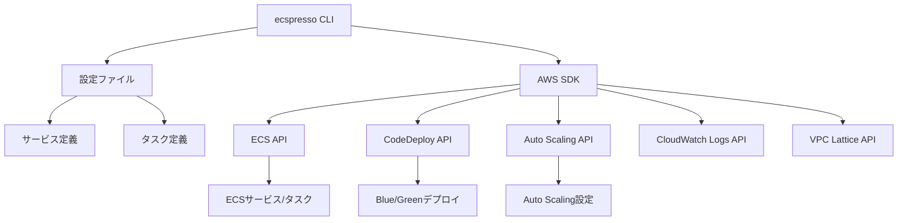

# ecspressoとは

ecspressoは、AWS Elastic Container Service (ECS)のデプロイと管理を簡素化するためのコマンドラインツールです。名前は「espresso」と同じ発音で、コーヒーのエスプレッソにちなんでいます。

## 主な特徴

ecspressoは、以下の主要な機能を提供します：

### ECSリソース管理

- **サービス定義の管理**: JSONまたはJsonnet形式でECSサービス定義を管理
- **タスク定義の管理**: JSONまたはJsonnet形式でECSタスク定義を管理
- **デプロイ管理**: ローリングデプロイとBlue/Greenデプロイ（AWS CodeDeploy連携）をサポート
- **タスク実行**: 一時的なタスクの実行と管理

### 高度な機能

- **テンプレート機能**: 環境変数を使用したテンプレート置換とJsonnetによる高度なテンプレート
- **複数環境対応**: 開発、ステージング、本番など複数環境での設定管理
- **CI/CD統合**: GitHub Actions、CircleCI、その他のCI/CDツールとの統合
- **Auto Scaling管理**: Application Auto Scalingの設定と管理
- **VPC Lattice連携**: VPC Latticeサービスとの統合
- **EBS Volume対応**: EBSボリュームの設定と管理

## ecspressoの利点

ecspressoを使用することで、以下のような利点があります：

1. **シンプルなコマンドライン操作**
   - 複雑なAWS CLIコマンドを簡略化
   - 一貫した操作方法でECSリソースを管理

2. **Infrastructure as Code（IaC）の実現**
   - サービス定義とタスク定義をコードとして管理
   - バージョン管理システムでの変更追跡が容易

3. **デプロイの安全性向上**
   - ドライランモードによる変更内容の事前確認
   - ロールバック機能によるデプロイ失敗時の復旧

4. **CI/CDパイプラインとの統合**
   - 自動デプロイプロセスの構築が容易
   - 様々なCI/CDツールとの連携

## ユースケース

ecspressoは、以下のようなユースケースに適しています：

1. **マイクロサービスアーキテクチャの管理**
   - 多数のECSサービスを効率的に管理
   - サービス間の依存関係を考慮したデプロイ

2. **複数環境でのアプリケーション運用**
   - 開発、テスト、ステージング、本番環境での一貫した管理
   - 環境ごとの設定差分の管理

3. **Blue/Greenデプロイの実装**
   - AWS CodeDeployと連携したゼロダウンタイムデプロイ
   - トラフィック移行の制御

4. **一時的なタスクの実行**
   - データベースマイグレーション
   - バッチ処理
   - メンテナンスタスク

## アーキテクチャ概要

ecspressoは、以下のようなアーキテクチャで動作します：

ecspressoは、設定ファイル、サービス定義、タスク定義を読み込み、AWS SDKを通じて各種AWSサービスのAPIを呼び出します。これにより、ECSサービスやタスクの管理、Blue/Greenデプロイ、Auto Scaling設定などを行います。

## 次のステップ

- [インストール方法](./installation.html)を参照して、ecspressoをインストールしましょう
- [基本的な使い方](../quickstart/basic-usage.html)を参照して、ecspressoの基本的な使い方を学びましょう
