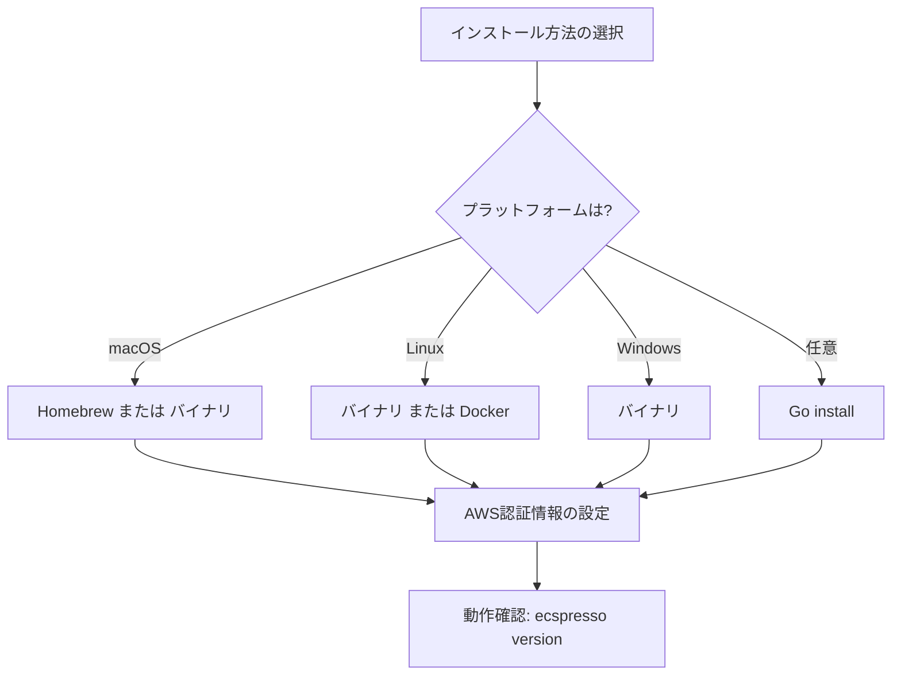

# インストール方法

ecspressoは複数の方法でインストールできます。ここでは、各プラットフォームでのインストール方法を説明します。

## バイナリのダウンロード

GitHub Releasesページから、お使いのプラットフォーム向けのバイナリをダウンロードできます。

```console
# macOS (Intel)
$ curl -sL https://github.com/kayac/ecspresso/releases/latest/download/ecspresso-darwin-amd64.zip > ecspresso.zip

# macOS (Apple Silicon)
$ curl -sL https://github.com/kayac/ecspresso/releases/latest/download/ecspresso-darwin-arm64.zip > ecspresso.zip

# Linux (x86_64)
$ curl -sL https://github.com/kayac/ecspresso/releases/latest/download/ecspresso-linux-amd64.zip > ecspresso.zip

# Windows
$ curl -sL https://github.com/kayac/ecspresso/releases/latest/download/ecspresso-windows-amd64.zip > ecspresso.zip
```

ダウンロードしたZIPファイルを解凍し、実行可能ファイルをPATHの通ったディレクトリに配置します。

```console
$ unzip ecspresso.zip
$ sudo mv ecspresso /usr/local/bin/
$ ecspresso version
```

## Homebrewを使用したインストール（macOS）

macOSをお使いの場合は、Homebrewを使用してインストールすることもできます。

```console
$ brew install kayac/tap/ecspresso
```

## Docker

Dockerイメージも利用可能です。

```console
$ docker pull kayac/ecspresso
$ docker run --rm -it -v $(pwd):/work -v $HOME/.aws:/root/.aws kayac/ecspresso version
```

## Go言語を使用したインストール

Go言語の環境がある場合は、`go install`コマンドを使用してインストールできます。

```console
$ go install github.com/kayac/ecspresso/v2/cmd/ecspresso@latest
```

## 動作確認

インストールが完了したら、以下のコマンドでバージョンを確認できます。

```console
$ ecspresso version
```

## 前提条件

ecspressoを使用するには、以下の前提条件があります：

1. AWS認証情報の設定
   - AWS CLIと同様に、環境変数、認証情報ファイル、またはIAMロールを使用して認証します
   - 必要なIAMポリシーについては、[AWS ECSのドキュメント](https://docs.aws.amazon.com/AmazonECS/latest/developerguide/security_iam_service-with-iam.html)を参照してください

2. AWS CLIの設定（オプション）
   - AWS CLIが設定されていると、ecspressoはその設定を利用します


