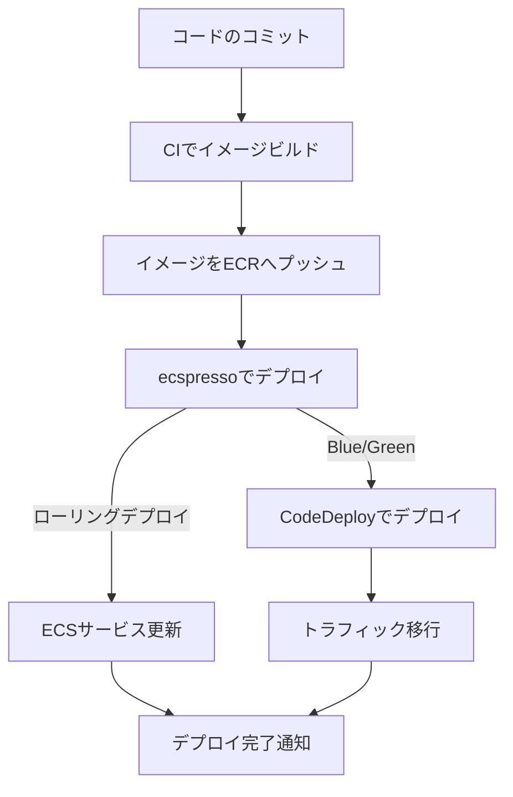

# CI/CDパイプラインとの統合

ecspressoはCI/CDパイプラインと簡単に統合できます。以下では、一般的なCI/CDサービスとの統合方法を説明します。

## CircleCIとの統合

```yaml
version: 2.1
orbs:
  ecspresso: fujiwara/ecspresso@2.0.4
jobs:
  deploy:
    docker:
      - image: cimg/base:2023.03
    steps:
      - checkout
      - ecspresso/install:
          version: v2.3.0
      - run:
          command: |
            IMAGE_TAG=${CIRCLE_SHA1} ecspresso deploy --config ecspresso.yml
```

## GitHub Actionsとの統合

```yaml
name: Deploy to ECS

on:
  push:
    branches: [ main ]

jobs:
  deploy:
    runs-on: ubuntu-latest
    steps:
      - uses: actions/checkout@v3
      - uses: kayac/ecspresso@v2
        with:
          version: v2.3.0
      - run: |
          IMAGE_TAG=${GITHUB_SHA} ecspresso deploy --config ecspresso.yml
```

## AWS CodeBuildとの統合

```yaml
version: 0.2

phases:
  install:
    runtime-versions:
      golang: 1.20
    commands:
      - curl -sL https://github.com/kayac/ecspresso/releases/download/v2.3.0/ecspresso_v2.3.0_linux_amd64.tar.gz | tar zxvf - -C /usr/local/bin
      - chmod +x /usr/local/bin/ecspresso
  build:
    commands:
      - IMAGE_TAG=${CODEBUILD_RESOLVED_SOURCE_VERSION} ecspresso deploy --config ecspresso.yml
```

## デプロイフロー



## 環境変数の活用

CI/CDパイプラインでは、環境変数を使用してデプロイ設定を動的に変更できます。

```yaml
# タスク定義の例
{
  "containerDefinitions": [
    {
      "name": "app",
      "image": "{{ must_env `ECR_REPOSITORY` }}:{{ must_env `IMAGE_TAG` }}",
      "environment": [
        {
          "name": "ENV",
          "value": "{{ must_env `DEPLOY_ENV` }}"
        }
      ]
    }
  ]
}
```

## デプロイ前の検証

CI/CDパイプラインでは、デプロイ前に`verify`コマンドを実行して設定の問題を早期に発見できます。

```yaml
steps:
  - run:
      command: |
        ecspresso verify --config ecspresso.yml
        ecspresso deploy --config ecspresso.yml
```

## 複数環境へのデプロイ

CI/CDパイプラインで複数環境（開発、ステージング、本番）へのデプロイを管理できます。

```yaml
jobs:
  deploy_dev:
    steps:
      - run: DEPLOY_ENV=dev ecspresso deploy --config ecspresso.yml
  deploy_staging:
    steps:
      - run: DEPLOY_ENV=staging ecspresso deploy --config ecspresso.yml
  deploy_prod:
    steps:
      - run: DEPLOY_ENV=prod ecspresso deploy --config ecspresso.yml
```

## 注意事項

- CI/CDパイプラインでecspressoを使用する場合、適切なAWS認証情報が必要です。
- 機密情報（AWS認証情報など）は、CI/CDサービスのシークレット管理機能を使用して安全に管理してください。
- デプロイが失敗した場合の通知を設定することをお勧めします。
