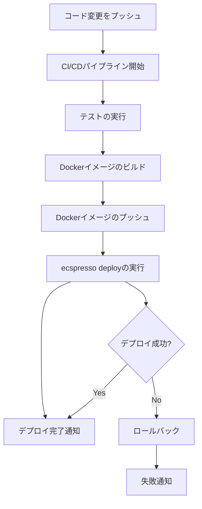

# CI/CDパイプラインとの統合

ecspressoは、継続的インテグレーション・継続的デリバリー（CI/CD）パイプラインとの統合が容易です。このガイドでは、一般的なCI/CDツールでecspressoを使用する方法を説明します。

## GitHubActions との統合

GitHub Actionsでecspressoを使用する例：

```yaml
name: Deploy to ECS

on:
  push:
    branches: [ main ]

jobs:
  deploy:
    runs-on: ubuntu-latest
    steps:
      - uses: actions/checkout@v2
      
      - name: Configure AWS credentials
        uses: aws-actions/configure-aws-credentials@v1
        with:
          aws-access-key-id: ${{ secrets.AWS_ACCESS_KEY_ID }}
          aws-secret-access-key: ${{ secrets.AWS_SECRET_ACCESS_KEY }}
          aws-region: ap-northeast-1
      
      - name: Install ecspresso
        run: |
          wget https://github.com/kayac/ecspresso/releases/download/v2.0.0/ecspresso_2.0.0_linux_amd64.tar.gz
          tar xzf ecspresso_2.0.0_linux_amd64.tar.gz
          sudo mv ecspresso /usr/local/bin/
      
      - name: Build and push Docker image
        run: |
          # ここでDockerイメージをビルドしてECRにプッシュするコマンド
      
      - name: Deploy to ECS
        run: |
          ecspresso deploy
```

## デプロイワークフローの図



## 環境変数の管理

CI/CD環境では、環境変数ファイルを使用して異なる環境（開発、ステージング、本番）の設定を管理できます：

```bash
# 開発環境へのデプロイ
ecspresso deploy --envfile dev.env

# ステージング環境へのデプロイ
ecspresso deploy --envfile staging.env

# 本番環境へのデプロイ
ecspresso deploy --envfile production.env
```

## デプロイ前の検証

CI/CDパイプラインでは、デプロイ前に設定の検証とdiffの確認を行うことをお勧めします：

```bash
# 設定の検証
ecspresso verify

# 差分の確認
ecspresso diff

# 問題がなければデプロイ
ecspresso deploy
```

## ロールバック戦略

デプロイが失敗した場合のロールバック戦略も実装することをお勧めします：

```bash
# デプロイを試行
if ! ecspresso deploy; then
  echo "デプロイに失敗しました。ロールバックを実行します。"
  ecspresso rollback
  exit 1
fi
```

## セキュリティのベストプラクティス

CI/CD環境でecspressoを使用する際のセキュリティのベストプラクティス：

1. 最小権限の原則に基づいたIAMロールを使用する
2. 機密情報はCI/CDプラットフォームのシークレット管理機能を使用する
3. AWS認証情報を直接スクリプトに埋め込まない
4. 本番環境へのデプロイには承認ステップを追加する
