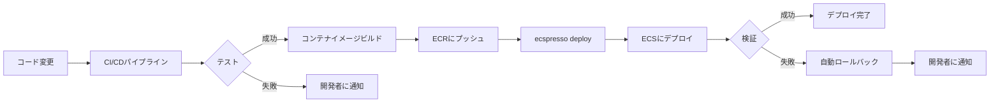

# CI/CDパイプラインとの統合

ecspressoは様々なCI/CDパイプラインと簡単に統合できます。このセクションでは、一般的なCI/CDツールとの統合方法を説明します。

## GitHub Actions

GitHub Actionsでecspressoを使用する例：

```yaml
name: Deploy to ECS

on:
  push:
    branches: [ main ]

jobs:
  deploy:
    runs-on: ubuntu-latest
    steps:
      - uses: actions/checkout@v2
      
      - name: Configure AWS credentials
        uses: aws-actions/configure-aws-credentials@v1
        with:
          aws-access-key-id: ${{ secrets.AWS_ACCESS_KEY_ID }}
          aws-secret-access-key: ${{ secrets.AWS_SECRET_ACCESS_KEY }}
          aws-region: ap-northeast-1
      
      - name: Deploy with ecspresso
        uses: kayac/ecspresso-action@v1
        with:
          version: v1.5.0
          command: deploy
          config: ecspresso.yml
```

## CircleCI

CircleCIでecspressoを使用する例：

```yaml
version: 2.1

orbs:
  ecspresso: fujiwara/ecspresso@1.0
  aws-cli: circleci/aws-cli@1.3

jobs:
  deploy:
    docker:
      - image: cimg/base:2021.04
    steps:
      - checkout
      - aws-cli/setup:
          profile-name: default
      - ecspresso/setup:
          version: v1.5.0
      - run:
          name: Deploy to ECS
          command: ecspresso deploy --config ecspresso.yml

workflows:
  version: 2
  deploy:
    jobs:
      - deploy:
          filters:
            branches:
              only: main
```

## AWS CodeBuild

AWS CodeBuildでecspressoを使用する例：

```yaml
version: 0.2

phases:
  install:
    runtime-versions:
      golang: 1.16
    commands:
      - curl -sL https://github.com/kayac/ecspresso/releases/download/v1.5.0/ecspresso_1.5.0_linux_amd64.tar.gz | tar xzf -
      - mv ecspresso /usr/local/bin/
  
  build:
    commands:
      - ecspresso deploy --config ecspresso.yml

artifacts:
  files:
    - ecspresso.yml
    - ecs-task-def.json
    - ecs-service-def.json
```

## GitLab CI/CD

GitLab CI/CDでecspressoを使用する例：

```yaml
stages:
  - deploy

deploy:
  stage: deploy
  image: 
    name: amazon/aws-cli:latest
    entrypoint: [""]
  before_script:
    - curl -sL https://github.com/kayac/ecspresso/releases/download/v1.5.0/ecspresso_1.5.0_linux_amd64.tar.gz | tar xzf -
    - mv ecspresso /usr/local/bin/
    - aws configure set aws_access_key_id $AWS_ACCESS_KEY_ID
    - aws configure set aws_secret_access_key $AWS_SECRET_ACCESS_KEY
    - aws configure set region ap-northeast-1
  script:
    - ecspresso deploy --config ecspresso.yml
  only:
    - main
```

## CI/CDパイプラインの構成図

以下はecspressoを使用したCI/CDパイプラインの一般的な構成を示しています：



## 環境変数の活用

CI/CD環境では、環境変数を使用してecspressoの設定を動的に変更できます。ecspressoはテンプレート関数を通じて環境変数を参照できます：

```json
{
  "containerDefinitions": [
    {
      "name": "app",
      "image": "{{ env `ECR_REPOSITORY_URL` }}/myapp:{{ env `IMAGE_TAG` }}",
      "environment": [
        {
          "name": "ENV",
          "value": "{{ must_env `DEPLOY_ENV` }}"
        }
      ]
    }
  ]
}
```

CI/CDパイプラインでは、これらの環境変数を設定してからecspressoを実行します：

```bash
export ECR_REPOSITORY_URL=123456789012.dkr.ecr.ap-northeast-1.amazonaws.com
export IMAGE_TAG=v1.0.0
export DEPLOY_ENV=production
ecspresso deploy
```
