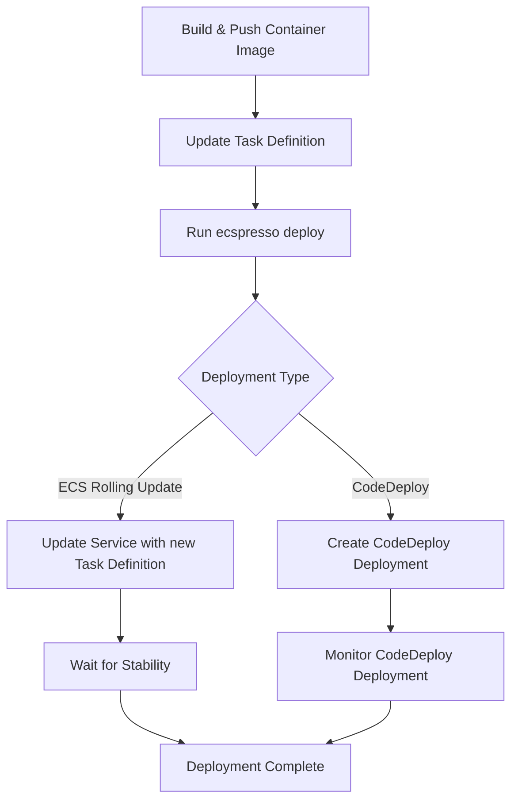

# CI/CD Integration

ecspresso can be easily integrated into CI/CD pipelines. This guide provides examples for common CI/CD platforms.

## GitHub Actions Example

```yaml
name: Deploy to ECS

on:
  push:
    branches: [main]

jobs:
  deploy:
    runs-on: ubuntu-latest
    steps:
      - uses: actions/checkout@v3
      
      - name: Configure AWS credentials
        uses: aws-actions/configure-aws-credentials@v1
        with:
          aws-access-key-id: ${{ secrets.AWS_ACCESS_KEY_ID }}
          aws-secret-access-key: ${{ secrets.AWS_SECRET_ACCESS_KEY }}
          aws-region: us-west-2
      
      - name: Setup ecspresso
        uses: kayac/ecspresso@v2
        with:
          version: v2.5.0
      
      - name: Verify configuration
        run: ecspresso verify
        
      - name: Deploy to ECS
        run: ecspresso deploy
```

## CircleCI Example

```yaml
version: 2.1
orbs:
  aws-cli: circleci/aws-cli@3.1
jobs:
  deploy:
    docker:
      - image: cimg/base:2023.03
    steps:
      - checkout
      - aws-cli/setup
      - run:
          name: Install ecspresso
          command: |
            curl -LO https://github.com/kayac/ecspresso/releases/download/v2.5.0/ecspresso_2.5.0_linux_amd64.tar.gz
            tar xzf ecspresso_2.5.0_linux_amd64.tar.gz
            sudo install ecspresso /usr/local/bin
      - run:
          name: Verify configuration
          command: ecspresso verify
      - run:
          name: Deploy to ECS
          command: ecspresso deploy
```

## Deployment Workflow Pattern



## Environment-specific Deployments

Use environment variables or separate configuration files for different environments:

```shell
# Development
ecspresso --config ecspresso.dev.yml deploy

# Staging
ecspresso --envfile staging.env deploy

# Production
ecspresso --config ecspresso.prod.yml --envfile prod.env deploy
```
