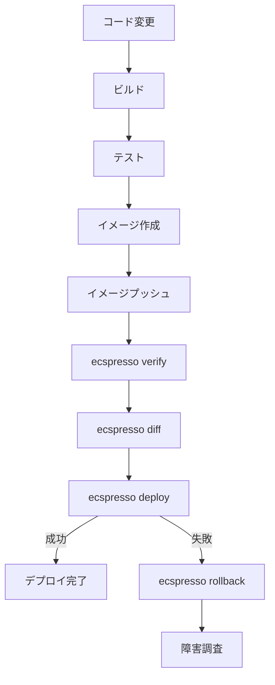

# CI/CDパイプラインでの利用

ecspressoは、CI/CDパイプラインと簡単に統合できます。このページでは、一般的なCI/CDプラットフォームでecspressoを使用する方法を説明します。

## GitHub Actions

GitHub Actionsでecspressoを使用する例：

```yaml
name: Deploy to ECS

on:
  push:
    branches: [ main ]

jobs:
  deploy:
    runs-on: ubuntu-latest
    steps:
      - uses: actions/checkout@v2
      
      - name: Configure AWS credentials
        uses: aws-actions/configure-aws-credentials@v1
        with:
          aws-access-key-id: ${{ secrets.AWS_ACCESS_KEY_ID }}
          aws-secret-access-key: ${{ secrets.AWS_SECRET_ACCESS_KEY }}
          aws-region: ap-northeast-1
      
      - name: Deploy with ecspresso
        uses: kayac/ecspresso@v2
        with:
          command: deploy
```

## CircleCI

CircleCIでecspresso orbを使用する例：

```yaml
version: 2.1

orbs:
  ecspresso: kayac/ecspresso@1.0.0
  aws-cli: circleci/aws-cli@1.3.0

jobs:
  deploy:
    executor: ecspresso/default
    steps:
      - checkout
      - aws-cli/setup:
          profile-name: default
      - ecspresso/install
      - ecspresso/deploy:
          config: ecspresso.yml

workflows:
  version: 2
  deploy:
    jobs:
      - deploy:
          filters:
            branches:
              only: main
```

## AWS CodeBuild

AWS CodeBuildでecspressoを使用する例（buildspec.yml）：

```yaml
version: 0.2

phases:
  install:
    runtime-versions:
      golang: 1.16
    commands:
      - go install github.com/kayac/ecspresso/v2@latest
  
  pre_build:
    commands:
      - echo Logging in to Amazon ECR...
      - aws ecr get-login-password --region $AWS_DEFAULT_REGION | docker login --username AWS --password-stdin $AWS_ACCOUNT_ID.dkr.ecr.$AWS_DEFAULT_REGION.amazonaws.com
  
  build:
    commands:
      - echo Building the Docker image...
      - docker build -t $REPOSITORY_URI:$CODEBUILD_RESOLVED_SOURCE_VERSION .
      - docker tag $REPOSITORY_URI:$CODEBUILD_RESOLVED_SOURCE_VERSION $REPOSITORY_URI:latest
  
  post_build:
    commands:
      - echo Pushing the Docker image...
      - docker push $REPOSITORY_URI:$CODEBUILD_RESOLVED_SOURCE_VERSION
      - docker push $REPOSITORY_URI:latest
      - echo Deploying with ecspresso...
      - ecspresso deploy
```

## GitLab CI/CD

GitLab CI/CDでecspressoを使用する例（.gitlab-ci.yml）：

```yaml
stages:
  - build
  - deploy

variables:
  DOCKER_DRIVER: overlay2
  DOCKER_TLS_CERTDIR: ""

build:
  stage: build
  image: docker:19.03.12
  services:
    - docker:19.03.12-dind
  script:
    - docker build -t $CI_REGISTRY_IMAGE:$CI_COMMIT_SHA .
    - docker tag $CI_REGISTRY_IMAGE:$CI_COMMIT_SHA $CI_REGISTRY_IMAGE:latest
    - docker login -u $CI_REGISTRY_USER -p $CI_REGISTRY_PASSWORD $CI_REGISTRY
    - docker push $CI_REGISTRY_IMAGE:$CI_COMMIT_SHA
    - docker push $CI_REGISTRY_IMAGE:latest

deploy:
  stage: deploy
  image: golang:1.16
  script:
    - go install github.com/kayac/ecspresso/v2@latest
    - aws configure set aws_access_key_id $AWS_ACCESS_KEY_ID
    - aws configure set aws_secret_access_key $AWS_SECRET_ACCESS_KEY
    - aws configure set region $AWS_DEFAULT_REGION
    - ecspresso deploy
```

## CI/CDパイプラインのベストプラクティス

### 1. 環境変数の活用

異なる環境（開発、ステージング、本番）に対応するために環境変数を活用します：

```yaml
# .env.dev
CLUSTER=dev-cluster
SERVICE=myservice-dev

# .env.prod
CLUSTER=prod-cluster
SERVICE=myservice-prod
```

CI/CDパイプラインでの使用例：

```yaml
# GitHub Actions
- name: Deploy to development
  if: github.ref == 'refs/heads/develop'
  uses: kayac/ecspresso@v2
  with:
    command: --envfile=.env.dev deploy

- name: Deploy to production
  if: github.ref == 'refs/heads/main'
  uses: kayac/ecspresso@v2
  with:
    command: --envfile=.env.prod deploy
```

### 2. デプロイ前の検証

デプロイ前に設定を検証することで、問題を早期に発見できます：

```yaml
# GitHub Actions
- name: Verify configuration
  uses: kayac/ecspresso@v2
  with:
    command: verify

- name: Check differences
  uses: kayac/ecspresso@v2
  with:
    command: diff
```

### 3. ロールバック戦略

デプロイに失敗した場合のロールバック戦略を実装します：

```yaml
# GitHub Actions
- name: Deploy with rollback on failure
  uses: kayac/ecspresso@v2
  with:
    command: deploy --rollback-events=DEPLOYMENT_FAILURE
```

### 4. デプロイフロー図


