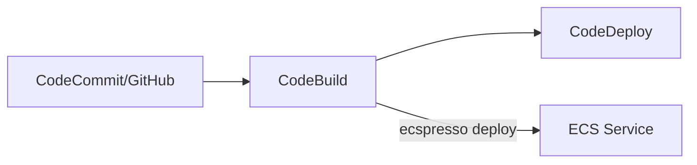

# CI/CDパイプラインとの統合

ecspressoは、CI/CDパイプラインと簡単に統合できるように設計されています。このガイドでは、一般的なCI/CDツールとecspressoを統合する方法を説明します。

## GitHub Actions

GitHub Actionsでecspressoを使用する例：

```yaml
name: Deploy to ECS

on:
  push:
    branches: [ main ]

jobs:
  deploy:
    runs-on: ubuntu-latest
    steps:
      - uses: actions/checkout@v2
      
      - name: Configure AWS credentials
        uses: aws-actions/configure-aws-credentials@v1
        with:
          aws-access-key-id: ${{ secrets.AWS_ACCESS_KEY_ID }}
          aws-secret-access-key: ${{ secrets.AWS_SECRET_ACCESS_KEY }}
          aws-region: ap-northeast-1
      
      - name: Install ecspresso
        run: |
          curl -LO https://github.com/kayac/ecspresso/releases/download/v2.x.x/ecspresso_2.x.x_linux_amd64.tar.gz
          tar xzf ecspresso_2.x.x_linux_amd64.tar.gz
          sudo mv ecspresso /usr/local/bin/
      
      - name: Deploy to ECS
        run: |
          cd ./ecs
          ecspresso deploy
```

## CircleCI

CircleCIでecspressoを使用する例：

```yaml
version: 2.1
jobs:
  deploy:
    docker:
      - image: cimg/base:2021.04
    steps:
      - checkout
      - run:
          name: Install AWS CLI
          command: |
            curl "https://awscli.amazonaws.com/awscli-exe-linux-x86_64.zip" -o "awscliv2.zip"
            unzip awscliv2.zip
            sudo ./aws/install
      - run:
          name: Install ecspresso
          command: |
            curl -LO https://github.com/kayac/ecspresso/releases/download/v2.x.x/ecspresso_2.x.x_linux_amd64.tar.gz
            tar xzf ecspresso_2.x.x_linux_amd64.tar.gz
            sudo mv ecspresso /usr/local/bin/
      - run:
          name: Deploy to ECS
          command: |
            cd ./ecs
            ecspresso deploy

workflows:
  version: 2
  build-and-deploy:
    jobs:
      - deploy:
          filters:
            branches:
              only: main
```

## AWS CodePipeline

AWS CodePipelineとecspressoを統合する例：



CodeBuildのbuildspec.yml例：

```yaml
version: 0.2

phases:
  install:
    runtime-versions:
      golang: 1.16
    commands:
      - curl -LO https://github.com/kayac/ecspresso/releases/download/v2.x.x/ecspresso_2.x.x_linux_amd64.tar.gz
      - tar xzf ecspresso_2.x.x_linux_amd64.tar.gz
      - mv ecspresso /usr/local/bin/
  
  build:
    commands:
      - cd ./ecs
      - ecspresso deploy

artifacts:
  files:
    - appspec.yml
    - taskdef.json
```

## GitLab CI/CD

GitLab CI/CDでecspressoを使用する例：

```yaml
stages:
  - deploy

deploy:
  stage: deploy
  image: 
    name: amazon/aws-cli:latest
    entrypoint: [""]
  before_script:
    - curl -LO https://github.com/kayac/ecspresso/releases/download/v2.x.x/ecspresso_2.x.x_linux_amd64.tar.gz
    - tar xzf ecspresso_2.x.x_linux_amd64.tar.gz
    - mv ecspresso /usr/local/bin/
  script:
    - cd ./ecs
    - ecspresso deploy
  only:
    - main
```

## 環境変数の活用

CI/CD環境では、環境変数を使用して異なる環境にデプロイすることができます：

```bash
# 開発環境
MYSQL_HOST=dev.example.com ecspresso deploy

# 本番環境
MYSQL_HOST=prod.example.com ecspresso deploy
```

または、環境ファイルを使用：

```bash
# 開発環境
ecspresso deploy --envfile=dev.env

# 本番環境
ecspresso deploy --envfile=prod.env
```
