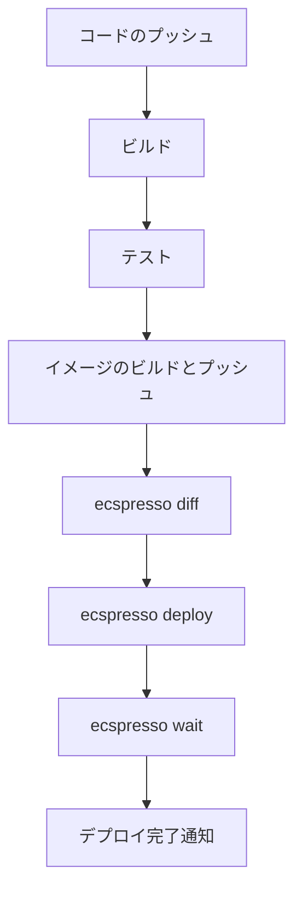

# CI/CDパイプラインとの統合

ecspressoは、CI/CDパイプラインと簡単に統合できるように設計されています。このガイドでは、一般的なCI/CDツールでecspressoを使用する方法を説明します。

## 目次

1. [基本的な統合フロー](#基本的な統合フロー)
2. [GitHub Actions](#github-actions)
3. [CircleCI](#circleci)
4. [AWS CodeBuild](#aws-codebuild)
5. [Jenkins](#jenkins)
6. [GitLab CI/CD](#gitlab-cicd)
7. [ベストプラクティス](#ベストプラクティス)

## 基本的な統合フロー

CI/CDパイプラインにecspressoを統合する基本的なフローは以下の通りです：



1. コードをリポジトリにプッシュ
2. アプリケーションのビルドとテスト
3. Dockerイメージのビルドとレジストリへのプッシュ
4. `ecspresso diff`で変更内容を確認
5. `ecspresso deploy`でECSサービスをデプロイ
6. `ecspresso wait`でデプロイの完了を待機
7. デプロイ完了の通知

## GitHub Actions

GitHub Actionsでecspressoを使用する例を示します。

### ワークフローファイルの例

```yaml
name: Deploy to ECS

on:
  push:
    branches: [ main ]

jobs:
  deploy:
    runs-on: ubuntu-latest
    steps:
      - uses: actions/checkout@v3
      
      - name: Configure AWS credentials
        uses: aws-actions/configure-aws-credentials@v1
        with:
          aws-access-key-id: ${{ secrets.AWS_ACCESS_KEY_ID }}
          aws-secret-access-key: ${{ secrets.AWS_SECRET_ACCESS_KEY }}
          aws-region: ap-northeast-1
      
      - name: Login to Amazon ECR
        id: login-ecr
        uses: aws-actions/amazon-ecr-login@v1
      
      - name: Build, tag, and push image to Amazon ECR
        id: build-image
        env:
          ECR_REGISTRY: ${{ steps.login-ecr.outputs.registry }}
          ECR_REPOSITORY: myapp
          IMAGE_TAG: ${{ github.sha }}
        run: |
          docker build -t $ECR_REGISTRY/$ECR_REPOSITORY:$IMAGE_TAG .
          docker push $ECR_REGISTRY/$ECR_REPOSITORY:$IMAGE_TAG
          echo "::set-output name=image::$ECR_REGISTRY/$ECR_REPOSITORY:$IMAGE_TAG"
      
      - name: Setup ecspresso
        uses: kayac/ecspresso@v2
        with:
          version: v2.3.0
      
      - name: Deploy to ECS
        env:
          IMAGE_TAG: ${{ github.sha }}
        run: |
          ecspresso diff --config ecspresso.yml --ext-str IMAGE_TAG=$IMAGE_TAG
          ecspresso deploy --config ecspresso.yml --ext-str IMAGE_TAG=$IMAGE_TAG
          ecspresso wait --config ecspresso.yml --timeout 10m
```

### 環境変数の使用

GitHub Actionsのシークレットを使用して、AWS認証情報などの機密情報を安全に管理できます。

```yaml
env:
  AWS_REGION: ap-northeast-1
  IMAGE_TAG: ${{ github.sha }}
```

## CircleCI

CircleCIでecspressoを使用する例を示します。

### config.ymlの例

```yaml
version: 2.1

jobs:
  deploy:
    docker:
      - image: cimg/base:2023.01
    steps:
      - checkout
      - setup_remote_docker
      - run:
          name: Install AWS CLI
          command: |
            curl "https://awscli.amazonaws.com/awscli-exe-linux-x86_64.zip" -o "awscliv2.zip"
            unzip awscliv2.zip
            sudo ./aws/install
      - run:
          name: Install ecspresso
          command: |
            curl -sL https://github.com/kayac/ecspresso/releases/download/v2.3.0/ecspresso-v2.3.0-linux-amd64.tar.gz | tar xvz
            sudo mv ecspresso /usr/local/bin/
      - run:
          name: Configure AWS credentials
          command: |
            aws configure set aws_access_key_id $AWS_ACCESS_KEY_ID
            aws configure set aws_secret_access_key $AWS_SECRET_ACCESS_KEY
            aws configure set region $AWS_REGION
      - run:
          name: Build and push Docker image
          command: |
            aws ecr get-login-password --region $AWS_REGION | docker login --username AWS --password-stdin $ECR_REGISTRY
            docker build -t $ECR_REGISTRY/$ECR_REPOSITORY:$CIRCLE_SHA1 .
            docker push $ECR_REGISTRY/$ECR_REPOSITORY:$CIRCLE_SHA1
      - run:
          name: Deploy to ECS
          command: |
            ecspresso diff --config ecspresso.yml --ext-str IMAGE_TAG=$CIRCLE_SHA1
            ecspresso deploy --config ecspresso.yml --ext-str IMAGE_TAG=$CIRCLE_SHA1
            ecspresso wait --config ecspresso.yml --timeout 10m

workflows:
  version: 2
  build-and-deploy:
    jobs:
      - deploy:
          filters:
            branches:
              only: main
```

## AWS CodeBuild

AWS CodeBuildでecspressoを使用する例を示します。

### buildspec.ymlの例

```yaml
version: 0.2

phases:
  install:
    runtime-versions:
      docker: 19
    commands:
      - curl -sL https://github.com/kayac/ecspresso/releases/download/v2.3.0/ecspresso-v2.3.0-linux-amd64.tar.gz | tar xvz
      - mv ecspresso /usr/local/bin/
  pre_build:
    commands:
      - echo Logging in to Amazon ECR...
      - aws ecr get-login-password --region $AWS_DEFAULT_REGION | docker login --username AWS --password-stdin $AWS_ACCOUNT_ID.dkr.ecr.$AWS_DEFAULT_REGION.amazonaws.com
      - COMMIT_HASH=$(echo $CODEBUILD_RESOLVED_SOURCE_VERSION | cut -c 1-7)
      - IMAGE_TAG=${COMMIT_HASH:=latest}
  build:
    commands:
      - echo Build started on `date`
      - echo Building the Docker image...
      - docker build -t $AWS_ACCOUNT_ID.dkr.ecr.$AWS_DEFAULT_REGION.amazonaws.com/$ECR_REPOSITORY:$IMAGE_TAG .
      - docker push $AWS_ACCOUNT_ID.dkr.ecr.$AWS_DEFAULT_REGION.amazonaws.com/$ECR_REPOSITORY:$IMAGE_TAG
  post_build:
    commands:
      - echo Deploying to ECS...
      - ecspresso diff --config ecspresso.yml --ext-str IMAGE_TAG=$IMAGE_TAG
      - ecspresso deploy --config ecspresso.yml --ext-str IMAGE_TAG=$IMAGE_TAG
      - ecspresso wait --config ecspresso.yml --timeout 10m
```

## Jenkins

Jenkinsでecspressoを使用する例を示します。

### Jenkinsfileの例

```groovy
pipeline {
    agent any
    
    environment {
        AWS_REGION = 'ap-northeast-1'
        ECR_REGISTRY = '123456789012.dkr.ecr.ap-northeast-1.amazonaws.com'
        ECR_REPOSITORY = 'myapp'
        IMAGE_TAG = "${env.GIT_COMMIT}"
    }
    
    stages {
        stage('Checkout') {
            steps {
                checkout scm
            }
        }
        
        stage('Build and Push') {
            steps {
                sh '''
                    aws ecr get-login-password --region $AWS_REGION | docker login --username AWS --password-stdin $ECR_REGISTRY
                    docker build -t $ECR_REGISTRY/$ECR_REPOSITORY:$IMAGE_TAG .
                    docker push $ECR_REGISTRY/$ECR_REPOSITORY:$IMAGE_TAG
                '''
            }
        }
        
        stage('Deploy') {
            steps {
                sh '''
                    curl -sL https://github.com/kayac/ecspresso/releases/download/v2.3.0/ecspresso-v2.3.0-linux-amd64.tar.gz | tar xvz
                    chmod +x ecspresso
                    ./ecspresso diff --config ecspresso.yml --ext-str IMAGE_TAG=$IMAGE_TAG
                    ./ecspresso deploy --config ecspresso.yml --ext-str IMAGE_TAG=$IMAGE_TAG
                    ./ecspresso wait --config ecspresso.yml --timeout 10m
                '''
            }
        }
    }
    
    post {
        success {
            echo 'Deployment successful!'
        }
        failure {
            echo 'Deployment failed!'
        }
    }
}
```

## GitLab CI/CD

GitLab CI/CDでecspressoを使用する例を示します。

### .gitlab-ci.ymlの例

```yaml
stages:
  - build
  - deploy

variables:
  AWS_REGION: ap-northeast-1
  ECR_REGISTRY: 123456789012.dkr.ecr.ap-northeast-1.amazonaws.com
  ECR_REPOSITORY: myapp

build:
  stage: build
  image: docker:20.10.16
  services:
    - docker:20.10.16-dind
  script:
    - apk add --no-cache aws-cli
    - aws ecr get-login-password --region $AWS_REGION | docker login --username AWS --password-stdin $ECR_REGISTRY
    - docker build -t $ECR_REGISTRY/$ECR_REPOSITORY:$CI_COMMIT_SHA .
    - docker push $ECR_REGISTRY/$ECR_REPOSITORY:$CI_COMMIT_SHA
  only:
    - main

deploy:
  stage: deploy
  image: alpine:3.15
  script:
    - apk add --no-cache aws-cli curl
    - curl -sL https://github.com/kayac/ecspresso/releases/download/v2.3.0/ecspresso-v2.3.0-linux-amd64.tar.gz | tar xvz
    - chmod +x ecspresso
    - ./ecspresso diff --config ecspresso.yml --ext-str IMAGE_TAG=$CI_COMMIT_SHA
    - ./ecspresso deploy --config ecspresso.yml --ext-str IMAGE_TAG=$CI_COMMIT_SHA
    - ./ecspresso wait --config ecspresso.yml --timeout 10m
  only:
    - main
```

## ベストプラクティス

### 1. 環境変数の使用

テンプレート変数を使用して、環境ごとに異なる設定を管理します。

```console
$ ecspresso deploy --config ecspresso.yml --ext-str IMAGE_TAG=v1.2.3 --ext-str ENV=production
```

### 2. ドライランの実行

本番環境にデプロイする前に、`--dry-run`オプションを使用して変更内容を確認します。

```console
$ ecspresso deploy --config ecspresso.yml --dry-run
```

### 3. 差分の確認

デプロイ前に`diff`コマンドを使用して、変更内容を確認します。

```console
$ ecspresso diff --config ecspresso.yml
```

### 4. タイムアウトの設定

長時間実行されるデプロイの場合は、適切なタイムアウト値を設定します。

```console
$ ecspresso deploy --config ecspresso.yml --timeout 20m
```

### 5. ロールバックイベントの設定

デプロイが失敗した場合に自動的にロールバックするように設定します。

```console
$ ecspresso deploy --config ecspresso.yml --rollback-events DEPLOYMENT_FAILURE
```

### 6. 並列デプロイ

複数の環境に並列でデプロイする場合は、各環境用の設定ファイルを用意します。

```console
$ ecspresso deploy --config ecspresso.dev.yml &
$ ecspresso deploy --config ecspresso.prod.yml &
```

### 7. デプロイ通知

デプロイの成功または失敗を通知するように設定します。例えば、Slackに通知を送信します。

```bash
#!/bin/bash
ecspresso deploy --config ecspresso.yml
if [ $? -eq 0 ]; then
  curl -X POST -H 'Content-type: application/json' --data '{"text":"デプロイが成功しました"}' $SLACK_WEBHOOK_URL
else
  curl -X POST -H 'Content-type: application/json' --data '{"text":"デプロイが失敗しました"}' $SLACK_WEBHOOK_URL
fi
```

### 8. アーティファクトの保存

デプロイの結果をアーティファクトとして保存します。

```console
$ ecspresso status --config ecspresso.yml > status.txt
```

## 関連リソース

- [GitHub Actions](https://docs.github.com/ja/actions)
- [CircleCI](https://circleci.com/docs/)
- [AWS CodeBuild](https://docs.aws.amazon.com/codebuild/latest/userguide/welcome.html)
- [Jenkins](https://www.jenkins.io/doc/)
- [GitLab CI/CD](https://docs.gitlab.com/ee/ci/)
