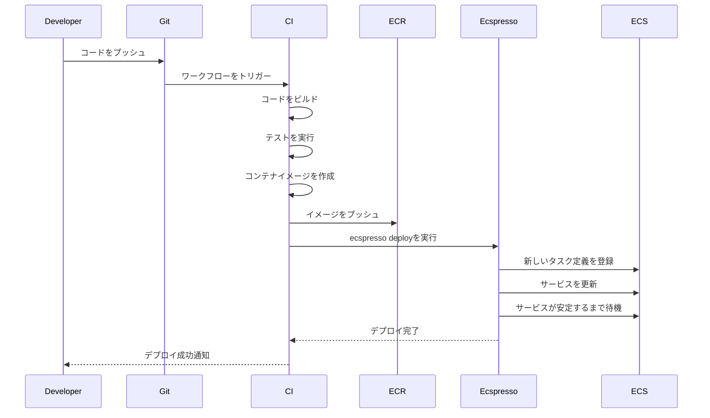

# CI/CDパイプラインとの統合

ecspressoは、CI/CDパイプラインと簡単に統合できます。このページでは、一般的なCI/CDツールとecspressoを統合する方法について説明します。

## CI/CDパイプラインの概要

CI/CD（継続的インテグレーション/継続的デリバリー）パイプラインは、コードの変更を自動的にテスト、ビルド、デプロイするプロセスです。ecspressoをCI/CDパイプラインに統合することで、ECSサービスのデプロイを自動化できます。


## GitHub Actions

GitHub Actionsは、GitHubリポジトリでCI/CDワークフローを自動化するためのツールです。以下は、GitHub ActionsでecspressoをセットアップするためのYAMLファイルの例です。

```yaml
name: Deploy to ECS

on:
  push:
    branches: [ main ]

jobs:
  deploy:
    runs-on: ubuntu-latest
    steps:
      - uses: actions/checkout@v3
      
      - name: Configure AWS credentials
        uses: aws-actions/configure-aws-credentials@v1
        with:
          aws-access-key-id: ${{ secrets.AWS_ACCESS_KEY_ID }}
          aws-secret-access-key: ${{ secrets.AWS_SECRET_ACCESS_KEY }}
          aws-region: ap-northeast-1
      
      - name: Login to Amazon ECR
        id: login-ecr
        uses: aws-actions/amazon-ecr-login@v1
      
      - name: Build, tag, and push image to Amazon ECR
        id: build-image
        env:
          ECR_REGISTRY: ${{ steps.login-ecr.outputs.registry }}
          ECR_REPOSITORY: myapp
          IMAGE_TAG: ${{ github.sha }}
        run: |
          docker build -t $ECR_REGISTRY/$ECR_REPOSITORY:$IMAGE_TAG .
          docker push $ECR_REGISTRY/$ECR_REPOSITORY:$IMAGE_TAG
          echo "::set-output name=image::$ECR_REGISTRY/$ECR_REPOSITORY:$IMAGE_TAG"
      
      - name: Install ecspresso
        uses: kayac/ecspresso@v2
        with:
          version: v2.3.0
      
      - name: Deploy to ECS
        env:
          IMAGE_TAG: ${{ github.sha }}
        run: |
          ecspresso deploy --config ecspresso.yml
```

## CircleCI

CircleCIは、CI/CDパイプラインを自動化するためのプラットフォームです。以下は、CircleCIでecspressoをセットアップするためのYAMLファイルの例です。

```yaml
version: 2.1

orbs:
  aws-ecr: circleci/aws-ecr@6.15.3
  aws-cli: circleci/aws-cli@2.0.3
  ecspresso: fujiwara/ecspresso@2.0.4

jobs:
  deploy:
    docker:
      - image: cimg/base:2022.01
    steps:
      - checkout
      - setup_remote_docker:
          version: 20.10.7
      - aws-cli/setup:
          profile-name: default
      - aws-ecr/build-and-push-image:
          repo: myapp
          tag: ${CIRCLE_SHA1}
      - ecspresso/install:
          version: v2.3.0
      - run:
          name: Deploy to ECS
          command: |
            IMAGE_TAG=${CIRCLE_SHA1} ecspresso deploy --config ecspresso.yml

workflows:
  version: 2
  build-and-deploy:
    jobs:
      - deploy:
          filters:
            branches:
              only: main
```

## AWS CodePipeline

AWS CodePipelineは、AWSのCI/CDサービスです。以下は、AWS CodePipelineでecspressoを使用するためのbuildspec.ymlファイルの例です。

```yaml
version: 0.2

phases:
  install:
    runtime-versions:
      docker: 18
    commands:
      - curl -sL -o /usr/local/bin/ecspresso https://github.com/kayac/ecspresso/releases/download/v2.3.0/ecspresso_2.3.0_linux_amd64.tar.gz
      - tar -xzf /usr/local/bin/ecspresso -C /usr/local/bin/
      - chmod +x /usr/local/bin/ecspresso
  pre_build:
    commands:
      - echo Logging in to Amazon ECR...
      - aws ecr get-login-password --region $AWS_DEFAULT_REGION | docker login --username AWS --password-stdin $AWS_ACCOUNT_ID.dkr.ecr.$AWS_DEFAULT_REGION.amazonaws.com
  build:
    commands:
      - echo Build started on `date`
      - echo Building the Docker image...
      - docker build -t $AWS_ACCOUNT_ID.dkr.ecr.$AWS_DEFAULT_REGION.amazonaws.com/myapp:$CODEBUILD_RESOLVED_SOURCE_VERSION .
      - docker push $AWS_ACCOUNT_ID.dkr.ecr.$AWS_DEFAULT_REGION.amazonaws.com/myapp:$CODEBUILD_RESOLVED_SOURCE_VERSION
  post_build:
    commands:
      - echo Build completed on `date`
      - echo Deploying to ECS...
      - IMAGE_TAG=$CODEBUILD_RESOLVED_SOURCE_VERSION ecspresso deploy --config ecspresso.yml
```

## GitLab CI/CD

GitLab CI/CDは、GitLabに組み込まれたCI/CDツールです。以下は、GitLab CI/CDでecspressoをセットアップするための.gitlab-ci.ymlファイルの例です。

```yaml
stages:
  - build
  - deploy

variables:
  DOCKER_DRIVER: overlay2
  DOCKER_TLS_CERTDIR: ""

build:
  stage: build
  image: docker:20.10.7
  services:
    - docker:20.10.7-dind
  before_script:
    - docker login -u $CI_REGISTRY_USER -p $CI_REGISTRY_PASSWORD $CI_REGISTRY
  script:
    - docker build -t $CI_REGISTRY_IMAGE:$CI_COMMIT_SHA .
    - docker push $CI_REGISTRY_IMAGE:$CI_COMMIT_SHA
  only:
    - main

deploy:
  stage: deploy
  image: 
    name: amazon/aws-cli:2.4.7
    entrypoint: [""]
  before_script:
    - amazon-linux-extras install docker
    - curl -sL -o ecspresso.tar.gz https://github.com/kayac/ecspresso/releases/download/v2.3.0/ecspresso_2.3.0_linux_amd64.tar.gz
    - tar -xzf ecspresso.tar.gz
    - mv ecspresso /usr/local/bin/
    - chmod +x /usr/local/bin/ecspresso
    - aws ecr get-login-password --region $AWS_DEFAULT_REGION | docker login --username AWS --password-stdin $AWS_ACCOUNT_ID.dkr.ecr.$AWS_DEFAULT_REGION.amazonaws.com
  script:
    - docker tag $CI_REGISTRY_IMAGE:$CI_COMMIT_SHA $AWS_ACCOUNT_ID.dkr.ecr.$AWS_DEFAULT_REGION.amazonaws.com/myapp:$CI_COMMIT_SHA
    - docker push $AWS_ACCOUNT_ID.dkr.ecr.$AWS_DEFAULT_REGION.amazonaws.com/myapp:$CI_COMMIT_SHA
    - IMAGE_TAG=$CI_COMMIT_SHA ecspresso deploy --config ecspresso.yml
  only:
    - main
```

## Jenkins

Jenkinsは、オープンソースの自動化サーバーです。以下は、JenkinsでecspressoをセットアップするためのJenkinsfileの例です。

```groovy
pipeline {
    agent {
        docker {
            image 'docker:20.10.7'
            args '-v /var/run/docker.sock:/var/run/docker.sock'
        }
    }
    environment {
        AWS_ACCOUNT_ID = credentials('aws-account-id')
        AWS_DEFAULT_REGION = 'ap-northeast-1'
        ECR_REPOSITORY = 'myapp'
        IMAGE_TAG = "${env.GIT_COMMIT}"
    }
    stages {
        stage('Build') {
            steps {
                sh 'docker build -t ${AWS_ACCOUNT_ID}.dkr.ecr.${AWS_DEFAULT_REGION}.amazonaws.com/${ECR_REPOSITORY}:${IMAGE_TAG} .'
            }
        }
        stage('Push') {
            steps {
                withCredentials([[$class: 'AmazonWebServicesCredentialsBinding', accessKeyVariable: 'AWS_ACCESS_KEY_ID', secretKeyVariable: 'AWS_SECRET_ACCESS_KEY', credentialsId: 'aws-credentials']]) {
                    sh 'aws ecr get-login-password --region ${AWS_DEFAULT_REGION} | docker login --username AWS --password-stdin ${AWS_ACCOUNT_ID}.dkr.ecr.${AWS_DEFAULT_REGION}.amazonaws.com'
                    sh 'docker push ${AWS_ACCOUNT_ID}.dkr.ecr.${AWS_DEFAULT_REGION}.amazonaws.com/${ECR_REPOSITORY}:${IMAGE_TAG}'
                }
            }
        }
        stage('Deploy') {
            steps {
                withCredentials([[$class: 'AmazonWebServicesCredentialsBinding', accessKeyVariable: 'AWS_ACCESS_KEY_ID', secretKeyVariable: 'AWS_SECRET_ACCESS_KEY', credentialsId: 'aws-credentials']]) {
                    sh 'curl -sL -o ecspresso.tar.gz https://github.com/kayac/ecspresso/releases/download/v2.3.0/ecspresso_2.3.0_linux_amd64.tar.gz'
                    sh 'tar -xzf ecspresso.tar.gz'
                    sh 'chmod +x ecspresso'
                    sh 'IMAGE_TAG=${IMAGE_TAG} ./ecspresso deploy --config ecspresso.yml'
                }
            }
        }
    }
}
```

## ベストプラクティス

### 1. 環境変数の使用

環境変数を使用して、異なる環境（開発、ステージング、本番）で同じ設定ファイルを使用できます。

```bash
# 開発環境
DEV=true CLUSTER=dev-cluster ecspresso deploy --config ecspresso.yml

# 本番環境
PROD=true CLUSTER=prod-cluster ecspresso deploy --config ecspresso.yml
```

### 2. 環境変数ファイルの使用

複数の環境変数を設定する場合は、環境変数ファイルを使用できます。

```bash
# 開発環境
ecspresso deploy --config ecspresso.yml --envfile=dev.env

# 本番環境
ecspresso deploy --config ecspresso.yml --envfile=prod.env
```

### 3. デプロイ前の検証

デプロイ前に設定を検証するには、`verify`コマンドを使用します。

```bash
ecspresso verify --config ecspresso.yml
```

### 4. 差分の確認

デプロイ前に差分を確認するには、`diff`コマンドを使用します。

```bash
ecspresso diff --config ecspresso.yml
```

### 5. 自動ロールバック

デプロイ失敗時に自動的にロールバックするには、`--rollback-events`オプションを使用します。

```bash
ecspresso deploy --config ecspresso.yml --rollback-events DEPLOYMENT_FAILURE
```

## CI/CDパイプラインの例

以下は、一般的なCI/CDパイプラインの例です。


