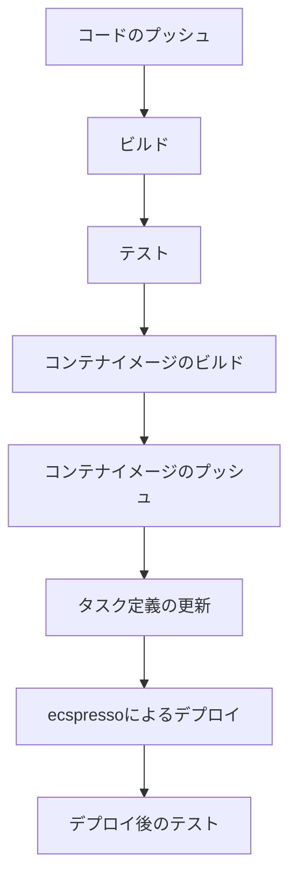

# CI/CDパイプラインとの統合

ecspressoは、CI/CDパイプラインと簡単に統合できるように設計されています。このガイドでは、一般的なCI/CDツールでecspressoを使用する方法を説明します。

## 基本的なCI/CDフロー

ecspressoを使用した一般的なCI/CDフローは以下のようになります：



## GitHub Actions での使用例

GitHub Actionsでecspressoを使用する例を示します：

```yaml
name: Deploy to ECS

on:
  push:
    branches: [ main ]

jobs:
  deploy:
    runs-on: ubuntu-latest
    steps:
      - uses: actions/checkout@v2

      - name: Configure AWS credentials
        uses: aws-actions/configure-aws-credentials@v1
        with:
          aws-access-key-id: ${{ secrets.AWS_ACCESS_KEY_ID }}
          aws-secret-access-key: ${{ secrets.AWS_SECRET_ACCESS_KEY }}
          aws-region: ap-northeast-1

      - name: Login to Amazon ECR
        id: login-ecr
        uses: aws-actions/amazon-ecr-login@v1

      - name: Build, tag, and push image to Amazon ECR
        id: build-image
        env:
          ECR_REGISTRY: ${{ steps.login-ecr.outputs.registry }}
          ECR_REPOSITORY: your-repository
          IMAGE_TAG: ${{ github.sha }}
        run: |
          docker build -t $ECR_REGISTRY/$ECR_REPOSITORY:$IMAGE_TAG .
          docker push $ECR_REGISTRY/$ECR_REPOSITORY:$IMAGE_TAG
          echo "::set-output name=image::$ECR_REGISTRY/$ECR_REPOSITORY:$IMAGE_TAG"

      - name: Download ecspresso
        run: |
          curl -sL https://github.com/kayac/ecspresso/releases/download/v1.5.0/ecspresso_1.5.0_linux_amd64.tar.gz | tar xzf -
          chmod +x ecspresso
          ./ecspresso version

      - name: Update task definition
        env:
          IMAGE: ${{ steps.build-image.outputs.image }}
        run: |
          # 環境変数を使用してタスク定義を更新
          export IMAGE_TAG=$IMAGE
          ./ecspresso render --task-def > task-def.json
          cat task-def.json

      - name: Deploy to ECS
        run: |
          ./ecspresso deploy --wait-until=deployed
```

## CircleCI での使用例

CircleCIでecspressoを使用する例を示します：

```yaml
version: 2.1
jobs:
  deploy:
    docker:
      - image: cimg/base:2021.04
    steps:
      - checkout
      - setup_remote_docker:
          version: 20.10.7
      - run:
          name: Install AWS CLI
          command: |
            curl "https://awscli.amazonaws.com/awscli-exe-linux-x86_64.zip" -o "awscliv2.zip"
            unzip awscliv2.zip
            sudo ./aws/install
      - run:
          name: Configure AWS credentials
          command: |
            aws configure set aws_access_key_id $AWS_ACCESS_KEY_ID
            aws configure set aws_secret_access_key $AWS_SECRET_ACCESS_KEY
            aws configure set default.region ap-northeast-1
      - run:
          name: Login to Amazon ECR
          command: |
            aws ecr get-login-password | docker login --username AWS --password-stdin $ECR_REGISTRY
      - run:
          name: Build and push Docker image
          command: |
            docker build -t $ECR_REGISTRY/$ECR_REPOSITORY:$CIRCLE_SHA1 .
            docker push $ECR_REGISTRY/$ECR_REPOSITORY:$CIRCLE_SHA1
      - run:
          name: Install ecspresso
          command: |
            curl -sL https://github.com/kayac/ecspresso/releases/download/v1.5.0/ecspresso_1.5.0_linux_amd64.tar.gz | tar xzf -
            chmod +x ecspresso
            ./ecspresso version
      - run:
          name: Deploy to ECS
          command: |
            export IMAGE_TAG=$ECR_REGISTRY/$ECR_REPOSITORY:$CIRCLE_SHA1
            ./ecspresso deploy --wait-until=deployed

workflows:
  version: 2
  build-and-deploy:
    jobs:
      - deploy:
          filters:
            branches:
              only: main
```

## AWS CodePipeline での使用例

AWS CodePipelineでecspressoを使用する例を示します：

```yaml
# buildspec.yml
version: 0.2

phases:
  install:
    runtime-versions:
      docker: 18
    commands:
      - curl -sL https://github.com/kayac/ecspresso/releases/download/v1.5.0/ecspresso_1.5.0_linux_amd64.tar.gz | tar xzf -
      - chmod +x ecspresso
      - ./ecspresso version
  pre_build:
    commands:
      - echo Logging in to Amazon ECR...
      - aws ecr get-login-password | docker login --username AWS --password-stdin $ECR_REGISTRY
  build:
    commands:
      - echo Build started on `date`
      - echo Building the Docker image...
      - docker build -t $ECR_REGISTRY/$ECR_REPOSITORY:$CODEBUILD_RESOLVED_SOURCE_VERSION .
      - docker push $ECR_REGISTRY/$ECR_REPOSITORY:$CODEBUILD_RESOLVED_SOURCE_VERSION
  post_build:
    commands:
      - echo Build completed on `date`
      - echo Deploying to ECS...
      - export IMAGE_TAG=$ECR_REGISTRY/$ECR_REPOSITORY:$CODEBUILD_RESOLVED_SOURCE_VERSION
      - ./ecspresso deploy --wait-until=deployed

artifacts:
  files:
    - appspec.yml
    - taskdef.json
```

## 環境変数の活用

CI/CD環境では、環境変数を活用してecspressoの設定を動的に変更することができます：

```bash
# 環境変数を使用してタスク定義を更新
export IMAGE_TAG=your-registry/your-repository:latest
export ENVIRONMENT=production
export MEMORY=1024
export CPU=512

# 環境変数を展開してタスク定義をレンダリング
ecspresso render --task-def > task-def.json

# デプロイ実行
ecspresso deploy
```

## 複数環境へのデプロイ

CI/CDパイプラインで複数環境（開発、ステージング、本番）へのデプロイを管理するには、以下のアプローチが有効です：

1. **ブランチベースのデプロイ**：GitHubのブランチに基づいて異なる環境にデプロイ

```yaml
jobs:
  deploy:
    steps:
      # ...
      - name: Deploy to development
        if: github.ref == 'refs/heads/develop'
        run: |
          export ENVIRONMENT=development
          ./ecspresso deploy --config=ecspresso-dev.yml

      - name: Deploy to staging
        if: github.ref == 'refs/heads/staging'
        run: |
          export ENVIRONMENT=staging
          ./ecspresso deploy --config=ecspresso-staging.yml

      - name: Deploy to production
        if: github.ref == 'refs/heads/main'
        run: |
          export ENVIRONMENT=production
          ./ecspresso deploy --config=ecspresso-prod.yml
```

2. **環境ファイルの使用**：環境ごとに異なる環境変数ファイルを使用

```bash
# 開発環境へのデプロイ
ecspresso deploy --envfile=dev.env

# ステージング環境へのデプロイ
ecspresso deploy --envfile=staging.env

# 本番環境へのデプロイ
ecspresso deploy --envfile=prod.env
```

## デプロイの検証

CI/CDパイプラインでデプロイ後の検証を行うには、以下のアプローチが有効です：

```yaml
jobs:
  deploy:
    steps:
      # ...
      - name: Deploy to ECS
        run: |
          ./ecspresso deploy --wait-until=deployed

      - name: Verify deployment
        run: |
          # サービスのステータスを確認
          ./ecspresso status

          # エンドポイントにリクエストを送信して応答を確認
          curl -f https://your-service-endpoint/health
```

## ロールバック戦略

CI/CDパイプラインでデプロイに失敗した場合のロールバック戦略を実装することも重要です：

```yaml
jobs:
  deploy:
    steps:
      # ...
      - name: Deploy to ECS
        id: deploy
        run: |
          ./ecspresso deploy --wait-until=deployed || echo "::set-output name=deploy_failed::true"

      - name: Rollback on failure
        if: steps.deploy.outputs.deploy_failed == 'true'
        run: |
          echo "Deployment failed, rolling back..."
          ./ecspresso rollback
```

## ベストプラクティス

1. **バージョン固定**：ecspressoの特定のバージョンを使用して、予期しない動作を防ぐ
2. **タイムアウト設定**：長時間実行されるデプロイのためにタイムアウトを適切に設定
3. **ログの保存**：デプロイログを保存して、問題のトラブルシューティングに役立てる
4. **通知の設定**：デプロイの成功/失敗を通知するメカニズムを実装
5. **デプロイ履歴の管理**：タスク定義のリビジョンを定期的に整理して、履歴を管理
