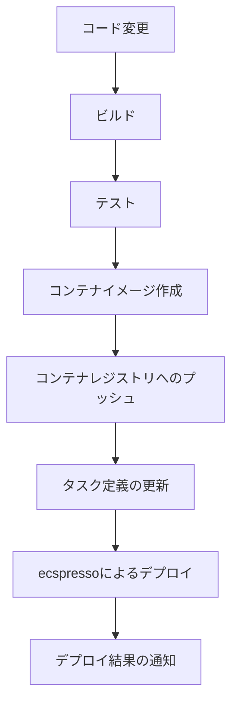
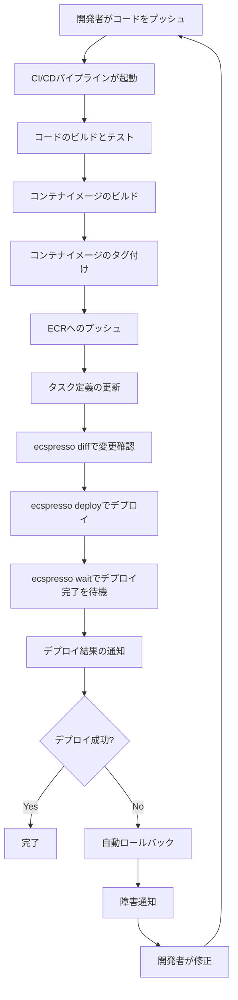

# CI/CDパイプラインとの統合

ecspressoは、CI/CDパイプラインと簡単に統合できます。このガイドでは、一般的なCI/CDツールでecspressoを使用する方法を説明します。

## CI/CDパイプラインの基本構成

ecspressoを使用したCI/CDパイプラインの基本的な構成は以下の通りです：



## GitHub Actions での使用例

GitHub Actionsでecspressoを使用する例を示します：

```yaml
name: Deploy to ECS

on:
  push:
    branches: [ main ]

jobs:
  deploy:
    runs-on: ubuntu-latest
    steps:
      - uses: actions/checkout@v2

      - name: Configure AWS credentials
        uses: aws-actions/configure-aws-credentials@v1
        with:
          aws-access-key-id: ${{ secrets.AWS_ACCESS_KEY_ID }}
          aws-secret-access-key: ${{ secrets.AWS_SECRET_ACCESS_KEY }}
          aws-region: ap-northeast-1

      - name: Login to Amazon ECR
        id: login-ecr
        uses: aws-actions/amazon-ecr-login@v1

      - name: Build, tag, and push image to Amazon ECR
        id: build-image
        env:
          ECR_REGISTRY: ${{ steps.login-ecr.outputs.registry }}
          ECR_REPOSITORY: your-repository
          IMAGE_TAG: ${{ github.sha }}
        run: |
          docker build -t $ECR_REGISTRY/$ECR_REPOSITORY:$IMAGE_TAG .
          docker push $ECR_REGISTRY/$ECR_REPOSITORY:$IMAGE_TAG
          echo "::set-output name=image::$ECR_REGISTRY/$ECR_REPOSITORY:$IMAGE_TAG"

      - name: Install ecspresso
        run: |
          curl -sL https://github.com/kayac/ecspresso/releases/latest/download/ecspresso-linux-amd64.zip > ecspresso.zip
          unzip ecspresso.zip
          sudo mv ecspresso /usr/local/bin/
          ecspresso version

      - name: Update task definition
        env:
          IMAGE: ${{ steps.build-image.outputs.image }}
        run: |
          sed -i "s|<IMAGE>|$IMAGE|g" ecs-task-def.json

      - name: Deploy to ECS
        run: |
          ecspresso deploy --config ecspresso.yml
```

## CircleCI での使用例

CircleCIでecspressoを使用する例を示します：

```yaml
version: 2.1

jobs:
  deploy:
    docker:
      - image: cimg/base:2021.04
    steps:
      - checkout
      - setup_remote_docker:
          version: 20.10.7
      - run:
          name: Install AWS CLI
          command: |
            curl "https://awscli.amazonaws.com/awscli-exe-linux-x86_64.zip" -o "awscliv2.zip"
            unzip awscliv2.zip
            sudo ./aws/install
      - run:
          name: Configure AWS credentials
          command: |
            aws configure set aws_access_key_id $AWS_ACCESS_KEY_ID
            aws configure set aws_secret_access_key $AWS_SECRET_ACCESS_KEY
            aws configure set default.region ap-northeast-1
      - run:
          name: Login to Amazon ECR
          command: |
            aws ecr get-login-password --region ap-northeast-1 | docker login --username AWS --password-stdin $ECR_REGISTRY
      - run:
          name: Build and push Docker image
          command: |
            docker build -t $ECR_REGISTRY/$ECR_REPOSITORY:$CIRCLE_SHA1 .
            docker push $ECR_REGISTRY/$ECR_REPOSITORY:$CIRCLE_SHA1
      - run:
          name: Install ecspresso
          command: |
            curl -sL https://github.com/kayac/ecspresso/releases/latest/download/ecspresso-linux-amd64.zip > ecspresso.zip
            unzip ecspresso.zip
            sudo mv ecspresso /usr/local/bin/
            ecspresso version
      - run:
          name: Update task definition
          command: |
            sed -i "s|<IMAGE>|$ECR_REGISTRY/$ECR_REPOSITORY:$CIRCLE_SHA1|g" ecs-task-def.json
      - run:
          name: Deploy to ECS
          command: |
            ecspresso deploy --config ecspresso.yml

workflows:
  version: 2
  build-and-deploy:
    jobs:
      - deploy:
          filters:
            branches:
              only: main
```

## AWS CodePipeline での使用例

AWS CodePipelineでecspressoを使用する例を示します：

```yaml
# buildspec.yml
version: 0.2

phases:
  install:
    runtime-versions:
      docker: 19
    commands:
      - curl -sL https://github.com/kayac/ecspresso/releases/latest/download/ecspresso-linux-amd64.zip > ecspresso.zip
      - unzip ecspresso.zip
      - mv ecspresso /usr/local/bin/
      - ecspresso version
  pre_build:
    commands:
      - echo Logging in to Amazon ECR...
      - aws ecr get-login-password --region $AWS_DEFAULT_REGION | docker login --username AWS --password-stdin $ECR_REGISTRY
      - COMMIT_HASH=$(echo $CODEBUILD_RESOLVED_SOURCE_VERSION | cut -c 1-7)
      - IMAGE_TAG=${COMMIT_HASH:=latest}
  build:
    commands:
      - echo Build started on `date`
      - echo Building the Docker image...
      - docker build -t $ECR_REGISTRY/$ECR_REPOSITORY:$IMAGE_TAG .
      - docker push $ECR_REGISTRY/$ECR_REPOSITORY:$IMAGE_TAG
  post_build:
    commands:
      - echo Build completed on `date`
      - echo Updating task definition...
      - sed -i "s|<IMAGE>|$ECR_REGISTRY/$ECR_REPOSITORY:$IMAGE_TAG|g" ecs-task-def.json
      - echo Deploying to ECS...
      - ecspresso deploy --config ecspresso.yml

artifacts:
  files:
    - appspec.yml
    - taskdef.json
```

## 環境変数の管理

CI/CD環境でecspressoを使用する場合、環境変数の管理が重要です。以下の方法があります：

1. CI/CDツールのシークレット管理機能を使用
   - GitHub ActionsのSecrets
   - CircleCIのEnvironment Variables
   - AWS CodeBuildのEnvironment Variables

2. ecspressoの環境変数ファイルを使用
   ```console
   $ ecspresso deploy --config ecspresso.yml --envfile .env.production
   ```

3. テンプレート関数を使用
   ```json
   {
     "image": "{{ must_env `ECR_REPOSITORY` }}:{{ must_env `IMAGE_TAG` }}"
   }
   ```

## デプロイ戦略

CI/CDパイプラインでecspressoを使用する場合、以下のデプロイ戦略があります：

1. ローリングアップデート（デフォルト）
   ```console
   $ ecspresso deploy --config ecspresso.yml
   ```

2. Blue/Greenデプロイメント（CodeDeployを使用）
   ```console
   $ ecspresso deploy --config ecspresso.yml --rollback-events DEPLOYMENT_FAILURE
   ```

3. カナリアデプロイメント
   ```console
   $ ecspresso deploy --config ecspresso.yml --tasks 1
   # 動作確認後
   $ ecspresso deploy --config ecspresso.yml --tasks 10
   ```

## CI/CDパイプラインの例

以下は、ecspressoを使用した完全なCI/CDパイプラインの例です：



## 注意事項

- CI/CD環境では、`--no-color`オプションを使用すると、ログが読みやすくなります
- 長時間実行されるデプロイの場合、タイムアウト設定を適切に行ってください
- デプロイ失敗時の自動ロールバックを設定することをお勧めします
- 本番環境へのデプロイ前に、ステージング環境でテストすることをお勧めします
