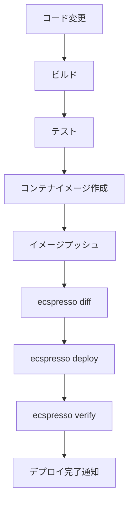
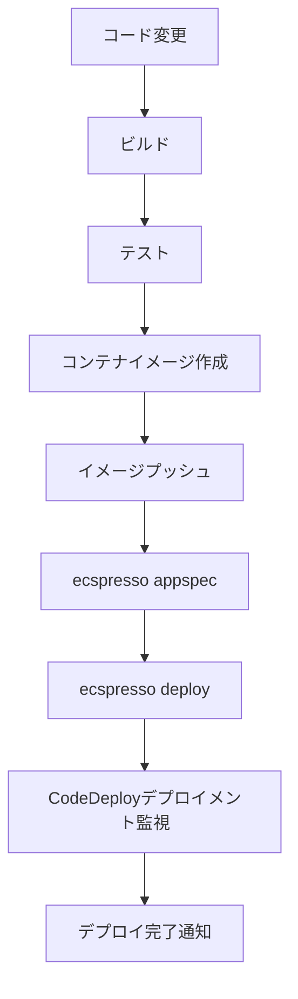
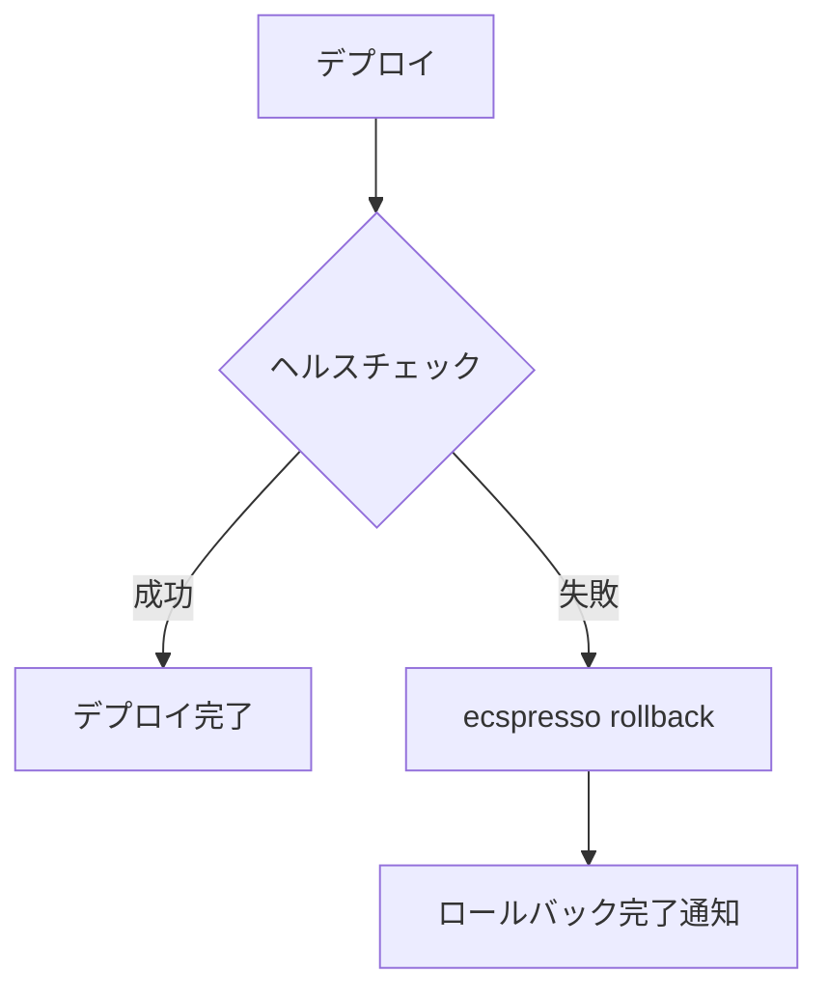

# CI/CDパイプラインとの統合

ecspressoはCI/CDパイプラインと簡単に統合できます。このページでは、一般的なCI/CDツールとの統合方法を説明します。

## GitHub Actions

GitHub Actionsでecspressoを使用する例です。

```yaml
name: Deploy to ECS

on:
  push:
    branches: [ main ]

jobs:
  deploy:
    runs-on: ubuntu-latest
    steps:
      - uses: actions/checkout@v2
      
      - name: Configure AWS credentials
        uses: aws-actions/configure-aws-credentials@v1
        with:
          aws-access-key-id: ${{ secrets.AWS_ACCESS_KEY_ID }}
          aws-secret-access-key: ${{ secrets.AWS_SECRET_ACCESS_KEY }}
          aws-region: ap-northeast-1
      
      - name: Install ecspresso
        run: |
          curl -LO https://github.com/kayac/ecspresso/releases/download/v2.X.X/ecspresso_v2.X.X_linux_amd64.tar.gz
          tar xzf ecspresso_v2.X.X_linux_amd64.tar.gz
          sudo mv ecspresso /usr/local/bin/
      
      - name: Deploy to ECS
        run: |
          cd ./ecs
          ecspresso deploy
```

## CircleCI

CircleCIでecspressoを使用する例です。

```yaml
version: 2.1
jobs:
  deploy:
    docker:
      - image: cimg/base:2021.04
    steps:
      - checkout
      - run:
          name: Install AWS CLI
          command: |
            curl "https://awscli.amazonaws.com/awscli-exe-linux-x86_64.zip" -o "awscliv2.zip"
            unzip awscliv2.zip
            sudo ./aws/install
      - run:
          name: Install ecspresso
          command: |
            curl -LO https://github.com/kayac/ecspresso/releases/download/v2.X.X/ecspresso_v2.X.X_linux_amd64.tar.gz
            tar xzf ecspresso_v2.X.X_linux_amd64.tar.gz
            sudo mv ecspresso /usr/local/bin/
      - run:
          name: Deploy to ECS
          command: |
            cd ./ecs
            ecspresso deploy

workflows:
  version: 2
  build-and-deploy:
    jobs:
      - deploy:
          filters:
            branches:
              only: main
```

## AWS CodeBuild

AWS CodeBuildでecspressoを使用する例です。

```yaml
version: 0.2

phases:
  install:
    runtime-versions:
      golang: 1.16
    commands:
      - curl -LO https://github.com/kayac/ecspresso/releases/download/v2.X.X/ecspresso_v2.X.X_linux_amd64.tar.gz
      - tar xzf ecspresso_v2.X.X_linux_amd64.tar.gz
      - mv ecspresso /usr/local/bin/
  
  build:
    commands:
      - cd ./ecs
      - ecspresso deploy

artifacts:
  files:
    - appspec.yaml
    - taskdef.json
```

## GitLab CI

GitLab CIでecspressoを使用する例です。

```yaml
stages:
  - deploy

deploy:
  stage: deploy
  image: amazon/aws-cli
  before_script:
    - curl -LO https://github.com/kayac/ecspresso/releases/download/v2.X.X/ecspresso_v2.X.X_linux_amd64.tar.gz
    - tar xzf ecspresso_v2.X.X_linux_amd64.tar.gz
    - mv ecspresso /usr/local/bin/
  script:
    - cd ./ecs
    - ecspresso deploy
  only:
    - main
```

## デプロイパイプラインの設計



## Blue/Greenデプロイパイプライン



## 自動ロールバックの設定

問題が発生した場合に自動的にロールバックするパイプラインの例です。



## 環境変数の管理

CI/CD環境での環境変数管理のベストプラクティス：

1. 機密情報はAWS Systems Manager Parameter StoreやAWS Secrets Managerに保存
2. 環境ごとに異なる設定は環境ファイル（.env.dev, .env.prod）で管理
3. CI/CDツールの環境変数機能を活用

```bash
# CI/CDパイプラインでの環境変数の使用例
ENV=prod ecspresso deploy --envfile=.env.${ENV}
```
