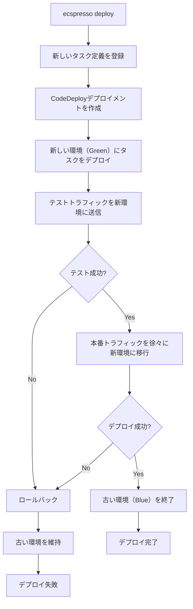

# 大規模サービスの管理

大規模なECSサービスを管理する場合、ecspressoはさまざまな機能を提供しています。このガイドでは、大規模サービスの管理に役立つecspressoの機能と戦略を説明します。

## Blue/Greenデプロイメント

大規模なサービスでは、ダウンタイムなしでデプロイすることが重要です。ecspressoは、AWS CodeDeployを使用したBlue/Greenデプロイメントをサポートしています。

### 設定方法

`ecspresso.yml`でCodeDeployを使用するように設定します：

```yaml
region: ap-northeast-1
cluster: your-cluster
service: your-service
task_definition: ecs-task-def.json
service_definition: ecs-service-def.json
appspec: appspec.yaml
```

サービス定義でデプロイメントコントローラーを設定します：

```json
{
  "deploymentController": {
    "type": "CODE_DEPLOY"
  }
}
```

AppSpecファイルの例：

```yaml
version: 0.0
Resources:
  - TargetService:
      Type: AWS::ECS::Service
      Properties:
        TaskDefinition: <TASK_DEFINITION>
        LoadBalancerInfo:
          ContainerName: "app"
          ContainerPort: 80
        PlatformVersion: "1.4.0"
Hooks:
  - BeforeInstall: "LambdaFunctionToValidateBeforeInstall"
  - AfterInstall: "LambdaFunctionToValidateAfterInstall"
  - AfterAllowTestTraffic: "LambdaFunctionToValidateAfterTestTrafficStarts"
  - BeforeAllowTraffic: "LambdaFunctionToValidateBeforeTrafficShift"
  - AfterAllowTraffic: "LambdaFunctionToValidateAfterTrafficShift"
```

### デプロイコマンド

```console
$ ecspresso deploy --config ecspresso.yml --rollback-events DEPLOYMENT_FAILURE
```

### Blue/Greenデプロイメントフロー



## オートスケーリングの管理

大規模サービスでは、オートスケーリングが重要です。ecspressoは、デプロイ中のオートスケーリングの管理をサポートしています。

### オートスケーリングの一時停止

デプロイ中にオートスケーリングを一時停止することで、予期しないスケーリングを防ぎます：

```console
$ ecspresso deploy --config ecspresso.yml --suspend-auto-scaling
```

### オートスケーリングの再開

デプロイ後にオートスケーリングを再開します：

```console
$ ecspresso deploy --config ecspresso.yml --suspend-auto-scaling --resume-auto-scaling
```

## 大規模デプロイの最適化

大規模サービスのデプロイを最適化するためのオプションがあります：

### デプロイメント設定のカスタマイズ

サービス定義でデプロイメント設定をカスタマイズできます：

```json
{
  "deploymentConfiguration": {
    "deploymentCircuitBreaker": {
      "enable": true,
      "rollback": true
    },
    "maximumPercent": 200,
    "minimumHealthyPercent": 100
  }
}
```

### デプロイタイムアウトの設定

長時間実行されるデプロイの場合、タイムアウト設定を調整します：

```yaml
# ecspresso.yml
region: ap-northeast-1
cluster: your-cluster
service: your-service
task_definition: ecs-task-def.json
service_definition: ecs-service-def.json
timeout: 30m  # 30分のタイムアウト
```

## マイクロサービスアーキテクチャの管理

多数のマイクロサービスを管理する場合、ecspressoは以下の方法で役立ちます：

### サービスごとのディレクトリ構造

```
.
├── services/
│   ├── api/
│   │   ├── ecspresso.yml
│   │   ├── ecs-task-def.json
│   │   └── ecs-service-def.json
│   ├── worker/
│   │   ├── ecspresso.yml
│   │   ├── ecs-task-def.json
│   │   └── ecs-service-def.json
│   └── batch/
│       ├── ecspresso.yml
│       ├── ecs-task-def.json
│       └── ecs-service-def.json
└── scripts/
    ├── deploy-all.sh
    └── status-all.sh
```

### 一括デプロイスクリプトの例

```bash
#!/bin/bash
# deploy-all.sh

set -e

SERVICES=("api" "worker" "batch")

for service in "${SERVICES[@]}"; do
  echo "Deploying $service..."
  cd "./services/$service"
  ecspresso deploy --config ecspresso.yml
  cd "../.."
  echo "$service deployed successfully."
done

echo "All services deployed successfully."
```

### 一括ステータス確認スクリプトの例

```bash
#!/bin/bash
# status-all.sh

set -e

SERVICES=("api" "worker" "batch")

for service in "${SERVICES[@]}"; do
  echo "Status of $service:"
  cd "./services/$service"
  ecspresso status --config ecspresso.yml
  cd "../.."
  echo "------------------------"
done
```

## 大規模サービスのモニタリング

大規模サービスのモニタリングには、以下のecspressoコマンドが役立ちます：

### サービスステータスの確認

```console
$ ecspresso status --config ecspresso.yml --events 20
```

### タスク一覧の確認

```console
$ ecspresso status --config ecspresso.yml --tasks
```

### 特定のタスクでのコマンド実行

```console
$ ecspresso exec --config ecspresso.yml --command "ps aux" --container app --select
```

## 大規模サービスのロールバック戦略

問題が発生した場合のロールバック戦略：

### 自動ロールバック

デプロイ失敗時に自動的にロールバックするオプション：

```console
$ ecspresso deploy --config ecspresso.yml --rollback-events DEPLOYMENT_FAILURE
```

### 手動ロールバック

特定のタスク定義リビジョンにロールバックする方法：

```console
# 以前のリビジョンを確認
$ ecspresso revisions --config ecspresso.yml

# 特定のリビジョンにロールバック
$ ecspresso rollback --config ecspresso.yml --revision 10
```

## 注意事項

- 大規模サービスでは、デプロイ前に必ず`diff`コマンドで変更内容を確認してください
- 本番環境へのデプロイは、オフピーク時に行うことをお勧めします
- Blue/Greenデプロイメントを使用する場合、追加のリソースが必要になることに注意してください
- 大規模なデプロイでは、タイムアウト設定を適切に行ってください
- 複数のサービスをデプロイする場合、依存関係を考慮した順序でデプロイしてください
