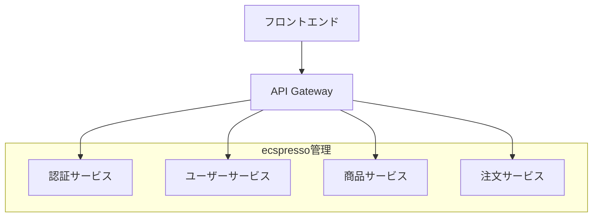
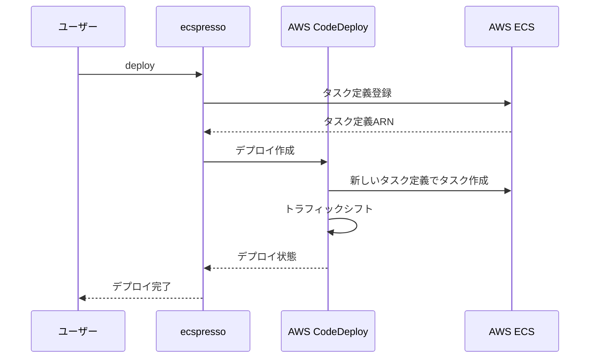

# 大規模サービスの管理

大規模なECSサービスを管理する場合、ecspressoを効果的に活用するためのベストプラクティスを紹介します。

## モジュール化された設定

大規模なプロジェクトでは、設定を小さなモジュールに分割することで管理が容易になります。

### Jsonnetの活用

ecspressoはJsonnetをサポートしており、これを使用して設定を効率的に管理できます。

```jsonnet
// base.libsonnet
{
  base_task: {
    family: "myapp",
    networkMode: "awsvpc",
    executionRoleArn: "arn:aws:iam::123456789012:role/ecsTaskExecutionRole",
    requiresCompatibilities: ["FARGATE"],
    cpu: "256",
    memory: "512",
  },
  
  base_container: {
    essential: true,
    logConfiguration: {
      logDriver: "awslogs",
      options: {
        "awslogs-group": "/ecs/myapp",
        "awslogs-region": "ap-northeast-1",
        "awslogs-stream-prefix": "ecs"
      }
    }
  }
}

// task-def.jsonnet
local base = import 'base.libsonnet';

{
  family: base.base_task.family,
  networkMode: base.base_task.networkMode,
  executionRoleArn: base.base_task.executionRoleArn,
  requiresCompatibilities: base.base_task.requiresCompatibilities,
  cpu: base.base_task.cpu,
  memory: base.base_task.memory,
  containerDefinitions: [
    base.base_container + {
      name: "app",
      image: "myapp:latest",
      portMappings: [
        {
          containerPort: 80,
          hostPort: 80,
          protocol: "tcp"
        }
      ]
    },
    base.base_container + {
      name: "sidecar",
      image: "sidecar:latest",
      essential: false
    }
  ]
}
```

使用方法：

```console
$ ecspresso render --task-def=task-def.jsonnet > ecs-task-def.json
$ ecspresso deploy
```

## サービスの分割

大規模なアプリケーションでは、複数の小さなサービスに分割することで管理が容易になります。

### マイクロサービスアーキテクチャ



各サービスごとに別々のecspresso設定を使用します：

```
.
├── services/
│   ├── auth/
│   │   ├── ecspresso.yml
│   │   ├── ecs-task-def.json
│   │   └── ecs-service-def.json
│   ├── user/
│   │   ├── ecspresso.yml
│   │   ├── ecs-task-def.json
│   │   └── ecs-service-def.json
│   ├── product/
│   │   ├── ecspresso.yml
│   │   ├── ecs-task-def.json
│   │   └── ecs-service-def.json
│   └── order/
│       ├── ecspresso.yml
│       ├── ecs-task-def.json
│       └── ecs-service-def.json
```

## リソース管理

大規模なサービスでは、リソースの効率的な管理が重要です。

### オートスケーリングの設定

ecspressoを使用してアプリケーションのオートスケーリングを管理できます：

```console
# オートスケーリングの一時停止
$ ecspresso deploy --suspend-auto-scaling

# オートスケーリングの再開
$ ecspresso deploy --resume-auto-scaling

# オートスケーリングの最小・最大容量を設定
$ ecspresso deploy --autoscaling-min=2 --autoscaling-max=10
```

### リソース使用状況の監視

CloudWatchと連携して、リソース使用状況を監視します：

```yaml
# CloudWatch Dashboardの例
widgets:
  - type: metric
    x: 0
    y: 0
    width: 12
    height: 6
    properties:
      metrics:
        - [ "AWS/ECS", "CPUUtilization", "ServiceName", "myservice", "ClusterName", "default" ]
        - [ "AWS/ECS", "MemoryUtilization", "ServiceName", "myservice", "ClusterName", "default" ]
      view: timeSeries
      stacked: false
      region: ap-northeast-1
      title: ECS Service Metrics
```

## デプロイ戦略

大規模なサービスでは、安全なデプロイ戦略が重要です。

### Blue/Greenデプロイ

AWS CodeDeployを使用したBlue/Greenデプロイを設定します：

```json
{
  "deploymentController": {
    "type": "CODE_DEPLOY"
  },
  "loadBalancers": [
    {
      "containerName": "app",
      "containerPort": 80,
      "targetGroupArn": "arn:aws:elasticloadbalancing:ap-northeast-1:123456789012:targetgroup/blue/1234567890123456"
    }
  ]
}
```

デプロイフロー：



### カナリアデプロイ

段階的にトラフィックを移行するカナリアデプロイも実装できます：

```console
# 最初に少数のタスクをデプロイ
$ ecspresso deploy --tasks=1

# 問題がなければ残りのタスクをデプロイ
$ ecspresso deploy --tasks=10
```

## パフォーマンスチューニング

大規模なサービスでは、パフォーマンスチューニングが重要です。

### タスク定義の最適化

```json
{
  "containerDefinitions": [
    {
      "name": "app",
      "image": "myapp:latest",
      "essential": true,
      "portMappings": [
        {
          "containerPort": 80,
          "hostPort": 80,
          "protocol": "tcp"
        }
      ],
      "cpu": 256,
      "memory": 512,
      "memoryReservation": 256,
      "ulimits": [
        {
          "name": "nofile",
          "softLimit": 65536,
          "hardLimit": 65536
        }
      ],
      "healthCheck": {
        "command": [ "CMD-SHELL", "curl -f http://localhost/health || exit 1" ],
        "interval": 30,
        "timeout": 5,
        "retries": 3,
        "startPeriod": 60
      }
    }
  ]
}
```
