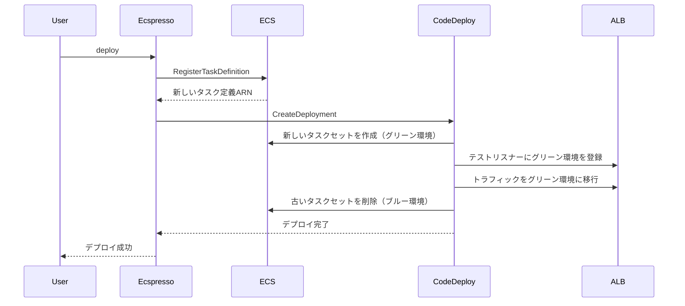

# 大規模サービス管理

ecspressoを使用して大規模なECSサービスを管理するためのベストプラクティスを紹介します。

## マイクロサービスアーキテクチャでの管理

複数のマイクロサービスを管理する場合、各サービスごとに別々のecspresso設定を用意することをお勧めします：

```
project/
├── service-a/
│   ├── ecspresso.yml
│   ├── ecs-service-def.json
│   └── ecs-task-def.json
├── service-b/
│   ├── ecspresso.yml
│   ├── ecs-service-def.json
│   └── ecs-task-def.json
└── service-c/
    ├── ecspresso.yml
    ├── ecs-service-def.json
    └── ecs-task-def.json
```

## Blue/Greenデプロイの活用

大規模サービスでは、ダウンタイムを最小限に抑えるためにBlue/Greenデプロイを活用することをお勧めします。

```json
// ecs-service-def.json
{
  "deploymentController": {
    "type": "CODE_DEPLOY"
  }
}
```

```yaml
# ecspresso.yml
codedeploy:
  application_name: AppECS-your-cluster-your-service
  deployment_group_name: DgpECS-your-cluster-your-service
  deployment_config_name: CodeDeployDefault.ECSAllAtOnce
```

## Blue/Greenデプロイのフロー



## オートスケーリングの管理

大規模サービスでは、Application Auto Scalingを活用することが重要です。ecspressoはデプロイ中のオートスケーリングの一時停止と再開をサポートしています：

```bash
# デプロイ中にオートスケーリングを一時停止
ecspresso deploy --suspend-auto-scaling

# デプロイ後にオートスケーリングを再開
ecspresso deploy --resume-auto-scaling

# オートスケーリングの最小・最大容量を設定
ecspresso deploy --auto-scaling-min 5 --auto-scaling-max 20
```

## 大規模デプロイのモニタリング

大規模なデプロイでは、進行状況のモニタリングが重要です：

```bash
# サービスの状態を確認
ecspresso status

# サービスが安定するまで待機
ecspresso wait
```

## パフォーマンスチューニング

大規模サービスのパフォーマンスを最適化するためのヒント：

1. タスク定義でコンテナのリソース制限（CPU、メモリ）を適切に設定する
2. ヘルスチェックの猶予期間を適切に設定する
3. デプロイ設定で最小ヘルス率と最大率を調整する
4. サービスの配置戦略を最適化する

```json
// ecs-service-def.json の例
{
  "deploymentConfiguration": {
    "deploymentCircuitBreaker": {
      "enable": true,
      "rollback": true
    },
    "maximumPercent": 200,
    "minimumHealthyPercent": 100
  },
  "placementStrategy": [
    {
      "field": "attribute:ecs.availability-zone",
      "type": "spread"
    },
    {
      "field": "instanceId",
      "type": "spread"
    }
  ]
}
```
