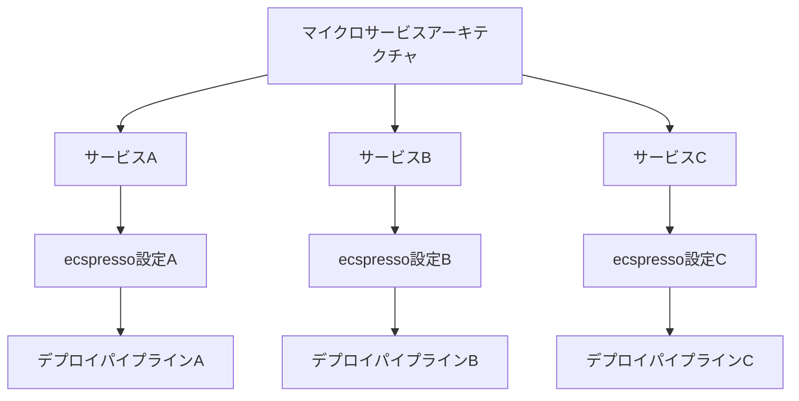
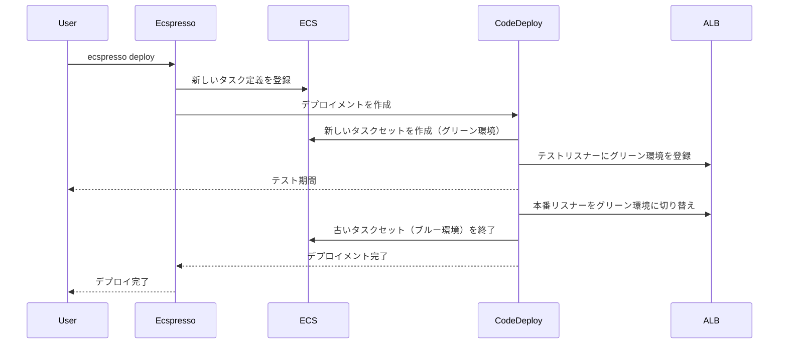

# 大規模サービスの管理

このページでは、ecspressoを使用して大規模なECSサービスやマイクロサービスアーキテクチャを管理する方法について説明します。

## 大規模サービス管理の概要

大規模なアプリケーションやマイクロサービスアーキテクチャでは、多数のECSサービスを管理する必要があります。ecspressoを使用すると、これらのサービスを効率的に管理できます。



## マイクロサービスアーキテクチャの管理

### ディレクトリ構造の例

```
.
├── services
│   ├── service-a
│   │   ├── ecspresso.yml
│   │   ├── ecs-task-def.json
│   │   └── ecs-service-def.json
│   ├── service-b
│   │   ├── ecspresso.yml
│   │   ├── ecs-task-def.json
│   │   └── ecs-service-def.json
│   └── service-c
│       ├── ecspresso.yml
│       ├── ecs-task-def.json
│       └── ecs-service-def.json
└── scripts
    ├── deploy-all.sh
    ├── status-all.sh
    └── verify-all.sh
```

### デプロイスクリプトの例

deploy-all.sh:
```bash
#!/bin/bash

set -e

SERVICES="service-a service-b service-c"
ENV=$1

if [ -z "$ENV" ]; then
  echo "Usage: $0 <environment>"
  exit 1
fi

for service in $SERVICES; do
  echo "Deploying $service to $ENV environment..."
  cd services/$service
  ecspresso deploy --config ecspresso.yml --envfile=../../envs/$ENV.env
  cd ../..
done

echo "All services deployed successfully!"
```

### ステータス確認スクリプトの例

status-all.sh:
```bash
#!/bin/bash

set -e

SERVICES="service-a service-b service-c"
ENV=$1

if [ -z "$ENV" ]; then
  echo "Usage: $0 <environment>"
  exit 1
fi

for service in $SERVICES; do
  echo "Checking status of $service in $ENV environment..."
  cd services/$service
  ecspresso status --config ecspresso.yml --envfile=../../envs/$ENV.env
  cd ../..
done
```

### 検証スクリプトの例

verify-all.sh:
```bash
#!/bin/bash

set -e

SERVICES="service-a service-b service-c"
ENV=$1

if [ -z "$ENV" ]; then
  echo "Usage: $0 <environment>"
  exit 1
fi

for service in $SERVICES; do
  echo "Verifying $service in $ENV environment..."
  cd services/$service
  ecspresso verify --config ecspresso.yml --envfile=../../envs/$ENV.env
  cd ../..
done

echo "All services verified successfully!"
```

## Blue/Greenデプロイメント

大規模なサービスでは、ダウンタイムを最小限に抑えるためにBlue/Greenデプロイメントを使用することが重要です。ecspressoは、AWS CodeDeployを使用したBlue/Greenデプロイメントをサポートしています。

### 設定例（ecspresso.yml）

```yaml
region: ap-northeast-1
cluster: default
service: myservice
task_definition: ecs-task-def.json
service_definition: ecs-service-def.json
codedeploy:
  application_name: AppECS-default-myservice
  deployment_group_name: DgpECS-default-myservice
  deployment_config_name: CodeDeployDefault.ECSAllAtOnce
  termination_wait_time_in_minutes: 5
  auto_rollback_enabled: true
```

### サービス定義例（ecs-service-def.json）

```json
{
  "deploymentController": {
    "type": "CODE_DEPLOY"
  },
  "loadBalancers": [
    {
      "containerName": "nginx",
      "containerPort": 80,
      "targetGroupArn": "{{ tfstate `aws_lb_target_group.blue.arn` }}"
    }
  ]
}
```

### AppSpec例

```yaml
version: 0.0
Resources:
  - TargetService:
      Type: AWS::ECS::Service
      Properties:
        TaskDefinition: <TASK_DEFINITION>
        LoadBalancerInfo:
          ContainerName: nginx
          ContainerPort: 80
        PlatformVersion: "1.4.0"
Hooks:
  - BeforeInstall: "LambdaFunctionToValidateBeforeInstall"
  - AfterInstall: "LambdaFunctionToValidateAfterInstall"
  - AfterAllowTestTraffic: "LambdaFunctionToValidateAfterTestTrafficStarts"
  - BeforeAllowTraffic: "LambdaFunctionToValidateBeforeAllowingProductionTraffic"
  - AfterAllowTraffic: "LambdaFunctionToValidateAfterAllowingProductionTraffic"
```

### Blue/Greenデプロイメントのフロー



## Auto Scaling

大規模なサービスでは、トラフィックの変動に対応するためにAuto Scalingを使用することが重要です。ecspressoは、ECSサービスのAuto Scaling設定をサポートしています。

### Auto Scaling設定例

```json
{
  "cluster": "default",
  "serviceName": "myservice",
  "desiredCount": 2,
  "deploymentConfiguration": {
    "maximumPercent": 200,
    "minimumHealthyPercent": 100
  }
}
```

### Auto Scalingを一時停止してデプロイ

```bash
ecspresso deploy --config ecspresso.yml --suspend-auto-scaling
```

### デプロイ後にAuto Scalingを再開

```bash
ecspresso deploy --config ecspresso.yml --resume-auto-scaling
```

## 大規模サービスのモニタリング

大規模なサービスでは、サービスのステータスを定期的に確認することが重要です。ecspressoは、サービスのステータスを確認するための`status`コマンドを提供しています。

```bash
ecspresso status --config ecspresso.yml
```

また、サービスが安定するまで待機するための`wait`コマンドも提供しています。

```bash
ecspresso wait --config ecspresso.yml
```

## タスクの実行と管理

大規模なサービスでは、メンテナンスやバッチ処理のためにタスクを実行することがあります。ecspressoは、タスクを実行するための`run`コマンドを提供しています。

```bash
ecspresso run --config ecspresso.yml
```

また、タスク上でコマンドを実行するための`exec`コマンドも提供しています。

```bash
ecspresso exec --config ecspresso.yml --command "bash"
```

## ベストプラクティス

### 1. サービスごとの設定ファイル

各サービスに専用の設定ファイルを使用します。

### 2. 共通設定の共有

共通の設定は共有し、サービス固有の設定のみをサービスごとに設定します。

### 3. デプロイスクリプトの使用

複数のサービスをデプロイするためのスクリプトを使用します。

### 4. Blue/Greenデプロイメントの使用

ダウンタイムを最小限に抑えるためにBlue/Greenデプロイメントを使用します。

### 5. Auto Scalingの使用

トラフィックの変動に対応するためにAuto Scalingを使用します。

### 6. モニタリングの実施

サービスのステータスを定期的に確認します。

### 7. CI/CDパイプラインの使用

デプロイを自動化するためにCI/CDパイプラインを使用します。
