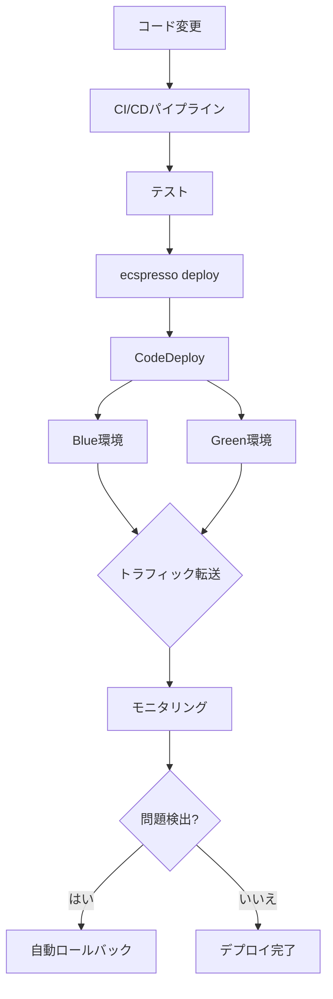

# 大規模サービスの管理

ecspressoを使用して大規模なECSサービスを効率的に管理する方法を説明します。

## マイクロサービスアーキテクチャでの管理

### リポジトリ構造

マイクロサービスごとに独立したecspresso設定を管理する例：

```
.
├── services/
│   ├── auth-service/
│   │   ├── ecspresso.yml
│   │   ├── task-def.json
│   │   └── service-def.json
│   ├── user-service/
│   │   ├── ecspresso.yml
│   │   ├── task-def.json
│   │   └── service-def.json
│   └── payment-service/
│       ├── ecspresso.yml
│       ├── task-def.json
│       └── service-def.json
└── scripts/
    ├── deploy-all.sh
    └── status-all.sh
```

### 一括デプロイスクリプト

複数のサービスを一度にデプロイするスクリプト例（deploy-all.sh）：

```bash
#!/bin/bash
set -e

SERVICES=("auth-service" "user-service" "payment-service")
ENV=${1:-dev}

for service in "${SERVICES[@]}"; do
  echo "Deploying $service to $ENV environment..."
  cd "./services/$service"
  ecspresso deploy --envfile="../../env/$ENV.env"
  cd "../.."
  echo "$service deployed successfully."
done

echo "All services deployed successfully."
```

## Blue/Greenデプロイメント

大規模サービスでは、無停止デプロイが重要です。ecspressoはAWS CodeDeployを使用したBlue/Greenデプロイをサポートしています。

### CodeDeployの設定

service-def.json:

```json
{
  "deploymentController": {
    "type": "CODE_DEPLOY"
  },
  "loadBalancers": [
    {
      "targetGroupArn": "arn:aws:elasticloadbalancing:ap-northeast-1:123456789012:targetgroup/blue-tg/abcdef1234567890",
      "containerName": "app",
      "containerPort": 80
    }
  ]
}
```

ecspresso.yml:

```yaml
region: ap-northeast-1
cluster: production-cluster
service: large-service
service_definition: service-def.json
task_definition: task-def.json
timeout: 20m
code_deploy:
  application_name: EcsApplication
  deployment_group_name: EcsDeploymentGroup
  deployment_config_name: CodeDeployDefault.ECSAllAtOnce
```

### Blue/Greenデプロイの実行

```bash
ecspresso deploy --rollback-events=DEPLOYMENT_FAILURE
```

## リソース最適化

### コンテナのリソース設定

task-def.json:

```json
{
  "containerDefinitions": [
    {
      "name": "app",
      "image": "myapp:latest",
      "cpu": 256,
      "memory": 512,
      "memoryReservation": 256,
      "essential": true
    }
  ]
}
```

### Auto Scaling設定

```bash
ecspresso deploy --resume-auto-scaling=true --auto-scaling-min=5 --auto-scaling-max=50
```

## モニタリングとアラート

### CloudWatchとの統合

ecspressoはCloudWatch Logsと統合されており、タスクのログを簡単に確認できます：

```bash
ecspresso run --wait
```

### 大規模サービスのデプロイフロー


