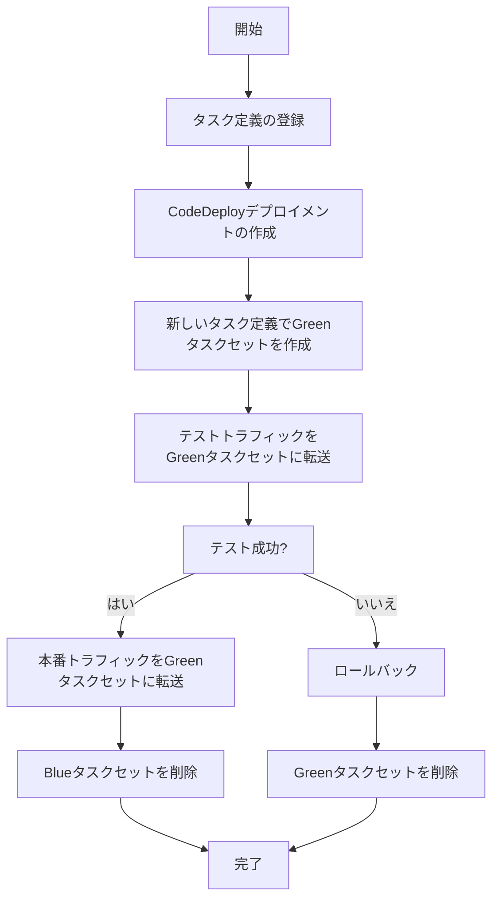

# 大規模サービスの管理

ecspressoは、大規模なECSサービスを効率的に管理するための機能を提供しています。このガイドでは、多数のサービスやタスクを持つ大規模なECS環境でecspressoを効果的に使用する方法を説明します。

## 目次

1. [大規模サービスの課題](#大規模サービスの課題)
2. [Blue/Greenデプロイメント](#bluegreenデプロイメント)
3. [自動スケーリングの管理](#自動スケーリングの管理)
4. [デプロイメントサーキットブレーカー](#デプロイメントサーキットブレーカー)
5. [マイクロサービスアーキテクチャ](#マイクロサービスアーキテクチャ)
6. [タスクの効率的な管理](#タスクの効率的な管理)
7. [モニタリングと通知](#モニタリングと通知)
8. [ベストプラクティス](#ベストプラクティス)

## 大規模サービスの課題

大規模なECSサービスを管理する際には、以下のような課題があります：

1. **デプロイの複雑さ**: 多数のサービスを安全にデプロイする必要がある
2. **ダウンタイムの最小化**: サービスの可用性を維持しながらデプロイする必要がある
3. **リソース管理**: 適切なCPUとメモリの割り当てを管理する必要がある
4. **スケーリング**: 負荷に応じて適切にスケールする必要がある
5. **モニタリング**: 多数のサービスとタスクを効率的にモニタリングする必要がある

ecspressoは、これらの課題に対処するための機能を提供しています。

## Blue/Greenデプロイメント

Blue/Greenデプロイメントは、ダウンタイムを最小化するためのデプロイ戦略です。ecspressoは、AWS CodeDeployと統合してBlue/Greenデプロイメントをサポートしています。

### Blue/Greenデプロイメントの設定

ecspresso.ymlの設定例：

```yaml
region: ap-northeast-1
cluster: my-cluster
service: myservice
service_definition: ecs-service-def.json
task_definition: ecs-task-def.json
timeout: 10m
codedeploy:
  application_name: myapp
  deployment_group_name: myapp-group
  deployment_config_name: CodeDeployDefault.ECSAllAtOnce
  auto_rollback: true
```

サービス定義ファイルの例：

```json
{
  "serviceName": "myservice",
  "desiredCount": 3,
  "launchType": "FARGATE",
  "networkConfiguration": {
    "awsvpcConfiguration": {
      "subnets": [
        "subnet-12345678",
        "subnet-87654321"
      ],
      "securityGroups": [
        "sg-12345678"
      ],
      "assignPublicIp": "DISABLED"
    }
  },
  "deploymentController": {
    "type": "CODE_DEPLOY"
  },
  "loadBalancers": [
    {
      "targetGroupArn": "arn:aws:elasticloadbalancing:ap-northeast-1:123456789012:targetgroup/blue/abcdef1234567890",
      "containerName": "web",
      "containerPort": 80
    }
  ]
}
```

appspec.ymlの例：

```yaml
version: 0.0
Resources:
  - TargetService:
      Type: AWS::ECS::Service
      Properties:
        TaskDefinition: <TASK_DEFINITION>
        LoadBalancerInfo:
          ContainerName: web
          ContainerPort: 80
        PlatformVersion: 1.4.0
Hooks:
  - BeforeInstall: "LambdaFunctionToValidateBeforeInstall"
  - AfterInstall: "LambdaFunctionToValidateAfterInstall"
  - AfterAllowTestTraffic: "LambdaFunctionToValidateAfterTestTrafficStarts"
  - BeforeAllowTraffic: "LambdaFunctionToValidateBeforeAllowingProductionTraffic"
  - AfterAllowTraffic: "LambdaFunctionToValidateAfterAllowingProductionTraffic"
```

Blue/Greenデプロイメントを使用したデプロイの例：

```console
$ ecspresso deploy --config ecspresso.yml
```

### Blue/Greenデプロイメントのフロー



## 自動スケーリングの管理

ecspressoは、ECSサービスの自動スケーリングを管理するための機能を提供しています。

### 自動スケーリングの設定

サービス定義ファイルの例：

```json
{
  "serviceName": "myservice",
  "desiredCount": 3,
  "launchType": "FARGATE",
  "networkConfiguration": {
    "awsvpcConfiguration": {
      "subnets": [
        "subnet-12345678",
        "subnet-87654321"
      ],
      "securityGroups": [
        "sg-12345678"
      ],
      "assignPublicIp": "DISABLED"
    }
  },
  "loadBalancers": [
    {
      "targetGroupArn": "arn:aws:elasticloadbalancing:ap-northeast-1:123456789012:targetgroup/myservice/abcdef1234567890",
      "containerName": "web",
      "containerPort": 80
    }
  ]
}
```

自動スケーリングの設定例：

```console
$ aws application-autoscaling register-scalable-target \
  --service-namespace ecs \
  --scalable-dimension ecs:service:DesiredCount \
  --resource-id service/my-cluster/myservice \
  --min-capacity 2 \
  --max-capacity 10

$ aws application-autoscaling put-scaling-policy \
  --service-namespace ecs \
  --scalable-dimension ecs:service:DesiredCount \
  --resource-id service/my-cluster/myservice \
  --policy-name cpu-tracking-scaling-policy \
  --policy-type TargetTrackingScaling \
  --target-tracking-scaling-policy-configuration '{
    "TargetValue": 70.0,
    "PredefinedMetricSpecification": {
      "PredefinedMetricType": "ECSServiceAverageCPUUtilization"
    },
    "ScaleOutCooldown": 60,
    "ScaleInCooldown": 60
  }'
```

### デプロイ中の自動スケーリングの一時停止と再開

デプロイ中に自動スケーリングを一時停止し、デプロイ完了後に再開することができます。

```console
# 自動スケーリングを一時停止
$ aws application-autoscaling suspend-scaling-policy \
  --service-namespace ecs \
  --scalable-dimension ecs:service:DesiredCount \
  --resource-id service/my-cluster/myservice \
  --policy-name cpu-tracking-scaling-policy

# デプロイ実行
$ ecspresso deploy --config ecspresso.yml

# 自動スケーリングを再開
$ aws application-autoscaling resume-scaling-policy \
  --service-namespace ecs \
  --scalable-dimension ecs:service:DesiredCount \
  --resource-id service/my-cluster/myservice \
  --policy-name cpu-tracking-scaling-policy
```

ecspressoの`--suspend-auto-scaling`と`--resume-auto-scaling`オプションを使用することもできます：

```console
$ ecspresso deploy --config ecspresso.yml --suspend-auto-scaling --resume-auto-scaling
```

## デプロイメントサーキットブレーカー

デプロイメントサーキットブレーカーは、デプロイが失敗した場合に自動的にロールバックする機能です。

### デプロイメントサーキットブレーカーの設定

サービス定義ファイルの例：

```json
{
  "serviceName": "myservice",
  "desiredCount": 3,
  "launchType": "FARGATE",
  "deploymentConfiguration": {
    "deploymentCircuitBreaker": {
      "enable": true,
      "rollback": true
    },
    "maximumPercent": 200,
    "minimumHealthyPercent": 100
  },
  "networkConfiguration": {
    "awsvpcConfiguration": {
      "subnets": [
        "subnet-12345678",
        "subnet-87654321"
      ],
      "securityGroups": [
        "sg-12345678"
      ],
      "assignPublicIp": "DISABLED"
    }
  },
  "loadBalancers": [
    {
      "targetGroupArn": "arn:aws:elasticloadbalancing:ap-northeast-1:123456789012:targetgroup/myservice/abcdef1234567890",
      "containerName": "web",
      "containerPort": 80
    }
  ]
}
```

### ロールバックイベントの指定

`--rollback-events`オプションを使用して、特定のイベントが発生した場合に自動的にロールバックするように設定できます。

```console
$ ecspresso deploy --config ecspresso.yml --rollback-events DEPLOYMENT_FAILURE
```

## マイクロサービスアーキテクチャ

ecspressoは、マイクロサービスアーキテクチャでの多数のサービスの管理をサポートしています。

### マイクロサービスの管理

マイクロサービスアーキテクチャでは、各サービスに対して別々の設定ファイルを用意することをお勧めします。

```
.
├── services/
│   ├── service1/
│   │   ├── ecspresso.yml
│   │   ├── ecs-task-def.json
│   │   └── ecs-service-def.json
│   ├── service2/
│   │   ├── ecspresso.yml
│   │   ├── ecs-task-def.json
│   │   └── ecs-service-def.json
│   └── service3/
│       ├── ecspresso.yml
│       ├── ecs-task-def.json
│       └── ecs-service-def.json
└── scripts/
    ├── deploy-all.sh
    └── status-all.sh
```

すべてのサービスをデプロイするスクリプトの例：

```bash
#!/bin/bash
# scripts/deploy-all.sh
set -e

for service in services/*/; do
  echo "Deploying $service..."
  ecspresso deploy --config $service/ecspresso.yml
done
```

すべてのサービスのステータスを確認するスクリプトの例：

```bash
#!/bin/bash
# scripts/status-all.sh
set -e

for service in services/*/; do
  echo "Status of $service..."
  ecspresso status --config $service/ecspresso.yml
done
```

### サービス間の依存関係の管理

サービス間の依存関係がある場合は、デプロイの順序を考慮する必要があります。

```bash
#!/bin/bash
# scripts/deploy-with-dependencies.sh
set -e

# データベースサービスを最初にデプロイ
echo "Deploying database service..."
ecspresso deploy --config services/database/ecspresso.yml
ecspresso wait --config services/database/ecspresso.yml

# APIサービスをデプロイ
echo "Deploying API service..."
ecspresso deploy --config services/api/ecspresso.yml
ecspresso wait --config services/api/ecspresso.yml

# フロントエンドサービスを最後にデプロイ
echo "Deploying frontend service..."
ecspresso deploy --config services/frontend/ecspresso.yml
ecspresso wait --config services/frontend/ecspresso.yml
```

## タスクの効率的な管理

大規模な環境では、タスクの効率的な管理が重要です。

### タスク定義のリビジョン管理

タスク定義のリビジョンを定期的にクリーンアップすることをお勧めします。

```bash
#!/bin/bash
# scripts/cleanup-task-definitions.sh
set -e

# 最新の5つを除くすべてのリビジョンを登録解除
REVISIONS=$(ecspresso revisions --config ecspresso.yml | sort -n | head -n -5)
for REV in $REVISIONS; do
  echo "Deregistering revision $REV..."
  ecspresso deregister --config ecspresso.yml --revision $REV
done
```

### Fargateスポットの使用

コスト削減のために、Fargateスポットを使用することができます。

```json
{
  "serviceName": "myservice",
  "desiredCount": 3,
  "capacityProviderStrategy": [
    {
      "capacityProvider": "FARGATE_SPOT",
      "weight": 3,
      "base": 0
    },
    {
      "capacityProvider": "FARGATE",
      "weight": 1,
      "base": 1
    }
  ],
  "networkConfiguration": {
    "awsvpcConfiguration": {
      "subnets": [
        "subnet-12345678",
        "subnet-87654321"
      ],
      "securityGroups": [
        "sg-12345678"
      ],
      "assignPublicIp": "DISABLED"
    }
  },
  "loadBalancers": [
    {
      "targetGroupArn": "arn:aws:elasticloadbalancing:ap-northeast-1:123456789012:targetgroup/myservice/abcdef1234567890",
      "containerName": "web",
      "containerPort": 80
    }
  ]
}
```

この設定では、3つのタスクのうち1つはFargate、2つはFargate Spotで実行されます。

### ECS Service Connect

ECS Service Connectを使用して、サービス間の通信を簡素化することができます。

```json
{
  "serviceName": "myservice",
  "desiredCount": 3,
  "launchType": "FARGATE",
  "networkConfiguration": {
    "awsvpcConfiguration": {
      "subnets": [
        "subnet-12345678",
        "subnet-87654321"
      ],
      "securityGroups": [
        "sg-12345678"
      ],
      "assignPublicIp": "DISABLED"
    }
  },
  "serviceConnectConfiguration": {
    "enabled": true,
    "namespace": "my-namespace",
    "services": [
      {
        "portName": "http",
        "clientAliases": [
          {
            "port": 80,
            "dnsName": "myservice"
          }
        ]
      }
    ]
  },
  "loadBalancers": [
    {
      "targetGroupArn": "arn:aws:elasticloadbalancing:ap-northeast-1:123456789012:targetgroup/myservice/abcdef1234567890",
      "containerName": "web",
      "containerPort": 80
    }
  ]
}
```

タスク定義ファイルの例：

```json
{
  "family": "myservice",
  "containerDefinitions": [
    {
      "name": "web",
      "image": "nginx:latest",
      "essential": true,
      "portMappings": [
        {
          "name": "http",
          "containerPort": 80,
          "hostPort": 80,
          "protocol": "tcp",
          "appProtocol": "http"
        }
      ]
    }
  ],
  "executionRoleArn": "arn:aws:iam::123456789012:role/ecsTaskExecutionRole",
  "networkMode": "awsvpc",
  "requiresCompatibilities": [
    "FARGATE"
  ],
  "cpu": "256",
  "memory": "512"
}
```

## モニタリングと通知

大規模な環境では、効果的なモニタリングと通知が重要です。

### サービスのステータス監視

`status`コマンドを使用して、サービスのステータスを監視できます。

```console
$ ecspresso status --config ecspresso.yml
```

### デプロイの待機

`wait`コマンドを使用して、デプロイの完了を待機できます。

```console
$ ecspresso deploy --config ecspresso.yml
$ ecspresso wait --config ecspresso.yml --timeout 10m
```

### CloudWatchアラームの設定

CloudWatchアラームを設定して、サービスの異常を検知することができます。

```bash
#!/bin/bash
# scripts/setup-alarms.sh
set -e

# CPUアラームの設定
aws cloudwatch put-metric-alarm \
  --alarm-name myservice-cpu-alarm \
  --alarm-description "Alarm when CPU exceeds 80%" \
  --metric-name CPUUtilization \
  --namespace AWS/ECS \
  --statistic Average \
  --period 60 \
  --threshold 80 \
  --comparison-operator GreaterThanThreshold \
  --dimensions Name=ClusterName,Value=my-cluster Name=ServiceName,Value=myservice \
  --evaluation-periods 3 \
  --alarm-actions arn:aws:sns:ap-northeast-1:123456789012:my-topic

# メモリアラームの設定
aws cloudwatch put-metric-alarm \
  --alarm-name myservice-memory-alarm \
  --alarm-description "Alarm when memory exceeds 80%" \
  --metric-name MemoryUtilization \
  --namespace AWS/ECS \
  --statistic Average \
  --period 60 \
  --threshold 80 \
  --comparison-operator GreaterThanThreshold \
  --dimensions Name=ClusterName,Value=my-cluster Name=ServiceName,Value=myservice \
  --evaluation-periods 3 \
  --alarm-actions arn:aws:sns:ap-northeast-1:123456789012:my-topic
```

## ベストプラクティス

### 1. デプロイ戦略の選択

サービスの要件に応じて、適切なデプロイ戦略を選択します。

- **ローリングデプロイ**: シンプルで一般的なデプロイ戦略
- **Blue/Greenデプロイメント**: ダウンタイムを最小化するためのデプロイ戦略
- **カナリアデプロイメント**: 一部のユーザーに新バージョンをテストするためのデプロイ戦略

### 2. リソース割り当ての最適化

サービスの要件に応じて、適切なCPUとメモリの割り当てを行います。

```json
{
  "cpu": "1024",
  "memory": "2048"
}
```

### 3. デプロイの並列化

多数のサービスをデプロイする場合は、デプロイを並列化することで時間を短縮できます。

```bash
#!/bin/bash
# scripts/deploy-parallel.sh
set -e

# 並列デプロイ
for service in services/*/; do
  (
    echo "Deploying $service..."
    ecspresso deploy --config $service/ecspresso.yml
    ecspresso wait --config $service/ecspresso.yml
  ) &
done

# すべてのバックグラウンドプロセスが完了するのを待つ
wait
```

### 4. デプロイの自動化

CI/CDパイプラインを使用して、デプロイを自動化します。

```yaml
# GitHub Actions
name: Deploy to ECS

on:
  push:
    branches: [ main ]

jobs:
  deploy:
    runs-on: ubuntu-latest
    steps:
      - uses: actions/checkout@v3
      
      - name: Configure AWS credentials
        uses: aws-actions/configure-aws-credentials@v1
        with:
          aws-access-key-id: ${{ secrets.AWS_ACCESS_KEY_ID }}
          aws-secret-access-key: ${{ secrets.AWS_SECRET_ACCESS_KEY }}
          aws-region: ap-northeast-1
      
      - name: Setup ecspresso
        uses: kayac/ecspresso@v2
        with:
          version: v2.3.0
      
      - name: Deploy to ECS
        run: |
          for service in services/*/; do
            echo "Deploying $service..."
            ecspresso deploy --config $service/ecspresso.yml
            ecspresso wait --config $service/ecspresso.yml
          done
```

### 5. ロールバック戦略の設定

デプロイが失敗した場合に自動的にロールバックするように設定します。

```console
$ ecspresso deploy --config ecspresso.yml --rollback-events DEPLOYMENT_FAILURE
```

### 6. モニタリングとアラートの設定

サービスの異常を検知するために、モニタリングとアラートを設定します。

```bash
#!/bin/bash
# scripts/setup-monitoring.sh
set -e

# CloudWatchダッシュボードの作成
aws cloudwatch put-dashboard \
  --dashboard-name myservice-dashboard \
  --dashboard-body '{
    "widgets": [
      {
        "type": "metric",
        "x": 0,
        "y": 0,
        "width": 12,
        "height": 6,
        "properties": {
          "metrics": [
            [ "AWS/ECS", "CPUUtilization", "ClusterName", "my-cluster", "ServiceName", "myservice" ]
          ],
          "period": 60,
          "stat": "Average",
          "region": "ap-northeast-1",
          "title": "CPU Utilization"
        }
      },
      {
        "type": "metric",
        "x": 0,
        "y": 6,
        "width": 12,
        "height": 6,
        "properties": {
          "metrics": [
            [ "AWS/ECS", "MemoryUtilization", "ClusterName", "my-cluster", "ServiceName", "myservice" ]
          ],
          "period": 60,
          "stat": "Average",
          "region": "ap-northeast-1",
          "title": "Memory Utilization"
        }
      }
    ]
  }'
```

### 7. セキュリティの強化

セキュリティグループとIAMロールを適切に設定して、セキュリティを強化します。

```json
{
  "networkConfiguration": {
    "awsvpcConfiguration": {
      "subnets": [
        "subnet-12345678",
        "subnet-87654321"
      ],
      "securityGroups": [
        "sg-12345678"
      ],
      "assignPublicIp": "DISABLED"
    }
  },
  "executionRoleArn": "arn:aws:iam::123456789012:role/ecsTaskExecutionRole",
  "taskRoleArn": "arn:aws:iam::123456789012:role/ecsTaskRole"
}
```

### 8. コスト最適化

Fargateスポットを使用して、コストを最適化します。

```json
{
  "capacityProviderStrategy": [
    {
      "capacityProvider": "FARGATE_SPOT",
      "weight": 3,
      "base": 0
    },
    {
      "capacityProvider": "FARGATE",
      "weight": 1,
      "base": 1
    }
  ]
}
```

## 関連コマンド

- [deploy](../commands/deploy.html) - サービスをデプロイ
- [status](../commands/status.html) - サービスの状態を表示
- [wait](../commands/wait.html) - サービスが安定状態になるまで待機
- [scale](../commands/scale.html) - サービスのタスク数を変更
- [exec](../commands/exec.html) - タスク内でコマンドを実行
