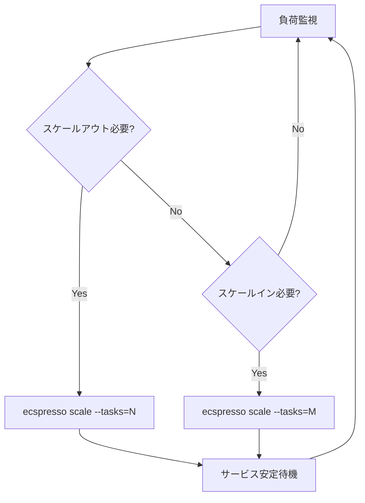
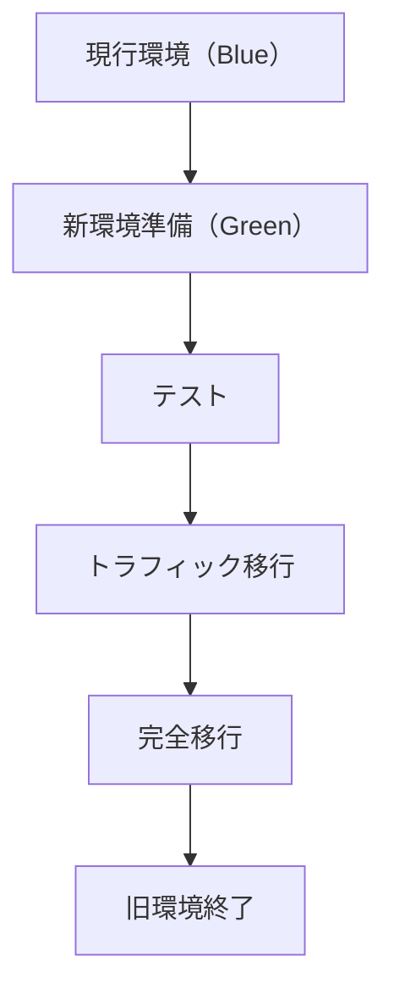
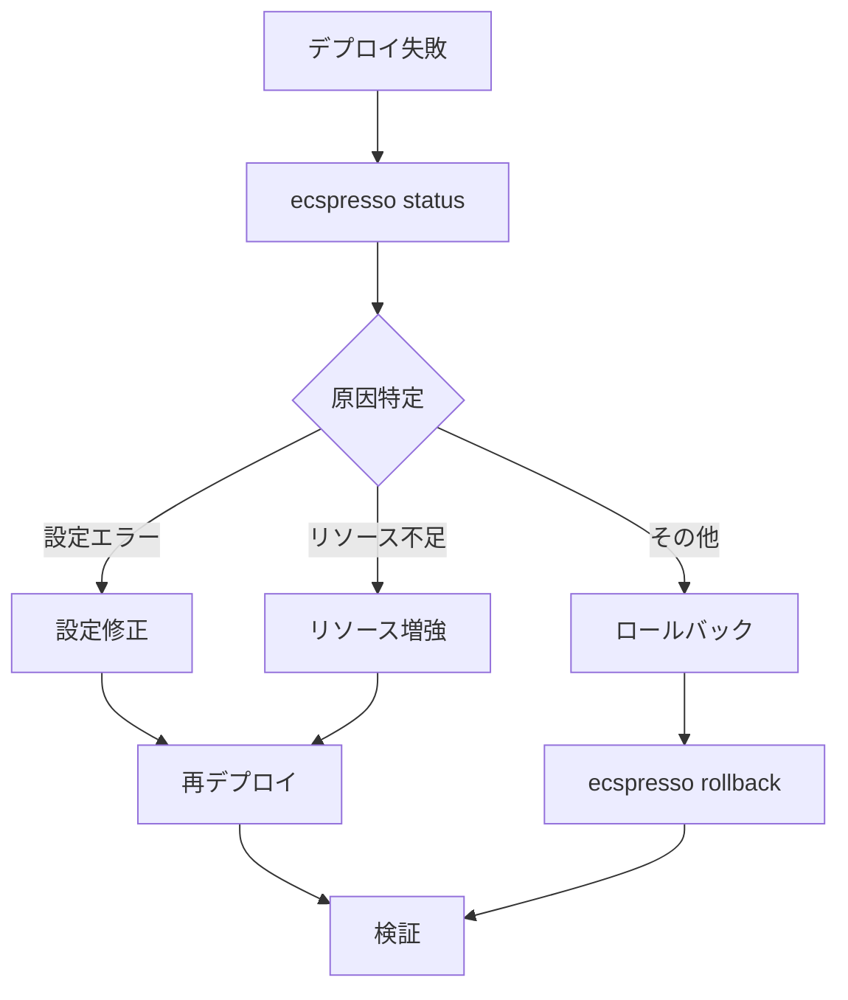

# 大規模サービスの管理

ecspressoを使用して大規模なECSサービスを効率的に管理する方法を説明します。

## スケーリング戦略

### Auto Scaling設定

ecspressoを使用してAuto Scaling設定を管理できます。

```console
# Auto Scalingの設定
$ ecspresso deploy --resume-auto-scaling --auto-scaling-min=5 --auto-scaling-max=50
```

サービス定義での設定例：

```json
{
  "deploymentConfiguration": {
    "maximumPercent": 200,
    "minimumHealthyPercent": 100,
    "deploymentCircuitBreaker": {
      "enable": true,
      "rollback": true
    }
  }
}
```

### スケーリングパターン



## 大規模デプロイの最適化

### デプロイ設定の最適化

大規模サービスでは、デプロイ設定を最適化することが重要です。

```json
{
  "deploymentConfiguration": {
    "maximumPercent": 150,
    "minimumHealthyPercent": 75
  }
}
```

### Blue/Greenデプロイの活用

大規模サービスでは、Blue/Greenデプロイを使用して無停止デプロイを実現できます。

```console
$ ecspresso appspec > appspec.yaml
$ ecspresso deploy
```



## リソース管理

### タスク定義の最適化

大規模サービスでは、タスク定義のリソース設定を最適化することが重要です。

```json
{
  "cpu": "1024",
  "memory": "2048",
  "containerDefinitions": [
    {
      "name": "app",
      "cpu": 900,
      "memory": 1800,
      "memoryReservation": 1024
    }
  ]
}
```

### Fargateスポットの活用

コスト効率を高めるために、Fargateスポットを活用できます。

```json
{
  "capacityProviderStrategy": [
    {
      "capacityProvider": "FARGATE_SPOT",
      "weight": 4,
      "base": 0
    },
    {
      "capacityProvider": "FARGATE",
      "weight": 1,
      "base": 1
    }
  ]
}
```

## モニタリングと監視

### ステータス監視

定期的にサービスのステータスを確認することで、問題を早期に発見できます。

```console
$ ecspresso status --tasks
```

### デプロイ監視

デプロイ中は、サービスの状態を監視することが重要です。

```console
$ ecspresso deploy --wait
$ ecspresso status --events=20
```

## 複数サービスの管理

### サービスグループ化

関連するサービスをグループ化して管理することで、複雑さを軽減できます。

```
project/
├── frontend/
│   ├── ecspresso.yml
│   ├── ecs-service-def.json
│   └── ecs-task-def.json
├── api/
│   ├── ecspresso.yml
│   ├── ecs-service-def.json
│   └── ecs-task-def.json
└── batch/
    ├── ecspresso.yml
    ├── ecs-service-def.json
    └── ecs-task-def.json
```

### 一括デプロイスクリプト

複数のサービスを一括でデプロイするスクリプトの例：

```bash
#!/bin/bash
set -e

SERVICES=("frontend" "api" "batch")

for service in "${SERVICES[@]}"; do
  echo "Deploying $service..."
  cd ./$service
  ecspresso deploy
  cd ..
done

echo "All services deployed successfully!"
```

## 大規模サービスのトラブルシューティング

### デプロイ失敗時の対応

デプロイに失敗した場合の対応フロー：



### サービス安定性の確保

サービスの安定性を確保するためのベストプラクティス：

1. デプロイ前に必ず `ecspresso diff` で変更内容を確認
2. デプロイサーキットブレーカーを有効化
3. ヘルスチェックの設定を最適化
4. 段階的なデプロイ（カナリアデプロイ）の検討
5. 自動ロールバックの設定
