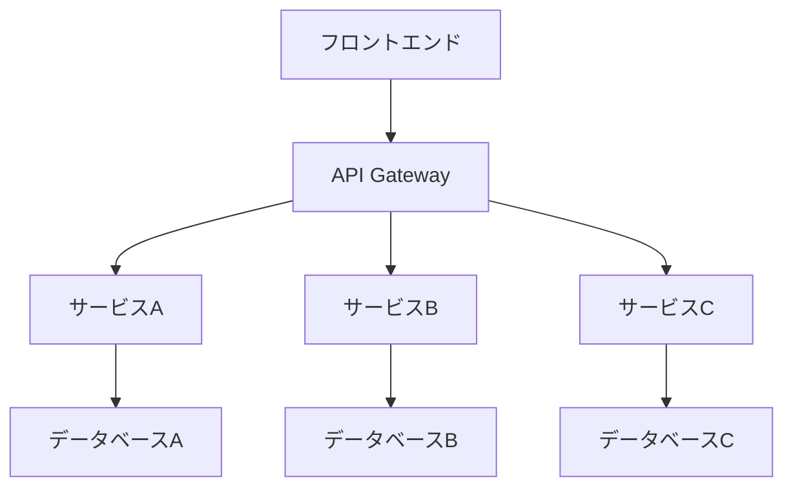
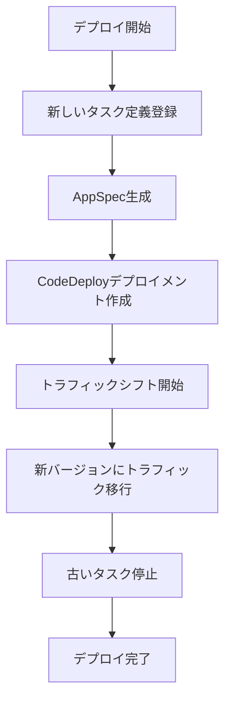

# 大規模サービスの管理

多数のECSサービスを管理する場合や、大規模なマイクロサービスアーキテクチャでecspressoを使用する場合のベストプラクティスを紹介します。

## マイクロサービスアーキテクチャでの利用

マイクロサービスアーキテクチャでは、多数の小さなサービスが連携して動作します。ecspressoを使用して、これらのサービスを効率的に管理する方法を説明します。



### プロジェクト構造

大規模プロジェクトでは、以下のようなディレクトリ構造が効果的です：

```
project/
├── services/
│   ├── service-a/
│   │   ├── ecspresso.yml
│   │   ├── ecs-task-def.json
│   │   └── ecs-service-def.json
│   ├── service-b/
│   │   ├── ecspresso.yml
│   │   ├── ecs-task-def.json
│   │   └── ecs-service-def.json
│   └── service-c/
│       ├── ecspresso.yml
│       ├── ecs-task-def.json
│       └── ecs-service-def.json
└── scripts/
    ├── deploy-all.sh
    └── status-all.sh
```

### 共通設定の管理

複数のサービスで共通の設定を使用する場合、環境変数やJSONテンプレートを活用できます：

```bash
# 共通の環境変数ファイル
cat > common.env << EOF
AWS_REGION=ap-northeast-1
CLUSTER_NAME=production
LOG_GROUP=/ecs/production
EOF

# 各サービスのデプロイ
for service in service-a service-b service-c; do
  cd services/$service
  ecspresso deploy --envfile=../../common.env
  cd ../..
done
```

### Jsonnetによるテンプレート化

Jsonnetを使用して、タスク定義やサービス定義をテンプレート化できます：

```jsonnet
// common-task-def.jsonnet
{
  family: std.extVar('SERVICE_NAME'),
  executionRoleArn: 'arn:aws:iam::123456789012:role/ecsTaskExecutionRole',
  networkMode: 'awsvpc',
  requiresCompatibilities: ['FARGATE'],
  cpu: std.extVar('CPU'),
  memory: std.extVar('MEMORY'),
  containerDefinitions: [
    {
      name: std.extVar('SERVICE_NAME'),
      image: std.extVar('IMAGE'),
      essential: true,
      logConfiguration: {
        logDriver: 'awslogs',
        options: {
          'awslogs-group': std.extVar('LOG_GROUP'),
          'awslogs-region': std.extVar('AWS_REGION'),
          'awslogs-stream-prefix': std.extVar('SERVICE_NAME')
        }
      },
      portMappings: [
        {
          containerPort: std.parseInt(std.extVar('CONTAINER_PORT')),
          hostPort: std.parseInt(std.extVar('CONTAINER_PORT')),
          protocol: 'tcp'
        }
      ],
      environment: std.parseJson(std.extVar('ENVIRONMENT_JSON'))
    }
  ]
}
```

使用例：

```bash
export SERVICE_NAME=service-a
export CPU=256
export MEMORY=512
export IMAGE=your-registry/service-a:latest
export CONTAINER_PORT=8080
export LOG_GROUP=/ecs/production
export AWS_REGION=ap-northeast-1
export ENVIRONMENT_JSON='[{"name":"NODE_ENV","value":"production"}]'

ecspresso register --task-def=common-task-def.jsonnet
```

## ブルー/グリーンデプロイメント

大規模サービスでは、ダウンタイムなしのデプロイが重要です。ecspressoはAWS CodeDeployと統合して、ブルー/グリーンデプロイメントをサポートしています。

### 設定例

```yaml
# ecspresso.yml
region: ap-northeast-1
cluster: your-cluster
service: your-service
service_definition: ecs-service-def.json
task_definition: ecs-task-def.json
timeout: 10m

codedeploy:
  application_name: AppECS-your-cluster-your-service
  deployment_group_name: DgpECS-your-cluster-your-service
  deployment_config_name: CodeDeployDefault.ECSAllAtOnce
  auto_rollback_enabled: true
  auto_rollback_events:
    - DEPLOYMENT_FAILURE
    - DEPLOYMENT_STOP_ON_ALARM
```

```json
// ecs-service-def.json
{
  "deploymentController": {
    "type": "CODE_DEPLOY"
  },
  "loadBalancers": [
    {
      "targetGroupArn": "arn:aws:elasticloadbalancing:ap-northeast-1:123456789012:targetgroup/blue-tg/1234567890123456",
      "containerName": "app",
      "containerPort": 80
    }
  ],
  "desiredCount": 4,
  "networkConfiguration": {
    "awsvpcConfiguration": {
      "subnets": [
        "subnet-12345678",
        "subnet-87654321"
      ],
      "securityGroups": [
        "sg-12345678"
      ],
      "assignPublicIp": "DISABLED"
    }
  }
}
```

### デプロイプロセス



### デプロイコマンド

```bash
# ブルー/グリーンデプロイの実行
ecspresso deploy --rollback-events=DEPLOYMENT_FAILURE

# デプロイ状態の確認
ecspresso status
```

## Auto Scalingの管理

大規模サービスでは、Auto Scalingを使用してトラフィックに応じてタスク数を自動調整することが重要です。

### Auto Scaling設定例

```json
// ecs-service-def.json
{
  "desiredCount": 2,
  "deploymentConfiguration": {
    "maximumPercent": 200,
    "minimumHealthyPercent": 100
  },
  "enableECSManagedTags": true,
  "capacityProviderStrategy": [
    {
      "capacityProvider": "FARGATE_SPOT",
      "weight": 1
    }
  ]
}
```

### Auto Scalingの管理コマンド

```bash
# デプロイ中にAuto Scalingを一時停止
ecspresso deploy --suspend-auto-scaling

# デプロイ後にAuto Scalingを再開し、容量を設定
ecspresso deploy --resume-auto-scaling --auto-scaling-min=2 --auto-scaling-max=10
```

## パフォーマンス最適化

大規模サービスでは、パフォーマンスの最適化が重要です。

### タスク配置戦略

```json
// ecs-service-def.json
{
  "placementStrategy": [
    {
      "type": "spread",
      "field": "attribute:ecs.availability-zone"
    },
    {
      "type": "spread",
      "field": "instanceId"
    }
  ]
}
```

### キャパシティプロバイダー戦略

```json
// ecs-service-def.json
{
  "capacityProviderStrategy": [
    {
      "capacityProvider": "FARGATE",
      "weight": 1,
      "base": 1
    },
    {
      "capacityProvider": "FARGATE_SPOT",
      "weight": 3
    }
  ]
}
```

## 大規模デプロイのモニタリング

大規模サービスのデプロイでは、モニタリングが重要です。

### デプロイ状態の監視

```bash
# デプロイ状態の確認
ecspresso status

# サービスが安定するまで待機
ecspresso wait --timeout=15m
```

### CloudWatchとの統合

CloudWatchアラームを設定して、デプロイの問題を検出できます：

```bash
# CloudWatchアラームが発生した場合に自動ロールバック
ecspresso deploy --rollback-events=DEPLOYMENT_STOP_ON_ALARM
```

## ベストプラクティス

1. **段階的デプロイ**: 大規模サービスでは、すべてのサービスを一度にデプロイするのではなく、段階的にデプロイすることを検討してください。

2. **デプロイ順序**: 依存関係のあるサービスは、適切な順序でデプロイしてください。

3. **リソース管理**: タスク定義のCPUとメモリ設定を最適化して、リソースの無駄を減らしてください。

4. **ロギング戦略**: 適切なロギング設定を行い、問題の診断を容易にしてください。

5. **セキュリティ設定**: IAMロールとセキュリティグループを適切に設定して、最小権限の原則に従ってください。

6. **タスク定義の整理**: 使用されていないタスク定義のリビジョンを定期的に整理してください。

```bash
# 最新の10個のリビジョンを除くすべてのリビジョンを登録解除
for rev in $(ecspresso revisions | tail -n +11); do
  ecspresso deregister --revision=$rev --force
done
```

7. **デプロイタイムアウトの設定**: 大規模サービスでは、デプロイに時間がかかる場合があります。適切なタイムアウト値を設定してください。

```yaml
# ecspresso.yml
timeout: 20m
```
