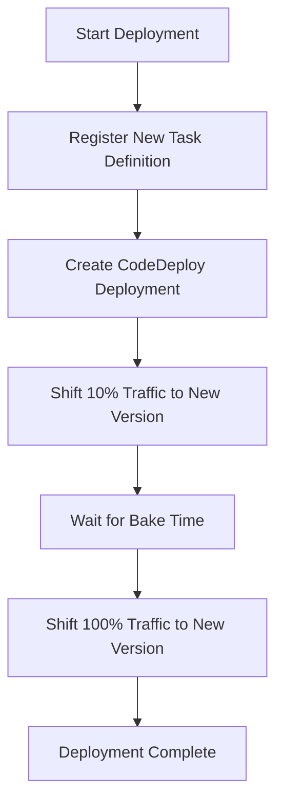

# Managing Large-scale Services

This guide provides best practices for using ecspresso to manage large-scale ECS services.

## Blue/Green Deployments

For large-scale services, blue/green deployments via CodeDeploy provide safer, zero-downtime deployments:

```yaml
# ecspresso.yml
region: us-west-2
cluster: production
service: web-service
task_definition: ecs-task-def.json
service_definition: ecs-service-def.json
code_deploy:
  application_name: AppECS-production-web-service
  deployment_group_name: DgpECS-production-web-service
  deployment_config_name: CodeDeployDefault.ECSAllAtOnce
```

Service definition must include the deployment controller:

```json
{
  "deploymentController": {
    "type": "CODE_DEPLOY"
  },
  "loadBalancers": [
    {
      "targetGroupArn": "arn:aws:elasticloadbalancing:us-west-2:123456789012:targetgroup/blue-tg/abcdef",
      "containerName": "web",
      "containerPort": 80
    }
  ]
}
```

## Auto Scaling Management

ecspresso can manage ECS Auto Scaling during deployments:

```shell
# Suspend auto scaling before deployment
ecspresso deploy --suspend-auto-scaling

# Resume auto scaling after deployment
ecspresso deploy --resume-auto-scaling

# Set specific auto scaling min/max capacity
ecspresso deploy --auto-scaling-min=5 --auto-scaling-max=20
```

## Deployment Strategies

### Canary Deployments with CodeDeploy



Configure with the appropriate deployment config:

```yaml
code_deploy:
  application_name: AppECS-production-web-service
  deployment_group_name: DgpECS-production-web-service
  deployment_config_name: CodeDeployDefault.ECSCanary10Percent5Minutes
```

## Resource Management

For large services, optimize resource usage:

```json
{
  "taskDefinition": {
    "cpu": "1024",
    "memory": "2048",
    "ephemeralStorage": {
      "sizeInGiB": 100
    }
  }
}
```
