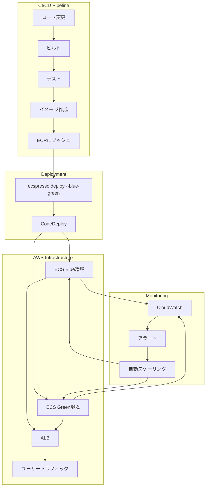

# 大規模サービスの管理

ecspressoを使用して大規模なECSサービスを効率的に管理する方法を説明します。

## マイクロサービスアーキテクチャでの活用

多数のマイクロサービスを管理する場合、各サービスごとにecspressoの設定を用意することで、独立したデプロイが可能になります。v2では、Jsonnet形式の設定ファイルもサポートされ、より柔軟な設定管理が可能になりました。

```
.
├── service-a/
│   ├── ecspresso.yml (または ecspresso.jsonnet)
│   ├── ecs-task-def.json (または ecs-task-def.jsonnet)
│   └── ecs-service-def.json (または ecs-service-def.jsonnet)
├── service-b/
│   ├── ecspresso.yml (または ecspresso.jsonnet)
│   ├── ecs-task-def.json (または ecs-task-def.jsonnet)
│   └── ecs-service-def.json (または ecs-service-def.jsonnet)
└── service-c/
    ├── ecspresso.yml (または ecspresso.jsonnet)
    ├── ecs-task-def.json (または ecs-task-def.jsonnet)
    └── ecs-service-def.json (または ecs-service-def.jsonnet)
```

v2では、共通のJsonnetライブラリを使用して設定を共有することもできます：

```
.
├── lib/
│   ├── base-task-def.libsonnet
│   └── base-service-def.libsonnet
├── service-a/
│   ├── ecspresso.jsonnet
│   ├── ecs-task-def.jsonnet
│   └── ecs-service-def.jsonnet
├── service-b/
...
```

## 共通設定の再利用

複数のサービスで共通の設定を再利用するには、テンプレート関数やプラグインを活用します。v2では、Jsonnetサポートが追加され、より柔軟な設定の再利用が可能になりました。

### テンプレート関数による再利用

例えば、共通のタスク実行ロールやロギング設定を持つ基本タスク定義テンプレートを作成し、各サービスで拡張できます：

```json
{
  "executionRoleArn": "{{ tfstate `aws_iam_role.ecs_task_execution.arn` }}",
  "taskRoleArn": "{{ tfstate `aws_iam_role.ecs_task.arn` }}",
  "family": "{{ env `SERVICE_NAME` }}",
  "networkMode": "awsvpc",
  "requiresCompatibilities": ["FARGATE"],
  "cpu": "{{ env `TASK_CPU` }}",
  "memory": "{{ env `TASK_MEMORY` }}",
  "containerDefinitions": [
    {
      "name": "{{ env `SERVICE_NAME` }}",
      "image": "{{ env `ECR_REPOSITORY_URL` }}/{{ env `SERVICE_NAME` }}:{{ env `IMAGE_TAG` }}",
      "logConfiguration": {
        "logDriver": "awslogs",
        "options": {
          "awslogs-group": "/ecs/{{ env `SERVICE_NAME` }}",
          "awslogs-region": "{{ env `AWS_REGION` }}",
          "awslogs-stream-prefix": "ecs"
        }
      }
    }
  ]
}
```

### Jsonnetによる再利用（v2）

v2では、Jsonnetを使用してより柔軟な設定の再利用が可能になりました：

```jsonnet
// base-task-def.libsonnet
{
  createTaskDefinition(serviceName, cpu, memory, image):: {
    executionRoleArn: "arn:aws:iam::123456789012:role/ecsTaskExecutionRole",
    taskRoleArn: "arn:aws:iam::123456789012:role/ecsTaskRole",
    family: serviceName,
    networkMode: "awsvpc",
    requiresCompatibilities: ["FARGATE"],
    cpu: cpu,
    memory: memory,
    containerDefinitions: [
      {
        name: serviceName,
        image: image,
        logConfiguration: {
          logDriver: "awslogs",
          options: {
            "awslogs-group": "/ecs/" + serviceName,
            "awslogs-region": "ap-northeast-1",
            "awslogs-stream-prefix": "ecs"
          }
        }
      }
    ]
  }
}
```

## スケーリング戦略

大規模サービスでは、適切なスケーリング戦略が重要です。ecspressoでは、サービス定義でAuto Scalingの設定を管理できます。

```json
{
  "deploymentConfiguration": {
    "deploymentCircuitBreaker": {
      "enable": true,
      "rollback": true
    },
    "maximumPercent": 200,
    "minimumHealthyPercent": 100
  },
  "desiredCount": 10,
  "enableECSManagedTags": true,
  "healthCheckGracePeriodSeconds": 60,
  "launchType": "FARGATE"
}
```

さらに、Application Auto Scalingを設定して、トラフィックに応じて自動的にスケールするようにできます：

```console
$ aws application-autoscaling register-scalable-target \
  --service-namespace ecs \
  --scalable-dimension ecs:service:DesiredCount \
  --resource-id service/my-cluster/my-service \
  --min-capacity 5 \
  --max-capacity 50

$ aws application-autoscaling put-scaling-policy \
  --policy-name cpu-tracking-scaling-policy \
  --service-namespace ecs \
  --scalable-dimension ecs:service:DesiredCount \
  --resource-id service/my-cluster/my-service \
  --policy-type TargetTrackingScaling \
  --target-tracking-scaling-policy-configuration '{ 
    "TargetValue": 70.0, 
    "PredefinedMetricSpecification": { 
      "PredefinedMetricType": "ECSServiceAverageCPUUtilization" 
    }
  }'
```

## Blue/Greenデプロイの活用

大規模サービスでは、ダウンタイムを最小限に抑えるためにBlue/Greenデプロイを活用することが重要です。ecspressoは、AWS CodeDeployを使用したBlue/Greenデプロイをサポートしています。

```console
$ ecspresso deploy --blue-green
```

サービス定義では、Blue/Greenデプロイの設定を指定します：

```json
{
  "deploymentController": {
    "type": "CODE_DEPLOY"
  },
  "loadBalancers": [
    {
      "containerName": "app",
      "containerPort": 80,
      "targetGroupArn": "{{ tfstate `aws_lb_target_group.blue.arn` }}"
    }
  ]
}
```

## 大規模サービス管理のアーキテクチャ図

以下は大規模サービスの管理アーキテクチャを示しています：



## パフォーマンスチューニング

大規模サービスでは、パフォーマンスチューニングが重要です。ecspressoを使用して、以下の設定を最適化できます：

1. **タスク定義のCPUとメモリ**: ワークロードに適したCPUとメモリの割り当て
2. **コンテナのヘルスチェック**: 適切なヘルスチェック設定
3. **デプロイ設定**: 適切な`maximumPercent`と`minimumHealthyPercent`の設定
4. **サーキットブレーカー**: デプロイ失敗時の自動ロールバック

```json
{
  "deploymentConfiguration": {
    "deploymentCircuitBreaker": {
      "enable": true,
      "rollback": true
    },
    "maximumPercent": 150,
    "minimumHealthyPercent": 100
  }
}
```

これらの設定を適切に調整することで、大規模サービスでも安定したデプロイと運用が可能になります。
