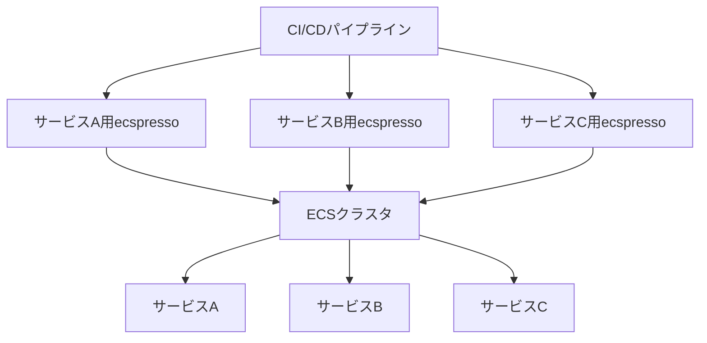

# 大規模サービスの管理

ecspressoを使用して大規模サービスを効率的に管理する方法を説明します。

## Application Auto Scalingの管理

Application Auto Scalingを使用するECSサービスでは、`ecspresso scale`コマンドで自動スケーリングの最小値と最大値を調整できます。

```console
$ ecspresso scale --tasks 5 --auto-scaling-min 5 --auto-scaling-max 20
```

`ecspresso deploy`と`scale`は自動スケーリングの一時停止と再開ができます。

- `--suspend-auto-scaling` - 一時停止状態をtrueに設定
- `--resume-auto-scaling` - 一時停止状態をfalseに設定

## Fargate Spotの活用

Fargate Spotを使用するには、サービス定義に`capacityProviderStrategy`を定義します。

```json
{
  "capacityProviderStrategy": [
    {
      "base": 1,
      "capacityProvider": "FARGATE",
      "weight": 1
    },
    {
      "base": 0,
      "capacityProvider": "FARGATE_SPOT",
      "weight": 1
    }
  ]
}
```

これにより、基本的なタスクはFARGATEで実行され、スケールアウト時の追加タスクはFARGATE_SPOTで実行されます。

## Blue/Greenデプロイメントの活用

大規模サービスでは、ダウンタイムを最小限に抑えるためにBlue/Greenデプロイメントを活用できます。

```json
{
  "deploymentController": {
    "type": "CODE_DEPLOY"
  }
}
```

AppSpecファイルを使用して、トラフィックの移行方法を制御できます。

```console
$ ecspresso appspec > appspec.yaml
```

```yaml
version: 0.0
Resources:
  - TargetService:
      Type: AWS::ECS::Service
      Properties:
        TaskDefinition: <TASK_DEFINITION>
        LoadBalancerInfo:
          ContainerName: "nginx"
          ContainerPort: 80
        PlatformVersion: "1.4.0"
Hooks:
  - BeforeInstall: "LambdaFunctionToValidateBeforeInstall"
  - AfterInstall: "LambdaFunctionToValidateAfterInstall"
  - AfterAllowTestTraffic: "LambdaFunctionToValidateAfterTestTrafficStarts"
  - BeforeAllowTraffic: "LambdaFunctionToValidateBeforeAllowingProductionTraffic"
  - AfterAllowTraffic: "LambdaFunctionToValidateAfterAllowingProductionTraffic"
```

## マイクロサービスアーキテクチャでの運用



マイクロサービスアーキテクチャでは、各サービスごとに別々の設定ファイルを用意し、独立してデプロイできます。

```
services/
├── service-a/
│   ├── ecspresso.yml
│   ├── ecs-task-def.json
│   └── ecs-service-def.json
├── service-b/
│   ├── ecspresso.yml
│   ├── ecs-task-def.json
│   └── ecs-service-def.json
└── service-c/
    ├── ecspresso.yml
    ├── ecs-task-def.json
    └── ecs-service-def.json
```

## リソース管理の最適化

大規模サービスでは、リソースの最適化が重要です。

### タスク定義の最適化

```json
{
  "cpu": "256",
  "memory": "512",
  "containerDefinitions": [
    {
      "name": "app",
      "cpu": 0,
      "memory": 256,
      "essential": true
    },
    {
      "name": "sidecar",
      "cpu": 0,
      "memory": 128,
      "essential": false
    }
  ]
}
```

### ヘルスチェックの最適化

```json
{
  "containerDefinitions": [
    {
      "name": "app",
      "healthCheck": {
        "command": [
          "CMD-SHELL",
          "curl -f http://localhost:8080/health || exit 1"
        ],
        "interval": 30,
        "timeout": 5,
        "retries": 3,
        "startPeriod": 60
      }
    }
  ]
}
```

## 注意事項

- 大規模サービスでは、デプロイ前に`verify`コマンドを実行して設定の問題を早期に発見することをお勧めします。
- Blue/Greenデプロイメントを使用する場合、ロールバックはCodeDeployコンソールから行う必要があります。
- Fargate Spotを使用する場合、スポットインスタンスの中断に対応できるようにアプリケーションを設計する必要があります。
