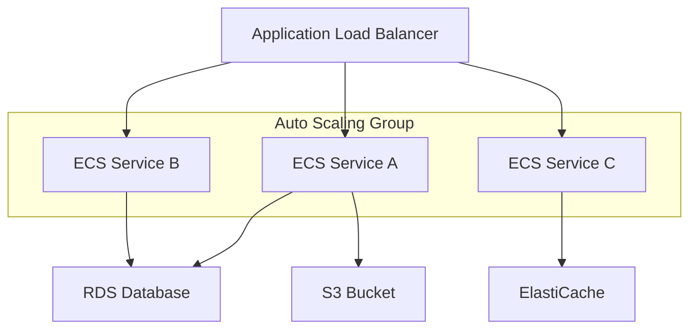

# 大規模サービスの管理

ecspressoを使用して大規模なECSサービスを効率的に管理する方法を紹介します。

## ブルー/グリーンデプロイメント

大規模サービスでは、ダウンタイムを最小限に抑えるためにブルー/グリーンデプロイメントが重要です。

### CodeDeployの設定

```yaml
# ecspresso.yml
region: ap-northeast-1
cluster: production
service: myapp
service_definition: ecs-service-def.json
task_definition: ecs-task-def.json
codedeploy:
  application_name: AppECS-production-myapp
  deployment_group_name: DgpECS-production-myapp
  deployment_config_name: CodeDeployDefault.ECSAllAtOnce
```

サービス定義にデプロイメントコントローラーとロードバランサー設定を追加：

```json
{
  "deploymentController": {
    "type": "CODE_DEPLOY"
  },
  "loadBalancers": [
    {
      "targetGroupArn": "arn:aws:elasticloadbalancing:ap-northeast-1:123456789012:targetgroup/blue/1234567890123456",
      "containerName": "app",
      "containerPort": 80
    }
  ]
}
```

AppSpecの設定例：

```yaml
# appspec.yml
version: 0.0
Resources:
  - TargetService:
      Type: AWS::ECS::Service
      Properties:
        TaskDefinition: <TASK_DEFINITION>
        LoadBalancerInfo:
          ContainerName: "app"
          ContainerPort: 80
        PlatformVersion: "1.4.0"
Hooks:
  - BeforeInstall: "LambdaFunctionToValidateBeforeInstall"
  - AfterInstall: "LambdaFunctionToValidateAfterTraffic"
  - AfterAllowTestTraffic: "LambdaFunctionToValidateAfterTestTrafficStarts"
  - BeforeAllowTraffic: "LambdaFunctionToValidateBeforeAllowingProductionTraffic"
  - AfterAllowTraffic: "LambdaFunctionToValidateAfterAllowingProductionTraffic"
```

### デプロイの実行

```bash
ecspresso deploy --rollback-events DEPLOYMENT_FAILURE
```

## オートスケーリングの管理

大規模サービスでは、需要に応じて自動的にスケールする能力が重要です。

### オートスケーリングの設定

```bash
# オートスケーリングの設定を変更
ecspresso deploy --auto-scaling-min 5 --auto-scaling-max 20
```

### デプロイ中のオートスケーリング管理

```bash
# デプロイ中にオートスケーリングを一時停止
ecspresso deploy --suspend-auto-scaling

# デプロイ後にオートスケーリングを再開
ecspresso deploy --resume-auto-scaling
```

## マイクロサービスアーキテクチャの管理

複数のマイクロサービスを管理する場合の構成例：

```
project/
├── common/
│   ├── env/
│   │   ├── dev.env
│   │   ├── staging.env
│   │   └── production.env
├── service-a/
│   ├── ecspresso.yml
│   ├── ecs-service-def.json
│   └── ecs-task-def.json
├── service-b/
│   ├── ecspresso.yml
│   ├── ecs-service-def.json
│   └── ecs-task-def.json
└── deploy.sh
```

デプロイスクリプト例：

```bash
#!/bin/bash
# deploy.sh
ENV=$1
SERVICES=${@:2}

if [ -z "$ENV" ]; then
  echo "Usage: $0 <environment> [service...]"
  exit 1
fi

if [ -z "$SERVICES" ]; then
  SERVICES=$(ls -d service-*)
fi

for SERVICE in $SERVICES; do
  echo "Deploying $SERVICE to $ENV environment..."
  cd $SERVICE
  ecspresso deploy --envfile ../common/env/$ENV.env
  cd ..
done
```

## 大規模デプロイのモニタリング

大規模サービスのデプロイを監視するためのコマンド：

```bash
# デプロイステータスの確認
ecspresso status --events 20

# デプロイが完了するまで待機
ecspresso wait
```

## パフォーマンス最適化

大規模サービスのパフォーマンスを最適化するためのヒント：

1. **タスク配置戦略の最適化**：サービス定義で適切な配置戦略を設定
2. **キャパシティプロバイダー戦略の活用**：Fargateスポットインスタンスとオンデマンドインスタンスの組み合わせ
3. **サービスディスカバリの活用**：サービス間通信の効率化
4. **ヘルスチェックの最適化**：適切なヘルスチェックグレースピリオドの設定
5. **ロギングとモニタリングの強化**：CloudWatchとの統合

## 大規模サービスのアーキテクチャ例


