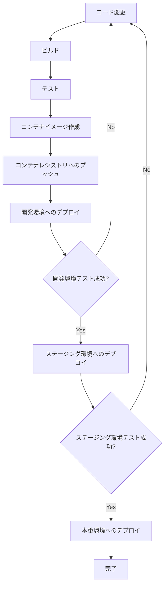

# 複数環境の管理

多くの場合、アプリケーションは開発環境、ステージング環境、本番環境など、複数の環境にデプロイされます。ecspressoを使用して、これらの環境を効率的に管理する方法を説明します。

## 環境ごとの設定ファイル

複数環境を管理する最も基本的な方法は、環境ごとに別々の設定ファイルを用意することです：

```
.
├── ecspresso.dev.yml     # 開発環境用設定
├── ecspresso.staging.yml # ステージング環境用設定
└── ecspresso.prod.yml    # 本番環境用設定
```

各環境に対してコマンドを実行する例：

```console
# 開発環境へのデプロイ
$ ecspresso deploy --config ecspresso.dev.yml

# ステージング環境へのデプロイ
$ ecspresso deploy --config ecspresso.staging.yml

# 本番環境へのデプロイ
$ ecspresso deploy --config ecspresso.prod.yml
```

## 環境変数ファイルの使用

同じ設定ファイルを使用しながら、環境ごとに異なる値を設定するには、環境変数ファイルを使用します：

```
.
├── ecspresso.yml  # 共通設定
├── .env.dev       # 開発環境用環境変数
├── .env.staging   # ステージング環境用環境変数
└── .env.prod      # 本番環境用環境変数
```

環境変数ファイルの例（`.env.dev`）：

```
CLUSTER_NAME=app-dev
SERVICE_NAME=api-dev
DESIRED_COUNT=1
MIN_CAPACITY=1
MAX_CAPACITY=2
```

環境変数ファイルの例（`.env.prod`）：

```
CLUSTER_NAME=app-prod
SERVICE_NAME=api-prod
DESIRED_COUNT=3
MIN_CAPACITY=2
MAX_CAPACITY=10
```

タスク定義での環境変数の使用例：

```json
{
  "family": "{{ env `SERVICE_NAME` }}",
  "containerDefinitions": [
    {
      "name": "app",
      "image": "123456789012.dkr.ecr.ap-northeast-1.amazonaws.com/{{ env `SERVICE_NAME` }}:latest",
      "essential": true
    }
  ]
}
```

サービス定義での環境変数の使用例：

```json
{
  "cluster": "{{ env `CLUSTER_NAME` }}",
  "serviceName": "{{ env `SERVICE_NAME` }}",
  "desiredCount": {{ env `DESIRED_COUNT` }},
  "deploymentConfiguration": {
    "minimumHealthyPercent": 100,
    "maximumPercent": 200
  }
}
```

環境変数ファイルを使用したデプロイ例：

```console
# 開発環境へのデプロイ
$ ecspresso deploy --config ecspresso.yml --envfile .env.dev

# ステージング環境へのデプロイ
$ ecspresso deploy --config ecspresso.yml --envfile .env.staging

# 本番環境へのデプロイ
$ ecspresso deploy --config ecspresso.yml --envfile .env.prod
```

## テンプレート関数の活用

ecspressoは、設定ファイル内でテンプレート関数を使用できます。これにより、環境に応じた値を動的に設定できます：

### 環境変数の参照

```json
{
  "family": "{{ env `SERVICE_NAME` }}",
  "containerDefinitions": [
    {
      "name": "app",
      "image": "{{ must_env `ECR_REPOSITORY` }}:{{ must_env `IMAGE_TAG` }}",
      "essential": true
    }
  ]
}
```

### AWS Systems Manager パラメータストアの値の参照

```json
{
  "containerDefinitions": [
    {
      "name": "app",
      "environment": [
        {
          "name": "DATABASE_URL",
          "value": "{{ ssm `/app/{{ env `ENV` }}/database_url` }}"
        },
        {
          "name": "API_KEY",
          "value": "{{ ssm `/app/{{ env `ENV` }}/api_key` }}"
        }
      ]
    }
  ]
}
```

### CloudFormation出力値の参照

```json
{
  "networkConfiguration": {
    "awsvpcConfiguration": {
      "subnets": [
        "{{ cfn_output `NetworkStack-{{ env `ENV` }}` `PrivateSubnet1` }}",
        "{{ cfn_output `NetworkStack-{{ env `ENV` }}` `PrivateSubnet2` }}"
      ],
      "securityGroups": [
        "{{ cfn_output `SecurityStack-{{ env `ENV` }}` `AppSecurityGroup` }}"
      ]
    }
  }
}
```

## 環境ごとのディレクトリ構造

より複雑なプロジェクトでは、環境ごとにディレクトリを分けることも効果的です：

```
.
├── common/
│   ├── task-definition-base.json  # 共通のタスク定義
│   └── service-definition-base.json  # 共通のサービス定義
├── dev/
│   ├── ecspresso.yml
│   ├── ecs-task-def.json
│   ├── ecs-service-def.json
│   └── .env
├── staging/
│   ├── ecspresso.yml
│   ├── ecs-task-def.json
│   ├── ecs-service-def.json
│   └── .env
└── prod/
    ├── ecspresso.yml
    ├── ecs-task-def.json
    ├── ecs-service-def.json
    └── .env
```

## 複数環境のデプロイフロー

複数環境へのデプロイフローの例：



## 環境ごとのデプロイ戦略

環境によって異なるデプロイ戦略を採用することも可能です：

1. 開発環境：迅速なデプロイを優先
   ```console
   $ ecspresso deploy --config ecspresso.dev.yml --force-new-deployment
   ```

2. ステージング環境：本番環境と同じ設定でテスト
   ```console
   $ ecspresso deploy --config ecspresso.staging.yml --rollback-events DEPLOYMENT_FAILURE
   ```

3. 本番環境：安全性を最優先
   ```console
   $ ecspresso deploy --config ecspresso.prod.yml --rollback-events DEPLOYMENT_FAILURE --suspend-auto-scaling
   ```

## 注意事項

- 環境変数ファイルには機密情報を含めないようにしてください
- 機密情報はAWS Systems Manager パラメータストアやAWS Secrets Managerを使用して管理することをお勧めします
- 本番環境へのデプロイ権限は制限することをお勧めします
- 環境ごとに異なるIAMロールを使用することで、セキュリティを強化できます
