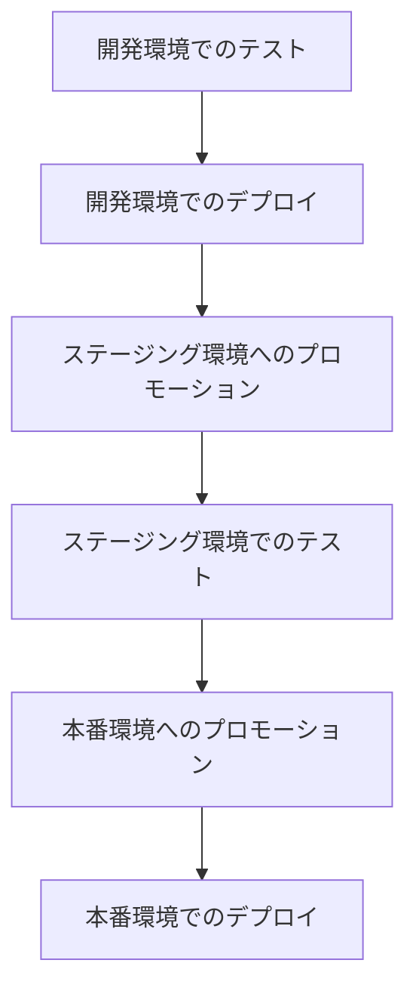

# 複数環境の管理

ecspressoを使用して、開発（dev）、ステージング（staging）、本番（production）など、複数の環境でECSサービスを管理する方法を説明します。

## 環境ごとの設定管理

複数環境を管理するための一般的なアプローチは以下の通りです：

1. **設定ファイルの分離**: 環境ごとに異なる設定ファイルを使用
2. **環境変数の活用**: 環境変数を使用して設定を動的に変更
3. **Jsonnetテンプレート**: 共通のテンプレートから環境固有の設定を生成

## 設定ファイルの分離

環境ごとに異なる設定ファイルを使用する方法です：

```
project/
├── ecspresso-dev.yml
├── ecspresso-staging.yml
├── ecspresso-prod.yml
├── ecs-task-def-dev.json
├── ecs-task-def-staging.json
├── ecs-task-def-prod.json
├── ecs-service-def-dev.json
├── ecs-service-def-staging.json
└── ecs-service-def-prod.json
```

各環境用の設定ファイルの例：

```yaml
# ecspresso-dev.yml
region: ap-northeast-1
cluster: dev-cluster
service: your-service
service_definition: ecs-service-def-dev.json
task_definition: ecs-task-def-dev.json
timeout: 5m
```

```yaml
# ecspresso-prod.yml
region: ap-northeast-1
cluster: prod-cluster
service: your-service
service_definition: ecs-service-def-prod.json
task_definition: ecs-task-def-prod.json
timeout: 10m
```

使用例：

```bash
# 開発環境にデプロイ
ecspresso deploy --config=ecspresso-dev.yml

# 本番環境にデプロイ
ecspresso deploy --config=ecspresso-prod.yml
```

## 環境変数の活用

環境変数ファイル（`.env`）を使用して、環境ごとの設定を管理する方法です：

```
project/
├── ecspresso.yml
├── ecs-task-def.json
├── ecs-service-def.json
├── dev.env
├── staging.env
└── prod.env
```

環境変数ファイルの例：

```bash
# dev.env
CLUSTER_NAME=dev-cluster
SERVICE_NAME=your-service-dev
DESIRED_COUNT=1
CONTAINER_IMAGE=your-registry/your-service:dev
MEMORY=512
CPU=256
LOG_GROUP=/ecs/dev/your-service
```

```bash
# prod.env
CLUSTER_NAME=prod-cluster
SERVICE_NAME=your-service
DESIRED_COUNT=3
CONTAINER_IMAGE=your-registry/your-service:latest
MEMORY=1024
CPU=512
LOG_GROUP=/ecs/prod/your-service
```

タスク定義の例（環境変数を参照）：

```json
{
  "family": "${SERVICE_NAME}",
  "executionRoleArn": "arn:aws:iam::123456789012:role/ecsTaskExecutionRole",
  "cpu": "${CPU}",
  "memory": "${MEMORY}",
  "containerDefinitions": [
    {
      "name": "app",
      "image": "${CONTAINER_IMAGE}",
      "essential": true,
      "logConfiguration": {
        "logDriver": "awslogs",
        "options": {
          "awslogs-group": "${LOG_GROUP}",
          "awslogs-region": "ap-northeast-1",
          "awslogs-stream-prefix": "ecs"
        }
      }
    }
  ]
}
```

使用例：

```bash
# 開発環境にデプロイ
ecspresso deploy --envfile=dev.env

# 本番環境にデプロイ
ecspresso deploy --envfile=prod.env
```

## Jsonnetテンプレート

Jsonnetを使用して、共通のテンプレートから環境固有の設定を生成する方法です：

```
project/
├── ecspresso.yml
├── task-def.jsonnet
├── service-def.jsonnet
├── dev.libsonnet
├── staging.libsonnet
└── prod.libsonnet
```

Jsonnetテンプレートの例：

```jsonnet
// task-def.jsonnet
local env = import std.extVar('env_file');

{
  family: env.serviceName,
  executionRoleArn: env.executionRoleArn,
  cpu: env.cpu,
  memory: env.memory,
  containerDefinitions: [
    {
      name: "app",
      image: env.containerImage,
      essential: true,
      logConfiguration: {
        logDriver: "awslogs",
        options: {
          "awslogs-group": env.logGroup,
          "awslogs-region": env.region,
          "awslogs-stream-prefix": "ecs"
        }
      },
      portMappings: [
        {
          containerPort: env.containerPort,
          hostPort: env.containerPort,
          protocol: "tcp"
        }
      ],
      environment: env.environment
    }
  ]
}
```

環境設定ファイルの例：

```jsonnet
// dev.libsonnet
{
  region: "ap-northeast-1",
  clusterName: "dev-cluster",
  serviceName: "your-service-dev",
  executionRoleArn: "arn:aws:iam::123456789012:role/ecsTaskExecutionRole",
  cpu: "256",
  memory: "512",
  containerImage: "your-registry/your-service:dev",
  containerPort: 8080,
  logGroup: "/ecs/dev/your-service",
  desiredCount: 1,
  environment: [
    {
      name: "NODE_ENV",
      value: "development"
    }
  ]
}
```

```jsonnet
// prod.libsonnet
{
  region: "ap-northeast-1",
  clusterName: "prod-cluster",
  serviceName: "your-service",
  executionRoleArn: "arn:aws:iam::123456789012:role/ecsTaskExecutionRole",
  cpu: "512",
  memory: "1024",
  containerImage: "your-registry/your-service:latest",
  containerPort: 8080,
  logGroup: "/ecs/prod/your-service",
  desiredCount: 3,
  environment: [
    {
      name: "NODE_ENV",
      value: "production"
    }
  ]
}
```

使用例：

```bash
# 開発環境のタスク定義をレンダリング
ecspresso render --task-def=task-def.jsonnet --ext-str=env_file=dev.libsonnet > task-def-dev.json

# 開発環境にデプロイ
ecspresso deploy --task-def=task-def.jsonnet --ext-str=env_file=dev.libsonnet

# 本番環境にデプロイ
ecspresso deploy --task-def=task-def.jsonnet --ext-str=env_file=prod.libsonnet
```

## 環境間の移行

アプリケーションを開発環境からステージング環境、本番環境へと移行する際のワークフローを示します：



### 環境間のプロモーションスクリプト

```bash
#!/bin/bash
# promote.sh
# 使用方法: ./promote.sh dev staging

SOURCE_ENV=$1
TARGET_ENV=$2

if [ -z "$SOURCE_ENV" ] || [ -z "$TARGET_ENV" ]; then
  echo "使用方法: ./promote.sh <source_env> <target_env>"
  exit 1
fi

# ソース環境のタスク定義をレンダリング
ecspresso render --task-def=task-def.jsonnet --ext-str=env_file=${SOURCE_ENV}.libsonnet > task-def-${SOURCE_ENV}.json

# ターゲット環境用にタスク定義を修正
# 例: イメージタグを変更
SOURCE_IMAGE=$(jq -r '.containerDefinitions[0].image' task-def-${SOURCE_ENV}.json)
TARGET_IMAGE=$(echo $SOURCE_IMAGE | sed "s/:.*/:${TARGET_ENV}/")

# ターゲット環境のタスク定義を生成
cat task-def-${SOURCE_ENV}.json | jq --arg image "$TARGET_IMAGE" '.containerDefinitions[0].image = $image' > task-def-${TARGET_ENV}.json

# ターゲット環境にデプロイ
ecspresso deploy --config=ecspresso-${TARGET_ENV}.yml --task-def=task-def-${TARGET_ENV}.json
```

## 環境固有の設定

環境ごとに異なる設定が必要な場合があります。以下に一般的な違いを示します：

| 設定 | 開発環境 | ステージング環境 | 本番環境 |
|------|---------|----------------|----------|
| タスク数 | 1 | 2 | 3以上 |
| CPU | 256 | 512 | 1024 |
| メモリ | 512 | 1024 | 2048 |
| Auto Scaling | 無効 | 有効（制限付き） | 有効（広範囲） |
| ロギング | 詳細 | 標準 | 最小限 |
| アラーム | 最小限 | 標準 | 広範囲 |

## 環境固有のデプロイオプション

環境ごとに異なるデプロイオプションを使用することもできます：

```bash
# 開発環境（高速デプロイ）
ecspresso deploy --config=ecspresso-dev.yml --force-new-deployment

# ステージング環境（標準デプロイ）
ecspresso deploy --config=ecspresso-staging.yml

# 本番環境（慎重なデプロイ）
ecspresso deploy --config=ecspresso-prod.yml --wait-until=deployed --rollback-events=DEPLOYMENT_FAILURE
```

## 複数AWSアカウントの管理

大規模な組織では、環境ごとに異なるAWSアカウントを使用することがあります。ecspressoでは、`--assume-role-arn`オプションを使用して、異なるアカウントのロールを引き受けることができます：

```bash
# 開発アカウントにデプロイ
ecspresso deploy --config=ecspresso-dev.yml

# 本番アカウントにデプロイ（ロールの引き受け）
ecspresso deploy --config=ecspresso-prod.yml --assume-role-arn=arn:aws:iam::123456789012:role/DeployRole
```

## ベストプラクティス

1. **設定の一元管理**: 環境固有の設定を一元管理し、重複を避ける
2. **環境変数の活用**: 環境変数を使用して、環境間の違いを管理
3. **テンプレート化**: Jsonnetなどのテンプレートを使用して、設定を生成
4. **バージョン管理**: すべての設定ファイルをバージョン管理システムで管理
5. **自動化**: 環境間のプロモーションを自動化
6. **テスト**: 各環境でのデプロイ後にテストを実行
7. **ロールバック計画**: 問題が発生した場合のロールバック計画を用意
