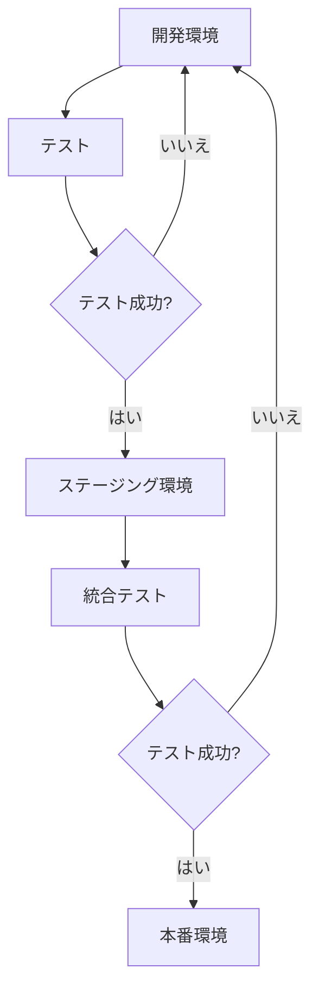

# 複数環境での運用

ecspressoを使用して、開発、ステージング、本番などの複数環境でECSサービスを管理する方法を説明します。

## 環境ごとの設定ファイル

### ディレクトリ構造

複数環境を管理するための一般的なディレクトリ構造：

```
.
├── common/
│   ├── task-def-base.json
│   └── service-def-base.json
├── dev/
│   ├── ecspresso.yml
│   ├── task-def.json
│   └── service-def.json
├── staging/
│   ├── ecspresso.yml
│   ├── task-def.json
│   └── service-def.json
└── prod/
    ├── ecspresso.yml
    ├── task-def.json
    └── service-def.json
```

### 環境ごとの設定ファイル例

開発環境の設定ファイル（dev/ecspresso.yml）：

```yaml
region: ap-northeast-1
cluster: dev-cluster
service: myapp-dev
service_definition: service-def.json
task_definition: task-def.json
timeout: 10m
```

本番環境の設定ファイル（prod/ecspresso.yml）：

```yaml
region: ap-northeast-1
cluster: prod-cluster
service: myapp-prod
service_definition: service-def.json
task_definition: task-def.json
timeout: 15m
```

## 環境変数を使用した設定の切り替え

### 環境ファイルの使用

環境ごとに異なる環境ファイルを作成：

dev.env:
```
MYSQL_HOST=dev-db.example.com
MYSQL_USER=devuser
MYSQL_PASSWORD=devpass
```

prod.env:
```
MYSQL_HOST=prod-db.example.com
MYSQL_USER=produser
MYSQL_PASSWORD=prodpass
```

環境ファイルを使用したデプロイ：

```bash
# 開発環境
cd dev/
ecspresso deploy --envfile=../dev.env

# 本番環境
cd prod/
ecspresso deploy --envfile=../prod.env
```

### JSONnetを使用した高度な設定管理

task-def.jsonnet:

```jsonnet
local env = std.extVar('env');

{
  family: 'myapp-' + env,
  containerDefinitions: [
    {
      name: 'app',
      image: 'myapp:latest',
      environment: [
        {
          name: 'ENV',
          value: env
        },
        {
          name: 'DB_HOST',
          value: if env == 'prod' then 'prod-db.example.com' else 'dev-db.example.com'
        }
      ]
    }
  ]
}
```

Jsonnetを使用したデプロイ：

```bash
# 開発環境
ecspresso deploy --ext-str=env=dev

# 本番環境
ecspresso deploy --ext-str=env=prod
```

## 環境間のデプロイフロー



## 環境ごとのスケーリング設定

開発環境（最小リソース）：

```bash
cd dev/
ecspresso deploy --tasks=1
```

ステージング環境（中程度のリソース）：

```bash
cd staging/
ecspresso deploy --tasks=2
```

本番環境（Auto Scaling）：

```bash
cd prod/
ecspresso deploy --resume-auto-scaling=true --auto-scaling-min=2 --auto-scaling-max=10
```
