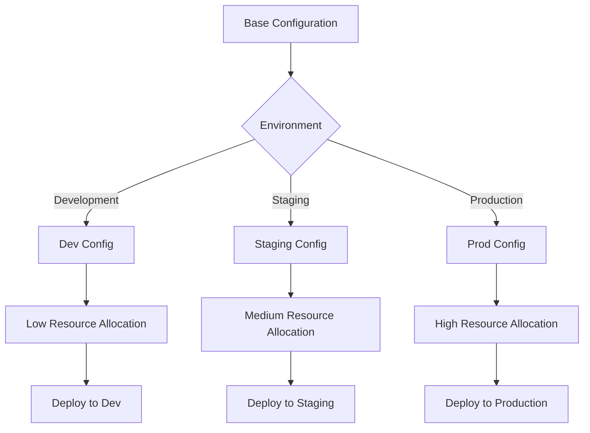

# Multi-environment Management

This guide demonstrates how to manage deployments across multiple environments (development, staging, production) using ecspresso.

## Using Environment Files

Environment files (.env) allow you to modify values in your task definition based on the target environment:

```shell
# Development
ecspresso --envfile dev.env deploy

# Staging
ecspresso --envfile staging.env deploy

# Production
ecspresso --envfile production.env deploy
```

Example environment file (dev.env):
```
CONTAINER_IMAGE=myapp:dev
MEMORY=512
CPU=256
LOG_LEVEL=debug
```

## Using Separate Configuration Files

Maintain separate configuration files for each environment:

```
ecspresso.dev.yml
ecspresso.staging.yml
ecspresso.prod.yml
```

```shell
ecspresso --config ecspresso.dev.yml deploy
```

## Using Jsonnet for Dynamic Configuration

Jsonnet allows for more complex templating and configuration management:

```jsonnet
// ecs-task-def.jsonnet
local env = std.extVar('env');
local configs = {
  dev: {
    memory: 512,
    cpu: 256,
    log_level: 'debug',
    replicas: 1
  },
  staging: {
    memory: 1024,
    cpu: 512,
    log_level: 'info',
    replicas: 2
  },
  prod: {
    memory: 2048,
    cpu: 1024,
    log_level: 'warn',
    replicas: 5
  }
};
local config = configs[env];
{
  family: 'my-app',
  cpu: std.toString(config.cpu),
  memory: std.toString(config.memory),
  containerDefinitions: [
    {
      name: 'web',
      image: 'myapp:' + env,
      environment: [
        {
          name: 'LOG_LEVEL',
          value: config.log_level
        }
      ]
    }
  ]
}
```

```shell
ecspresso --ext-str env=dev deploy
```

## Environment-specific Service Configurations


