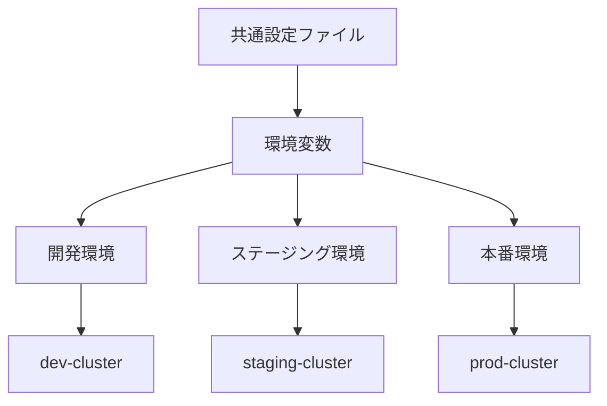
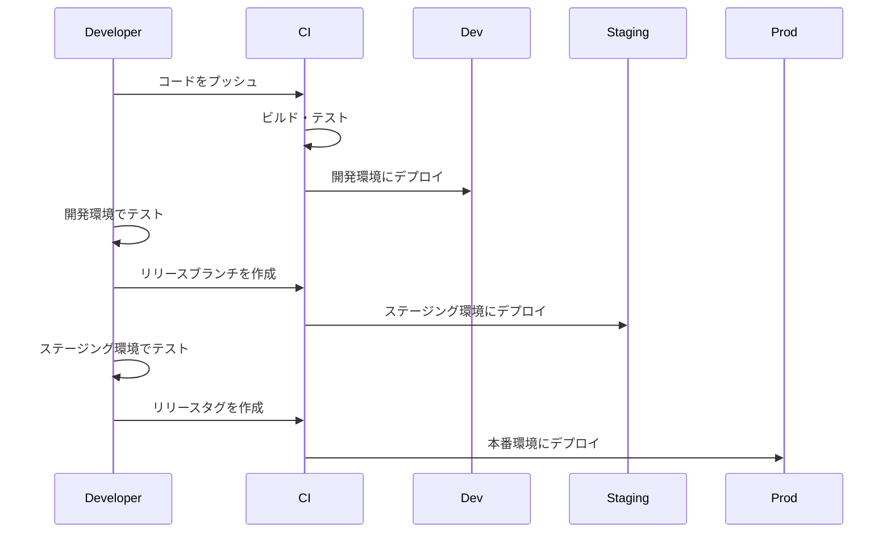

# 複数環境での運用

このページでは、ecspressoを使用して複数の環境（開発、ステージング、本番など）でECSサービスを管理する方法について説明します。

## 複数環境管理の概要

多くの組織では、開発、テスト、ステージング、本番などの複数の環境でアプリケーションを運用しています。ecspressoを使用すると、同じ設定ファイルを使用して複数の環境でECSサービスを管理できます。



## 環境変数を使用した環境の切り替え

ecspressoでは、環境変数を使用して異なる環境で同じ設定ファイルを使用できます。

### 設定ファイルの例

```yaml
region: ap-northeast-1
cluster: "{{ must_env `CLUSTER` }}"
service: "{{ must_env `SERVICE` }}"
task_definition: ecs-task-def.json
service_definition: ecs-service-def.json
```

### タスク定義の例

```json
{
  "family": "{{ must_env `SERVICE` }}",
  "executionRoleArn": "{{ must_env `TASK_EXECUTION_ROLE` }}",
  "taskRoleArn": "{{ must_env `TASK_ROLE` }}",
  "containerDefinitions": [
    {
      "name": "app",
      "image": "{{ must_env `ECR_REPOSITORY` }}:{{ must_env `IMAGE_TAG` }}",
      "essential": true,
      "environment": [
        {
          "name": "ENV",
          "value": "{{ must_env `ENV` }}"
        }
      ],
      "logConfiguration": {
        "logDriver": "awslogs",
        "options": {
          "awslogs-group": "/ecs/{{ must_env `SERVICE` }}",
          "awslogs-region": "{{ must_env `AWS_REGION` }}",
          "awslogs-stream-prefix": "{{ must_env `ENV` }}"
        }
      }
    }
  ]
}
```

### サービス定義の例

```json
{
  "cluster": "{{ must_env `CLUSTER` }}",
  "serviceName": "{{ must_env `SERVICE` }}",
  "desiredCount": {{ must_env `DESIRED_COUNT` }},
  "networkConfiguration": {
    "awsvpcConfiguration": {
      "subnets": [
        "{{ must_env `SUBNET_1` }}",
        "{{ must_env `SUBNET_2` }}"
      ],
      "securityGroups": [
        "{{ must_env `SECURITY_GROUP` }}"
      ]
    }
  }
}
```

## 環境変数ファイルの使用

複数の環境変数を設定する場合は、環境変数ファイルを使用できます。

### 環境変数ファイルの例

dev.env:
```
ENV=development
CLUSTER=dev-cluster
SERVICE=myapp-dev
ECR_REPOSITORY=123456789012.dkr.ecr.ap-northeast-1.amazonaws.com/myapp
IMAGE_TAG=latest
TASK_EXECUTION_ROLE=arn:aws:iam::123456789012:role/ecsTaskExecutionRole
TASK_ROLE=arn:aws:iam::123456789012:role/ecsTaskRole
DESIRED_COUNT=1
SUBNET_1=subnet-0123456789abcdef0
SUBNET_2=subnet-0123456789abcdef1
SECURITY_GROUP=sg-0123456789abcdef2
AWS_REGION=ap-northeast-1
```

staging.env:
```
ENV=staging
CLUSTER=staging-cluster
SERVICE=myapp-staging
ECR_REPOSITORY=123456789012.dkr.ecr.ap-northeast-1.amazonaws.com/myapp
IMAGE_TAG=stable
TASK_EXECUTION_ROLE=arn:aws:iam::123456789012:role/ecsTaskExecutionRole
TASK_ROLE=arn:aws:iam::123456789012:role/ecsTaskRole
DESIRED_COUNT=2
SUBNET_1=subnet-0123456789abcdef3
SUBNET_2=subnet-0123456789abcdef4
SECURITY_GROUP=sg-0123456789abcdef5
AWS_REGION=ap-northeast-1
```

prod.env:
```
ENV=production
CLUSTER=prod-cluster
SERVICE=myapp-prod
ECR_REPOSITORY=123456789012.dkr.ecr.ap-northeast-1.amazonaws.com/myapp
IMAGE_TAG=v1.0.0
TASK_EXECUTION_ROLE=arn:aws:iam::123456789012:role/ecsTaskExecutionRole
TASK_ROLE=arn:aws:iam::123456789012:role/ecsTaskRole
DESIRED_COUNT=3
SUBNET_1=subnet-0123456789abcdef6
SUBNET_2=subnet-0123456789abcdef7
SECURITY_GROUP=sg-0123456789abcdef8
AWS_REGION=ap-northeast-1
```

### 環境変数ファイルを使用したデプロイ

```bash
# 開発環境
ecspresso deploy --config ecspresso.yml --envfile=dev.env

# ステージング環境
ecspresso deploy --config ecspresso.yml --envfile=staging.env

# 本番環境
ecspresso deploy --config ecspresso.yml --envfile=prod.env
```

## 複数の設定ファイルを使用する方法

環境ごとに異なる設定ファイルを使用することもできます。

### ディレクトリ構造の例

```
.
├── common
│   ├── ecs-task-def.json
│   └── ecs-service-def.json
├── dev
│   └── ecspresso.yml
├── staging
│   └── ecspresso.yml
└── prod
    └── ecspresso.yml
```

### 設定ファイルの例

dev/ecspresso.yml:
```yaml
region: ap-northeast-1
cluster: dev-cluster
service: myapp-dev
task_definition: ../common/ecs-task-def.json
service_definition: ../common/ecs-service-def.json
```

staging/ecspresso.yml:
```yaml
region: ap-northeast-1
cluster: staging-cluster
service: myapp-staging
task_definition: ../common/ecs-task-def.json
service_definition: ../common/ecs-service-def.json
```

prod/ecspresso.yml:
```yaml
region: ap-northeast-1
cluster: prod-cluster
service: myapp-prod
task_definition: ../common/ecs-task-def.json
service_definition: ../common/ecs-service-def.json
```

### 異なる設定ファイルを使用したデプロイ

```bash
# 開発環境
ecspresso deploy --config dev/ecspresso.yml --envfile=dev.env

# ステージング環境
ecspresso deploy --config staging/ecspresso.yml --envfile=staging.env

# 本番環境
ecspresso deploy --config prod/ecspresso.yml --envfile=prod.env
```

## 環境ごとの差分管理

環境ごとの差分を確認するには、`diff`コマンドを使用します。

```bash
# 開発環境
ecspresso diff --config ecspresso.yml --envfile=dev.env

# ステージング環境
ecspresso diff --config ecspresso.yml --envfile=staging.env

# 本番環境
ecspresso diff --config ecspresso.yml --envfile=prod.env
```

## 環境ごとの検証

環境ごとの設定を検証するには、`verify`コマンドを使用します。

```bash
# 開発環境
ecspresso verify --config ecspresso.yml --envfile=dev.env

# ステージング環境
ecspresso verify --config ecspresso.yml --envfile=staging.env

# 本番環境
ecspresso verify --config ecspresso.yml --envfile=prod.env
```

## 環境ごとのデプロイフロー



## ベストプラクティス

### 1. 環境変数の使用

環境変数を使用して、環境固有の値を設定します。

### 2. 環境変数ファイルの使用

複数の環境変数を設定する場合は、環境変数ファイルを使用します。

### 3. 共通設定の共有

共通の設定は共有し、環境固有の設定のみを環境変数で設定します。

### 4. デプロイ前の検証

デプロイ前に設定を検証するには、`verify`コマンドを使用します。

### 5. 差分の確認

デプロイ前に差分を確認するには、`diff`コマンドを使用します。

### 6. 自動ロールバック

デプロイ失敗時に自動的にロールバックするには、`--rollback-events`オプションを使用します。

### 7. CI/CDパイプラインの使用

CI/CDパイプラインを使用して、環境ごとのデプロイを自動化します。
