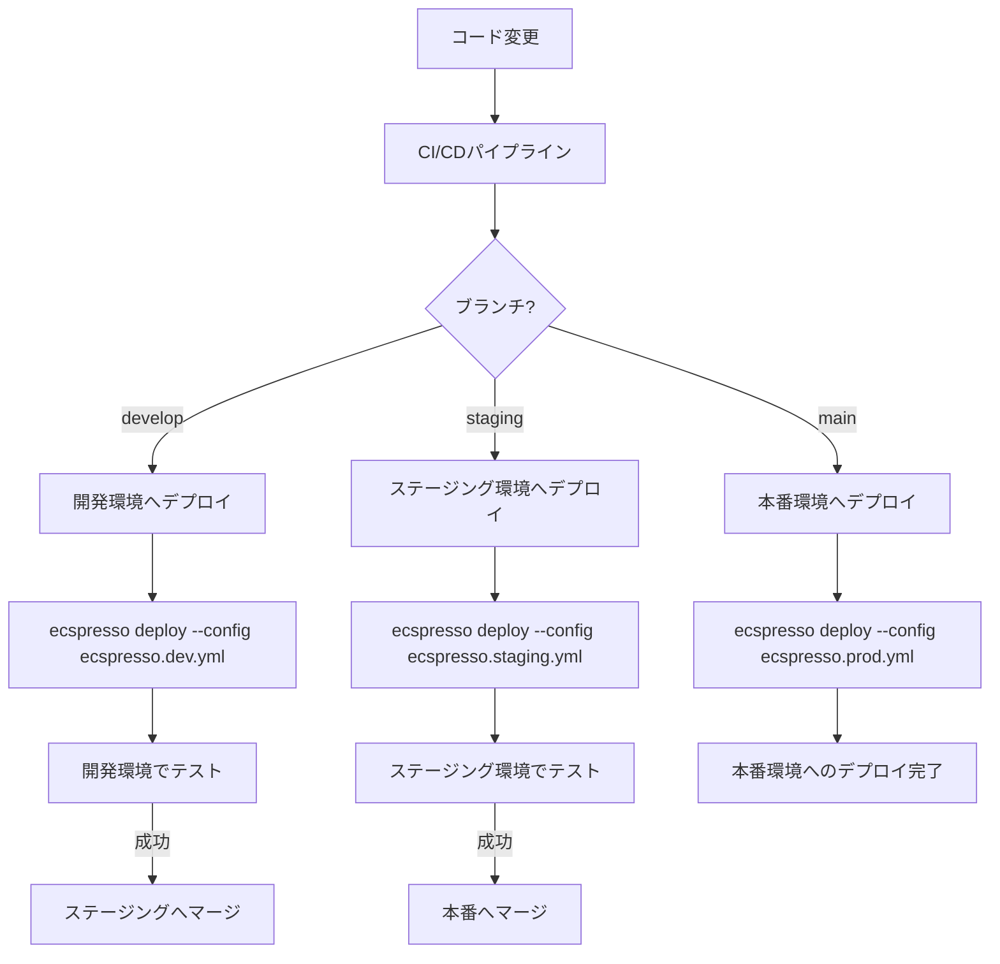

# 複数環境での運用

ecspressoを使用して複数の環境（開発、ステージング、本番など）を管理する方法を説明します。

## 環境ごとの設定ファイル

複数環境を管理するための一般的なアプローチは、環境ごとに異なる設定ファイルを用意することです。

```
.
├── ecspresso.yml          # 共通設定
├── ecspresso.dev.yml      # 開発環境用設定
├── ecspresso.staging.yml  # ステージング環境用設定
├── ecspresso.prod.yml     # 本番環境用設定
├── ecs-task-def.json      # 共通タスク定義テンプレート
└── ecs-service-def.json   # 共通サービス定義テンプレート
```

各環境用の設定ファイルでは、`--config`オプションを使用して指定します：

```console
$ ecspresso deploy --config ecspresso.dev.yml
$ ecspresso deploy --config ecspresso.staging.yml
$ ecspresso deploy --config ecspresso.prod.yml
```

## テンプレート関数を使用した環境変数の活用

環境変数を使用して、同じ定義ファイルを異なる環境で再利用できます。

```json
{
  "containerDefinitions": [
    {
      "name": "app",
      "image": "{{ env `ECR_REPOSITORY_URL` }}/myapp:{{ env `IMAGE_TAG` }}",
      "environment": [
        {
          "name": "ENV",
          "value": "{{ must_env `DEPLOY_ENV` }}"
        }
      ]
    }
  ]
}
```

環境ごとに異なる環境変数を設定してからecspressoを実行します：

```bash
# 開発環境
export ECR_REPOSITORY_URL=123456789012.dkr.ecr.ap-northeast-1.amazonaws.com
export IMAGE_TAG=dev
export DEPLOY_ENV=development
ecspresso deploy --config ecspresso.dev.yml

# 本番環境
export ECR_REPOSITORY_URL=123456789012.dkr.ecr.ap-northeast-1.amazonaws.com
export IMAGE_TAG=v1.0.0
export DEPLOY_ENV=production
ecspresso deploy --config ecspresso.prod.yml
```

## プラグインを使用した環境設定

ecspressoのプラグイン機能を使用して、環境ごとの設定を管理することもできます。v2では、外部プラグイン、SSMパラメータストアプラグイン、Secrets Managerプラグインがサポートされました。

### tfstateプラグイン

Terraformの状態から環境固有の値を取得できます：

```yaml
# ecspresso.yml
plugins:
  - name: tfstate
    config:
      url: s3://my-bucket/terraform-{{ env `ENV` }}.tfstate
```

```json
{
  "networkConfiguration": {
    "awsvpcConfiguration": {
      "subnets": [
        "{{ tfstate `aws_subnet.private['az-a'].id` }}",
        "{{ tfstate `aws_subnet.private['az-b'].id` }}"
      ],
      "securityGroups": [
        "{{ tfstate `aws_security_group.ecs.id` }}"
      ]
    }
  }
}
```

### 複数のtfstateファイル

v2では、プレフィックスを使用して複数のtfstateファイルをサポートします：

```yaml
# ecspresso.yml
plugins:
  - name: tfstate
    config:
      url: s3://my-bucket/network.tfstate
      prefix: network
  - name: tfstate
    config:
      url: s3://my-bucket/app.tfstate
      prefix: app
```

```json
{
  "networkConfiguration": {
    "awsvpcConfiguration": {
      "subnets": [
        "{{ tfstate `network:aws_subnet.private['az-a'].id` }}",
        "{{ tfstate `network:aws_subnet.private['az-b'].id` }}"
      ],
      "securityGroups": [
        "{{ tfstate `app:aws_security_group.ecs.id` }}"
      ]
    }
  }
}
```

## 複数環境管理のフロー図

以下は複数環境を管理するためのフロー図です：



## Jsonnetを活用した環境管理

v2では、Jsonnet形式の設定ファイルがサポートされ、より柔軟な環境管理が可能になりました：

```jsonnet
// ecspresso.jsonnet
local env = std.extVar("env");

{
  region: "ap-northeast-1",
  cluster: "my-cluster-" + env,
  service: "my-service-" + env,
  task_definition: "ecs-task-def.jsonnet",
  service_definition: "ecs-service-def.jsonnet",
  timeout: "10m",
  plugins: [
    {
      name: "ssm",
    },
    {
      name: "secretsmanager",
    }
  ]
}
```

環境ごとに異なる設定でデプロイする場合：

```bash
# 開発環境
ecspresso deploy --config ecspresso.jsonnet --jsonnet --ext-str env=dev

# ステージング環境
ecspresso deploy --config ecspresso.jsonnet --jsonnet --ext-str env=staging

# 本番環境
ecspresso deploy --config ecspresso.jsonnet --jsonnet --ext-str env=prod
```

## 環境固有の変数管理

環境固有の変数を管理するためのベストプラクティスは以下の通りです：

1. **環境変数**: デプロイ時に環境変数を設定
2. **SSMパラメータストア**: 環境ごとのパラメータをAWS SSMパラメータストアに保存
3. **SecretsManager**: 機密情報をAWS Secrets Managerに保存
4. **Terraform**: インフラストラクチャをコードとして管理し、環境ごとに異なる状態を維持
5. **Jsonnet**: 環境ごとの設定を柔軟に管理

### SSMパラメータストアとSecrets Managerの活用

v2では、SSMパラメータストアとSecrets Managerのプラグインが組み込まれています：

```json
{
  "containerDefinitions": [
    {
      "name": "app",
      "environment": [
        {
          "name": "DATABASE_URL",
          "value": "{{ ssm `/{{ env `ENV` }}/database/url` }}"
        }
      ],
      "secrets": [
        {
          "name": "API_KEY",
          "valueFrom": "{{ secretsmanager_arn `{{ env `ENV` }}/api-key` }}"
        }
      ]
    }
  ]
}
```

これにより、環境ごとに異なる設定を簡単に管理できます。

### 外部プラグインの活用

v2では、カスタム外部プラグインを使用して、より柔軟な環境管理が可能になりました：

```yaml
# ecspresso.yml
plugins:
  - name: my-env-plugin
    command: /path/to/env-plugin
    config:
      env: "{{ env `ENV` }}"
```

外部プラグインは、環境固有の設定を動的に生成するために使用できます。
