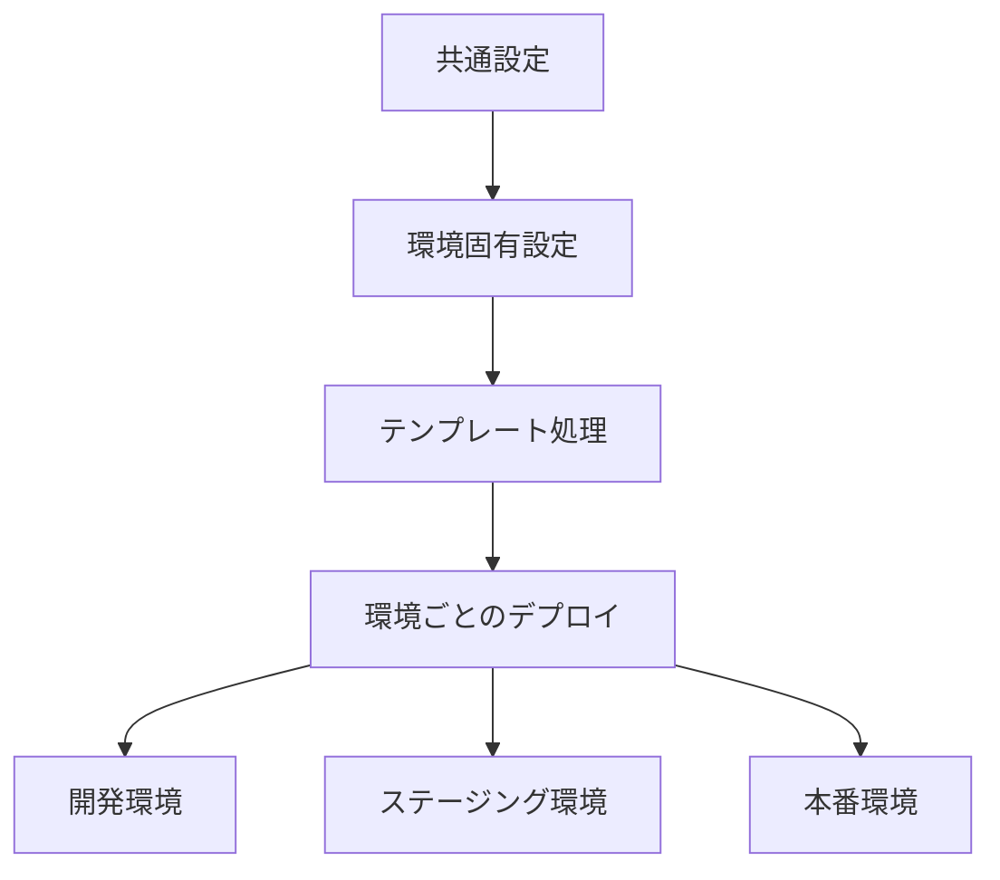

# 複数環境の管理

多くのプロジェクトでは、開発、ステージング、本番など複数の環境を管理する必要があります。ecspressoでは、環境変数とテンプレート機能を使用して、複数環境を効率的に管理できます。

## 環境変数ファイルの活用

ecspressoは、`--envfile`オプションを使用して環境変数ファイルを読み込むことができます。これにより、環境ごとに異なる設定を簡単に管理できます。

### 環境変数ファイルの例

```
# .env.dev（開発環境）
CLUSTER=dev-cluster
SERVICE=myservice-dev
DESIRED_COUNT=1
IMAGE_TAG=latest

# .env.stg（ステージング環境）
CLUSTER=stg-cluster
SERVICE=myservice-stg
DESIRED_COUNT=2
IMAGE_TAG=stable

# .env.prod（本番環境）
CLUSTER=prod-cluster
SERVICE=myservice-prod
DESIRED_COUNT=5
IMAGE_TAG=release
```

### 環境変数ファイルの使用方法

```console
# 開発環境へのデプロイ
$ ecspresso --envfile=.env.dev deploy

# ステージング環境へのデプロイ
$ ecspresso --envfile=.env.stg deploy

# 本番環境へのデプロイ
$ ecspresso --envfile=.env.prod deploy
```

## テンプレート機能の活用

ecspressoは、タスク定義とサービス定義で環境変数を参照できます。これにより、環境ごとに異なる設定を一元管理できます。

### タスク定義のテンプレート例

```json
{
  "family": "${SERVICE}",
  "containerDefinitions": [
    {
      "name": "app",
      "image": "myapp:${IMAGE_TAG}",
      "essential": true,
      "portMappings": [
        {
          "containerPort": 80,
          "hostPort": 80,
          "protocol": "tcp"
        }
      ],
      "environment": [
        {
          "name": "ENV",
          "value": "${ENV:-dev}"
        }
      ],
      "logConfiguration": {
        "logDriver": "awslogs",
        "options": {
          "awslogs-group": "/ecs/${SERVICE}",
          "awslogs-region": "${AWS_REGION}",
          "awslogs-stream-prefix": "ecs"
        }
      }
    }
  ]
}
```

### サービス定義のテンプレート例

```json
{
  "cluster": "${CLUSTER}",
  "serviceName": "${SERVICE}",
  "desiredCount": ${DESIRED_COUNT},
  "loadBalancers": [
    {
      "targetGroupArn": "${TARGET_GROUP_ARN}",
      "containerName": "app",
      "containerPort": 80
    }
  ],
  "networkConfiguration": {
    "awsvpcConfiguration": {
      "subnets": ${SUBNETS},
      "securityGroups": ${SECURITY_GROUPS},
      "assignPublicIp": "DISABLED"
    }
  }
}
```

## 環境ごとの設定ファイル

複雑なプロジェクトでは、環境ごとに異なる設定ファイルを使用することもできます。

### ディレクトリ構造の例

```
.
├── ecspresso.yml
├── environments/
│   ├── dev/
│   │   ├── ecspresso.yml
│   │   ├── ecs-task-def.json
│   │   └── ecs-service-def.json
│   ├── stg/
│   │   ├── ecspresso.yml
│   │   ├── ecs-task-def.json
│   │   └── ecs-service-def.json
│   └── prod/
│       ├── ecspresso.yml
│       ├── ecs-task-def.json
│       └── ecs-service-def.json
└── scripts/
    └── deploy.sh
```

### デプロイスクリプトの例

```bash
#!/bin/bash
# deploy.sh

ENV=$1
if [ -z "$ENV" ]; then
  echo "Usage: $0 <env>"
  exit 1
fi

cd environments/$ENV
ecspresso deploy
```

使用方法：

```console
$ ./scripts/deploy.sh dev   # 開発環境へのデプロイ
$ ./scripts/deploy.sh stg   # ステージング環境へのデプロイ
$ ./scripts/deploy.sh prod  # 本番環境へのデプロイ
```

## 環境管理のベストプラクティス

### 1. 環境変数の階層化

共通の設定と環境固有の設定を分離します：

```
# .env.common（共通設定）
AWS_REGION=ap-northeast-1
LOG_LEVEL=info

# .env.dev（開発環境固有の設定）
CLUSTER=dev-cluster
SERVICE=myservice-dev
```

使用方法：

```console
$ ecspresso --envfile=.env.common,.env.dev deploy
```

### 2. 環境変数のデフォルト値

テンプレート内でデフォルト値を設定します：

```json
{
  "environment": [
    {
      "name": "LOG_LEVEL",
      "value": "${LOG_LEVEL:-info}"
    }
  ]
}
```

### 3. 環境管理フロー


