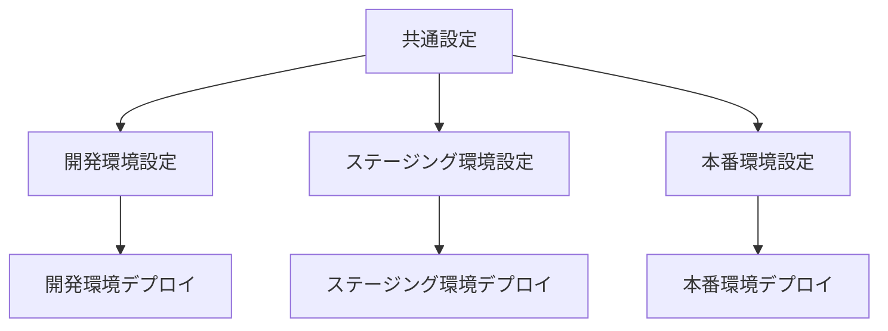

# 複数環境での運用

ecspressoを使用して複数の環境（開発、ステージング、本番など）を管理する方法を説明します。

## 環境ごとの設定ファイル

複数環境を管理するための一般的なアプローチは、環境ごとに設定ファイルを分けることです。

### ディレクトリ構造の例

```
project/
├── ecs/
│   ├── common/
│   │   ├── task-def-template.json
│   │   └── service-def-template.json
│   ├── dev/
│   │   ├── ecspresso.yml
│   │   ├── ecs-service-def.json
│   │   ├── ecs-task-def.json
│   │   └── .env.dev
│   ├── staging/
│   │   ├── ecspresso.yml
│   │   ├── ecs-service-def.json
│   │   ├── ecs-task-def.json
│   │   └── .env.staging
│   └── prod/
│       ├── ecspresso.yml
│       ├── ecs-service-def.json
│       ├── ecs-task-def.json
│       └── .env.prod
```

## 環境変数を使用した設定

環境変数を使用して、同じ設定ファイルで異なる環境を管理することもできます。

### 環境ファイルの例

`.env.dev`:
```
CLUSTER_NAME=dev-cluster
SERVICE_NAME=myapp-dev
DESIRED_COUNT=1
MIN_CAPACITY=1
MAX_CAPACITY=3
```

`.env.prod`:
```
CLUSTER_NAME=prod-cluster
SERVICE_NAME=myapp-prod
DESIRED_COUNT=3
MIN_CAPACITY=2
MAX_CAPACITY=10
```

### 環境変数を使用したタスク定義

```json
{
  "family": "${SERVICE_NAME}",
  "containerDefinitions": [
    {
      "name": "app",
      "image": "${ECR_REPOSITORY_URL}:${IMAGE_TAG}",
      "environment": [
        {
          "name": "ENV",
          "value": "${ENV}"
        }
      ]
    }
  ]
}
```

## Jsonnetを使用した設定

Jsonnetを使用すると、より柔軟な設定管理が可能になります。

### Jsonnetの例

`task-def.jsonnet`:
```jsonnet
local env = std.extVar('env');
local config = import 'config/' + env + '.libsonnet';

{
  family: config.serviceName,
  containerDefinitions: [
    {
      name: 'app',
      image: config.image,
      cpu: config.cpu,
      memory: config.memory,
      environment: [
        {
          name: 'ENV',
          value: env
        }
      ]
    }
  ]
}
```

`config/dev.libsonnet`:
```jsonnet
{
  serviceName: 'myapp-dev',
  image: 'myapp:dev',
  cpu: 256,
  memory: 512
}
```

`config/prod.libsonnet`:
```jsonnet
{
  serviceName: 'myapp-prod',
  image: 'myapp:latest',
  cpu: 1024,
  memory: 2048
}
```

## 環境ごとのデプロイコマンド

```bash
# 開発環境へのデプロイ
$ ENV=dev ecspresso --config=./ecs/dev/ecspresso.yml --envfile=./ecs/dev/.env.dev deploy

# 本番環境へのデプロイ
$ ENV=prod ecspresso --config=./ecs/prod/ecspresso.yml --envfile=./ecs/prod/.env.prod deploy
```

## 環境間の設定差分管理



## 環境ごとのリソース命名規則

一貫性のある命名規則を使用することで、複数環境の管理が容易になります。

```
# クラスター名
<project>-<env>-cluster

# サービス名
<project>-<env>-<service>

# タスク定義ファミリー
<project>-<env>-<service>

# ロググループ
/ecs/<project>/<env>/<service>
```

## 環境ごとのIAMロール管理

環境ごとに異なるIAMロールを使用することで、権限を適切に分離できます。

```yaml
# 開発環境のタスク実行ロール
TaskExecutionRole: arn:aws:iam::123456789012:role/dev-task-execution-role

# 本番環境のタスク実行ロール
TaskExecutionRole: arn:aws:iam::123456789012:role/prod-task-execution-role
```
