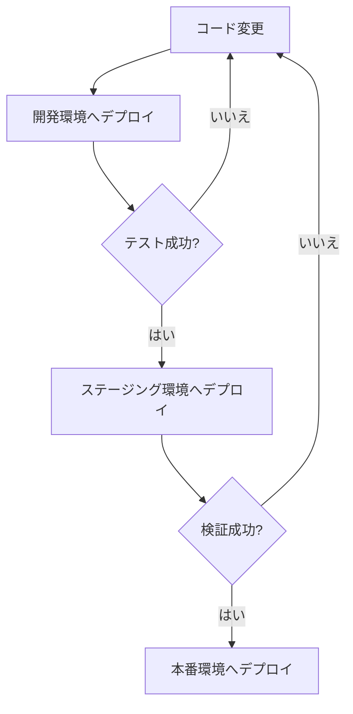

# 複数環境での運用

ecspressoでは環境変数やテンプレート機能を使用して、複数の環境（開発、ステージング、本番）で効率的に運用できます。

## 環境ファイルの活用

`--envfile`オプションを使用して、環境ごとの設定ファイルを指定できます。

```console
$ ecspresso deploy --config ecspresso.yml --envfile dev.env
$ ecspresso deploy --config ecspresso.yml --envfile prod.env
```

環境ファイルの例：

```
# dev.env
SERVICE_NAME=myapp-dev
ECR_REPOSITORY=123456789012.dkr.ecr.ap-northeast-1.amazonaws.com/myapp
IMAGE_TAG=latest
CPU=256
MEMORY=512
ENV=development
```

```
# prod.env
SERVICE_NAME=myapp-prod
ECR_REPOSITORY=123456789012.dkr.ecr.ap-northeast-1.amazonaws.com/myapp
IMAGE_TAG=v1.0.0
CPU=1024
MEMORY=2048
ENV=production
```

## テンプレート構文の活用

ecs-task-def.jsonで環境変数を活用します。

```json
{
  "family": "{{ must_env `SERVICE_NAME` }}",
  "cpu": "{{ env `CPU` `256` }}",
  "memory": "{{ env `MEMORY` `512` }}",
  "containerDefinitions": [
    {
      "name": "{{ must_env `SERVICE_NAME` }}",
      "image": "{{ must_env `ECR_REPOSITORY` }}:{{ must_env `IMAGE_TAG` }}",
      "environment": [
        {
          "name": "ENV",
          "value": "{{ must_env `ENV` }}"
        }
      ]
    }
  ]
}
```

## 環境別の設定ファイル

環境ごとに別々の設定ファイルを用意することもできます。

```
environments/
├── dev/
│   ├── ecspresso.yml
│   ├── ecs-task-def.json
│   └── ecs-service-def.json
├── staging/
│   ├── ecspresso.yml
│   ├── ecs-task-def.json
│   └── ecs-service-def.json
└── prod/
    ├── ecspresso.yml
    ├── ecs-task-def.json
    └── ecs-service-def.json
```

## 環境別のデプロイフロー



## プラグインの活用

ecspressoは様々なプラグインをサポートしており、複数環境での運用に役立ちます。

### SSM Parameter Storeの活用

```json
{
  "containerDefinitions": [
    {
      "environment": [
        {
          "name": "DATABASE_URL",
          "value": "{{ ssm `/${ENV}/database/url` }}"
        }
      ]
    }
  ]
}
```

### Secrets Managerの活用

```json
{
  "containerDefinitions": [
    {
      "secrets": [
        {
          "name": "API_KEY",
          "valueFrom": "{{ secretsmanager `${ENV}/api-key` }}"
        }
      ]
    }
  ]
}
```

### CloudFormationの活用

```json
{
  "containerDefinitions": [
    {
      "environment": [
        {
          "name": "VPC_ID",
          "value": "{{ cloudformation `${ENV}-VPC` `VpcId` }}"
        }
      ]
    }
  ]
}
```

## 注意事項

- 環境変数が設定されていない場合、`must_env`関数を使用している部分でエラーが発生します。
- 環境ファイルには機密情報を含めないようにしてください。機密情報はAWS Secrets Managerなどを使用して管理することをお勧めします。
- 環境ごとに異なるAWSアカウントを使用する場合は、適切なAWS認証情報を設定してください。
