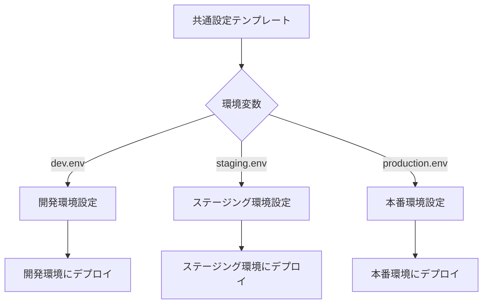

# 複数環境管理

ecspressoを使用して、開発、ステージング、本番などの複数環境を効率的に管理する方法を説明します。

## 環境変数ファイルの活用

ecspressoは`--envfile`オプションを使用して、環境ごとに異なる設定を適用できます。

```bash
# 開発環境
ecspresso deploy --envfile dev.env

# ステージング環境
ecspresso deploy --envfile staging.env

# 本番環境
ecspresso deploy --envfile production.env
```

環境変数ファイルの例：

```
# dev.env
TASK_CPU=256
TASK_MEMORY=512
CONTAINER_IMAGE=myapp:dev
MIN_CAPACITY=1
MAX_CAPACITY=2

# production.env
TASK_CPU=1024
TASK_MEMORY=2048
CONTAINER_IMAGE=myapp:release
MIN_CAPACITY=3
MAX_CAPACITY=10
```

## Jsonnetテンプレートの活用

より柔軟な設定管理のために、Jsonnetテンプレートを使用できます：

```jsonnet
// ecs-task-def.jsonnet
local env = std.extVar('env');

{
  family: 'myapp-' + env,
  cpu: if env == 'production' then '1024' else '256',
  memory: if env == 'production' then '2048' else '512',
  containerDefinitions: [
    {
      name: 'app',
      image: 'myapp:' + (if env == 'production' then 'release' else 'dev'),
      // 他の設定...
    }
  ]
}
```

Jsonnetテンプレートを使用する場合は、設定ファイルの拡張子を`.jsonnet`にし、外部変数を渡します：

```bash
ecspresso --ext-str env=dev deploy
ecspresso --ext-str env=production deploy
```

## 複数環境管理のワークフロー



## 環境固有の設定ファイル

別の方法として、環境ごとに異なる設定ファイルを用意することもできます：

```
project/
├── dev/
│   ├── ecspresso.yml
│   ├── ecs-service-def.json
│   └── ecs-task-def.json
├── staging/
│   ├── ecspresso.yml
│   ├── ecs-service-def.json
│   └── ecs-task-def.json
└── production/
    ├── ecspresso.yml
    ├── ecs-service-def.json
    └── ecs-task-def.json
```

この場合、各環境ディレクトリで個別にecspressoコマンドを実行します：

```bash
cd dev && ecspresso deploy
cd staging && ecspresso deploy
cd production && ecspresso deploy
```

## AWS Systems Manager Parameter Storeの活用

環境固有の設定値をAWS Systems Manager Parameter Storeに保存し、ecspressoのテンプレート機能で参照することができます：

```json
{
  "containerDefinitions": [
    {
      "name": "app",
      "image": "{{ ssm `/myapp/container_image` }}",
      "environment": [
        {
          "name": "DATABASE_URL",
          "value": "{{ ssm `/myapp/database_url` }}"
        }
      ]
    }
  ]
}
```

## AWS Secrets Managerの活用

機密情報はAWS Secrets Managerに保存し、ecspressoから参照できます：

```json
{
  "containerDefinitions": [
    {
      "secrets": [
        {
          "name": "API_KEY",
          "valueFrom": "{{ secretsmanager_arn `myapp/api_key` }}"
        }
      ]
    }
  ]
}
```
