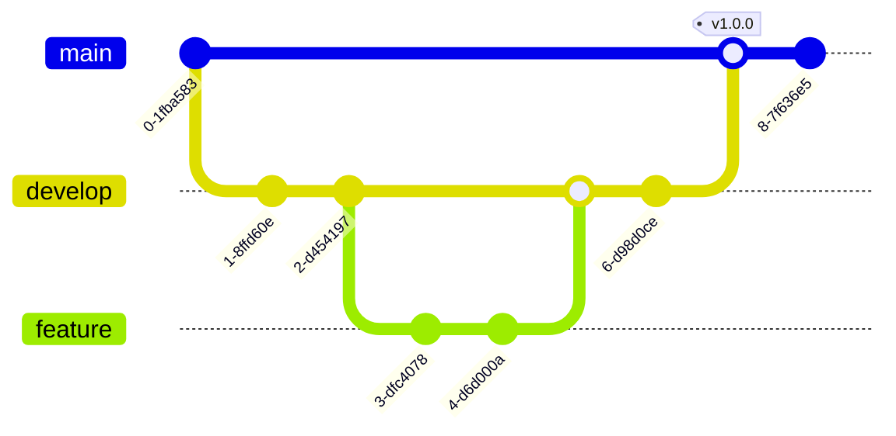

# 複数環境での運用

ecspressoを使用して、開発、ステージング、本番などの複数環境を効率的に管理する方法を紹介します。

## 環境変数ファイルの活用

ecspressoは`--envfile`オプションを使用して、環境ごとに異なる設定を適用できます。

### 環境変数ファイルの例

```
# dev.env
CLUSTER_NAME=dev-cluster
SERVICE_NAME=myapp-dev
DESIRED_COUNT=1
MEMORY=512
CPU=256
LOG_LEVEL=debug

# production.env
CLUSTER_NAME=prod-cluster
SERVICE_NAME=myapp
DESIRED_COUNT=3
MEMORY=1024
CPU=512
LOG_LEVEL=info
```

### 環境変数の使用方法

タスク定義ファイル（`ecs-task-def.json`）で環境変数を参照：

```json
{
  "family": "${SERVICE_NAME}",
  "cpu": "${CPU}",
  "memory": "${MEMORY}",
  "containerDefinitions": [
    {
      "name": "app",
      "image": "your-image:latest",
      "environment": [
        {
          "name": "LOG_LEVEL",
          "value": "${LOG_LEVEL}"
        }
      ]
    }
  ]
}
```

設定ファイル（`ecspresso.yml`）で環境変数を参照：

```yaml
region: ap-northeast-1
cluster: ${CLUSTER_NAME}
service: ${SERVICE_NAME}
service_definition: ecs-service-def.json
task_definition: ecs-task-def.json
```

### 環境ごとのデプロイ

```bash
# 開発環境へのデプロイ
ecspresso deploy --envfile dev.env

# 本番環境へのデプロイ
ecspresso deploy --envfile production.env
```

## 設定ファイルのテンプレート化

複数環境で共通の設定を管理するために、Jsonnetを使用してテンプレート化することもできます。

### Jsonnetの使用例

```jsonnet
// ecspresso.jsonnet
local env = std.extVar('env');

{
  region: 'ap-northeast-1',
  cluster: env + '-cluster',
  service: 'myapp-' + env,
  service_definition: 'ecs-service-def.json',
  task_definition: 'ecs-task-def.json',
  timeout: '10m',
  
  // 環境ごとの設定
  [if env == 'prod' then 'codedeploy']: {
    application_name: 'AppECS-prod-cluster-myapp-prod',
    deployment_group_name: 'DgpECS-prod-cluster-myapp-prod',
  },
}
```

Jsonnetファイルを使用する場合：

```bash
ecspresso --config ecspresso.jsonnet --ext-str env=dev deploy
ecspresso --config ecspresso.jsonnet --ext-str env=prod deploy
```

## 環境ごとのブランチ戦略

複数環境を管理するための一般的なブランチ戦略：



- `feature`ブランチ：新機能開発（開発環境にデプロイ）
- `develop`ブランチ：開発版（ステージング環境にデプロイ）
- `main`ブランチ：安定版（本番環境にデプロイ）

## 環境ごとの設定管理のベストプラクティス

1. **設定の分離**: 環境固有の設定と共通設定を分離する
2. **変数の標準化**: 環境間で一貫した変数名を使用する
3. **シークレット管理**: 機密情報はAWS Systems Manager Parameter StoreやSecrets Managerで管理する
4. **バージョン管理**: すべての設定ファイルをバージョン管理する
5. **自動化**: 環境ごとのデプロイを自動化する
6. **検証**: 本番デプロイ前に必ずステージング環境でテストする
