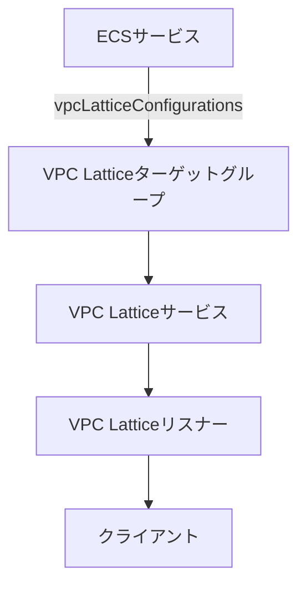

# VPC Latticeとの統合

ecspressoは[VPC Lattice](https://aws.amazon.com/vpc/lattice/)との統合をサポートしています。VPC Latticeを使用すると、サービス間の接続、観測、セキュリティを簡単に管理できます。

## 設定方法

VPC Latticeとecspressoを統合するには、以下の2つのステップが必要です：

### 1. タスク定義での設定

タスク定義の`portMappings`に`name`フィールドを定義します。

```json
{
    "containerDefinitions": [
        {
            "name": "webserver",
            "portMappings": [
                {
                    "name": "web-80-tcp",
                    "containerPort": 80,
                    "hostPort": 80,
                    "protocol": "tcp",
                    "appProtocol": "http"
                }
            ],
```

### 2. サービス定義での設定

サービス定義に`vpcLatticeConfigurations`を定義します。`portName`、`roleArn`、`targetGroupArn`フィールドが必要です。

```json
{
  "vpcLatticeConfigurations": [
    {
      "portName": "web-80-tcp",
      "roleArn": "arn:aws:iam::123456789012:role/ecsInfrastructureRole",
      "targetGroupArn": "arn:aws:vpc-lattice:ap-northeast-1:123456789012:targetgroup/tg-009147df264a0bacb"
    }
  ],
```

## 設定項目の説明

- `portName`: タスク定義の`portMappings`の`name`フィールドと一致する必要があります。
- `roleArn`: ECSサービスがVPC Lattice APIを呼び出すために引き受けるIAMロールのARN。
  - ロールには`ecs.amazonaws.com`サービスプリンシパルが必要です。
  - ロールには`AmazonECSInfrastructureRolePolicyForVpcLattice`ポリシーまたは同等の権限が必要です。
- `targetGroupArn`: VPC LatticeターゲットグループのARN。

## 注意事項

- ecspressoはVPC Latticeリソースの作成や変更を行いません。ECSサービスと関連付けるVPC Latticeターゲットグループは事前に作成しておく必要があります。
- VPC Lattice統合を使用するには、適切なIAM権限が必要です。
- 詳細については、[Amazon VPC Latticeを使用してAmazon ECSサービスを接続、観測、保護する方法](https://docs.aws.amazon.com/AmazonECS/latest/developerguide/ecs-vpc-lattice.html)を参照してください。

## 使用例

以下は、VPC Lattice統合を使用したecspressoの設定例です：

```yaml
# ecspresso.yml
region: ap-northeast-1
cluster: my-cluster
service: my-service
service_definition: ecs-service-def.json
task_definition: ecs-task-def.json
```

```json
// ecs-task-def.json
{
  "family": "my-service",
  "containerDefinitions": [
    {
      "name": "app",
      "image": "nginx:latest",
      "portMappings": [
        {
          "name": "http-80",
          "containerPort": 80,
          "hostPort": 80,
          "protocol": "tcp",
          "appProtocol": "http"
        }
      ]
    }
  ]
}
```

```json
// ecs-service-def.json
{
  "serviceName": "my-service",
  "desiredCount": 2,
  "launchType": "FARGATE",
  "networkConfiguration": {
    "awsvpcConfiguration": {
      "subnets": ["subnet-12345678", "subnet-87654321"],
      "securityGroups": ["sg-12345678"],
      "assignPublicIp": "ENABLED"
    }
  },
  "vpcLatticeConfigurations": [
    {
      "portName": "http-80",
      "roleArn": "arn:aws:iam::123456789012:role/ecsInfrastructureRole",
      "targetGroupArn": "arn:aws:vpc-lattice:ap-northeast-1:123456789012:targetgroup/tg-009147df264a0bacb"
    }
  ]
}
```

## アーキテクチャ例



この構成により、ECSサービスはVPC Latticeを通じて他のサービスと安全に通信できます。
