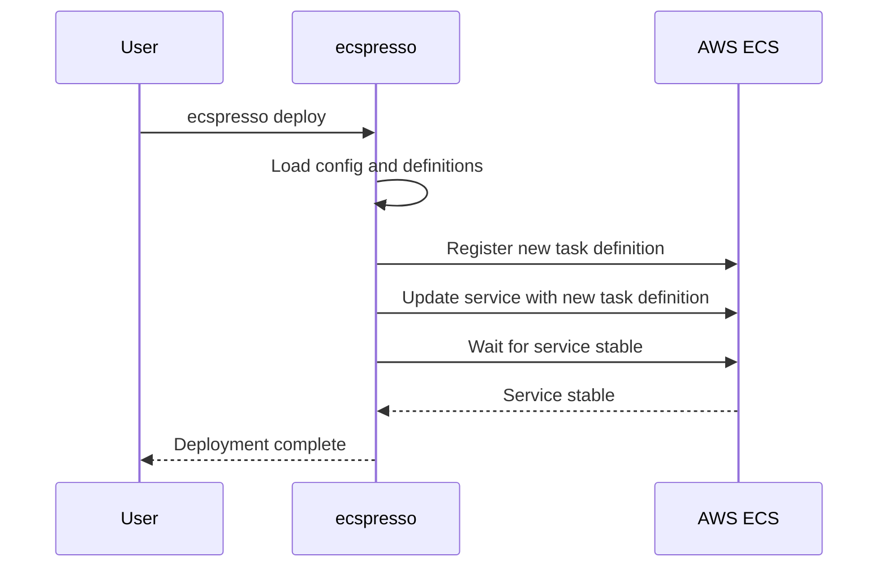

# Basic Usage

## Configuration

ecspresso requires a configuration file, typically named `ecspresso.yml`. This file defines the ECS service, cluster, and paths to your task and service definition files.

```yaml
region: us-west-2
cluster: my-cluster
service: my-service
task_definition: ecs-task-def.json
service_definition: ecs-service-def.json
timeout: 10m
```

## Initialization

If you have an existing ECS service, you can initialize ecspresso configuration files:

```shell
ecspresso init --region us-west-2 --cluster my-cluster --service my-service
```

This will create:
- `ecspresso.yml` - The main configuration file
- `ecs-task-def.json` - Task definition from the current service
- `ecs-service-def.json` - Service definition from the current service

## Deployment Workflow



## Example Deployment

1. Update your task or service definition files
2. Verify the changes:
   ```shell
   ecspresso diff
   ```
3. Deploy the changes:
   ```shell
   ecspresso deploy
   ```
4. Monitor the deployment:
   ```shell
   ecspresso status
   ```

## Rolling Back

If a deployment fails, you can roll back to a previous task definition:

```shell
ecspresso rollback
```
