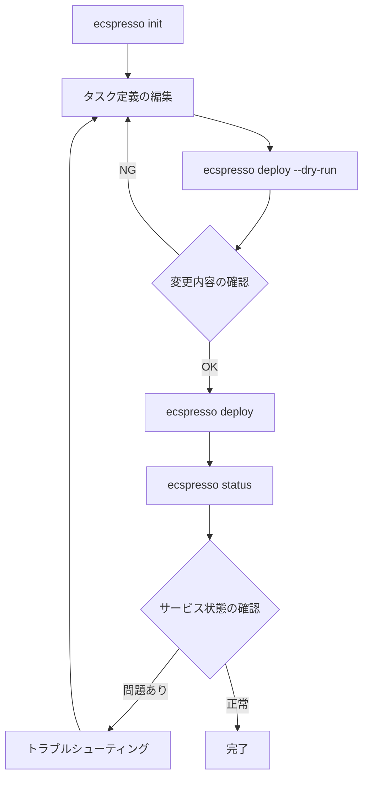

# 基本的な使い方

ecspressoを使用するための基本的な手順を説明します。

## 設定ファイルの作成

ecspressoを使用するには、まず設定ファイル（`ecspresso.yml`）を作成する必要があります。`init`コマンドを使用して、既存のECSサービスから設定ファイルを生成することができます。

```console
$ ecspresso init --region ap-northeast-1 --cluster your-cluster --service your-service --config ecspresso.yml
```

または、新しいサービスのために手動で設定ファイルを作成することもできます：

```yaml
# ecspresso.yml
region: ap-northeast-1
cluster: your-cluster
service: your-service
service_definition: ecs-service-def.json
task_definition: ecs-task-def.json
timeout: 10m
```

## タスク定義とサービス定義

ecspressoは、タスク定義とサービス定義をJSONまたはYAML形式で管理します。既存のサービスから定義ファイルを生成するには：

```console
$ ecspresso init --region ap-northeast-1 --cluster your-cluster --service your-service --config ecspresso.yml
```

このコマンドは、`ecs-task-def.json`と`ecs-service-def.json`を生成します。

## デプロイの実行

サービスをデプロイするには、`deploy`コマンドを使用します：

```console
$ ecspresso deploy --config ecspresso.yml
```

デプロイ前に変更内容を確認するには、`--dry-run`オプションを使用します：

```console
$ ecspresso deploy --config ecspresso.yml --dry-run
```

## サービスの状態確認

サービスの状態を確認するには、`status`コマンドを使用します：

```console
$ ecspresso status --config ecspresso.yml
```

## 基本的なワークフロー

ecspressoを使用した基本的なワークフローは以下の通りです：



## 設定ファイルの検証

デプロイ前に設定ファイルを検証するには、`verify`コマンドを使用します：

```console
$ ecspresso verify --config ecspresso.yml
```

## 設定ファイルのレンダリング

テンプレート変数が適用された後の設定ファイルを確認するには、`render`コマンドを使用します：

```console
$ ecspresso render --config ecspresso.yml
```

## 差分の確認

現在のECS設定と新しい設定の差分を確認するには、`diff`コマンドを使用します：

```console
$ ecspresso diff --config ecspresso.yml
```

これにより、タスク定義とサービス定義の変更点が表示されます。
