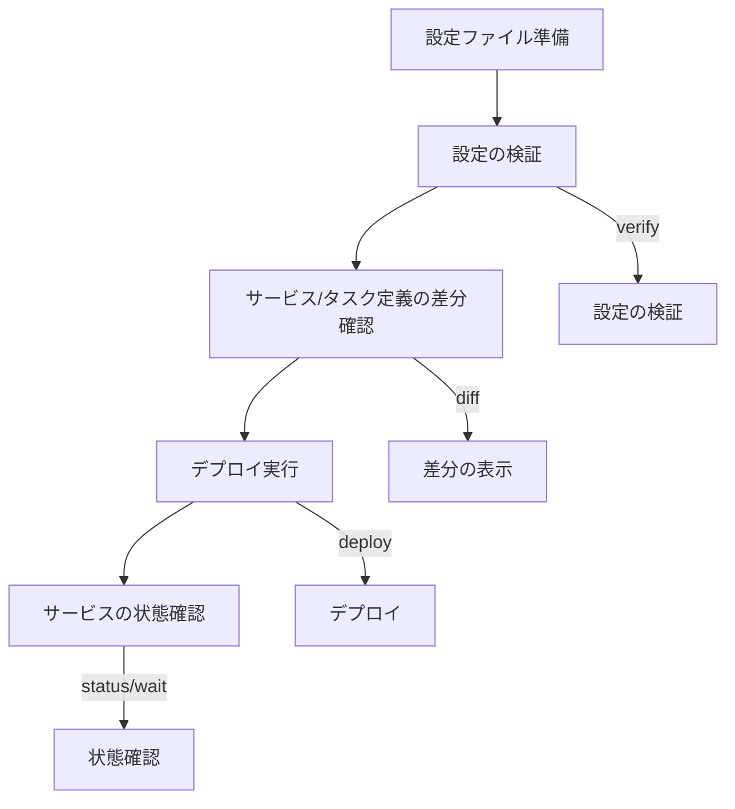

# 基本的な使い方

ecspressoを使い始めるための基本的な手順を説明します。

## 設定ファイルの初期化

既存のECSサービスからecspressoの設定を初期化するには、以下のコマンドを使用します。

```bash
ecspresso init --region ap-northeast-1 --cluster your-cluster-name --service your-service-name
```

これにより、以下のファイルが生成されます：
- `ecspresso.yml` - ecspressoの設定ファイル
- `ecs-service-def.json` - ECSサービス定義
- `ecs-task-def.json` - ECSタスク定義

もし既存のサービスがなく、新しくタスク定義から始める場合は：

```bash
ecspresso init --region ap-northeast-1 --cluster your-cluster-name --task-definition family:revision
```

## デプロイフロー



## デプロイの実行

設定ファイルを準備したら、以下のステップでデプロイを行います：

1. 設定の検証
```bash
ecspresso verify
```

2. デプロイする内容の差分を確認
```bash
ecspresso diff
```

3. 実際にデプロイを実行
```bash
ecspresso deploy
```

4. サービスの状態を確認
```bash
ecspresso status
```

## 一時的なタスクの実行

一時的なタスクを実行するには、以下のコマンドを使用します：

```bash
ecspresso run
```

タスク定義のオーバーライドを指定することもできます：

```bash
ecspresso run --overrides '{"containerOverrides":[{"name":"app","command":["command", "arg1", "arg2"]}]}'
```
