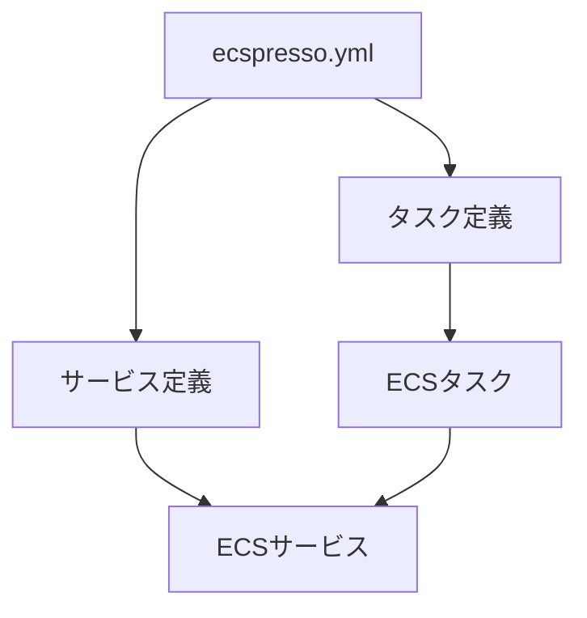

# 基本的な使い方

## 設定ファイルの作成

既存のECSサービスから設定ファイルを生成するには、`init`コマンドを使用します：

```bash
$ ecspresso init --region ap-northeast-1 --cluster your-cluster --service your-service
```

これにより、`ecspresso.yml`、`ecs-service-def.json`、`ecs-task-def.json`が生成されます。

## 設定の検証

設定が正しいことを確認するには、`verify`コマンドを使用します：

```bash
$ ecspresso verify
```

## サービスのデプロイ

サービスをデプロイするには、`deploy`コマンドを使用します：

```bash
$ ecspresso deploy
```

## サービスのステータス確認

サービスのステータスを確認するには、`status`コマンドを使用します：

```bash
$ ecspresso status
```

## タスクの実行

一時的なタスクを実行するには、`run`コマンドを使用します：

```bash
$ ecspresso run
```

## 設定の流れ


