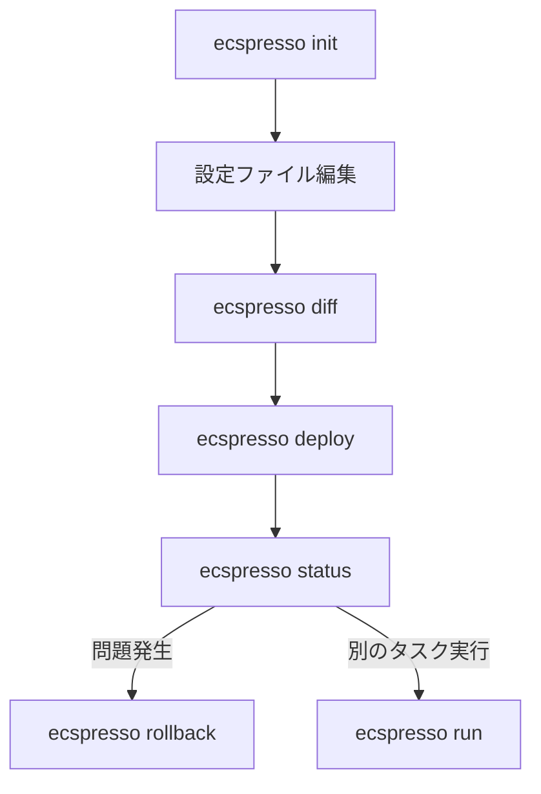

# 基本的な使い方

ここでは、ecspressoを使用して基本的なECSサービス管理を行う方法を説明します。

## 設定ファイルの初期化

既存のECSサービスから設定ファイルを作成します。

```console
$ ecspresso init --region ap-northeast-1 --cluster your-cluster --service your-service
```

これにより、カレントディレクトリに`ecspresso.yml`、`ecs-service-def.json`、`ecs-task-def.json`が作成されます。

## サービスのデプロイ

`deploy`コマンドを使用して、サービスをデプロイします。

```console
$ ecspresso deploy
```

デプロイ前に差分を確認したい場合は、`diff`コマンドを使用します。

```console
$ ecspresso diff
```

## タスクの実行

`run`コマンドを使用して、ワンタイムタスクを実行できます。

```console
$ ecspresso run
```

特定のタスク定義を使用する場合：

```console
$ ecspresso run --task-def=custom-task-def.json
```

## サービスステータスの確認

`status`コマンドを使用して、サービスの現在の状態を確認できます。

```console
$ ecspresso status
```

## サービスのロールバック

問題が発生した場合、以前のバージョンにロールバックできます。

```console
$ ecspresso rollback
```

## 基本的なワークフロー図


