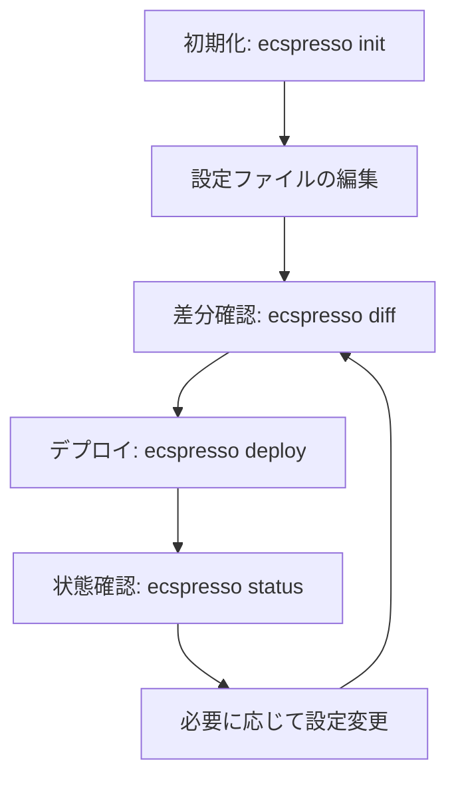

# 基本的な使い方

このページでは、ecspressoの基本的な使い方について説明します。

## 設定ファイルの初期化

ecspressoを使用するには、まず設定ファイルを作成する必要があります。既存のECSサービスから設定ファイルを作成するには、`init`コマンドを使用します。

```bash
# 既存のECSサービスから設定ファイルを作成
ecspresso init --region ap-northeast-1 --cluster your-cluster --service your-service
```

これにより、以下のファイルが作成されます：

- `ecspresso.yml` - ecspressoの設定ファイル
- `ecs-service-def.json` - ECSサービス定義ファイル
- `ecs-task-def.json` - ECSタスク定義ファイル

## 設定ファイルの構造

`ecspresso.yml`は以下のような構造になっています：

```yaml
region: ap-northeast-1
cluster: your-cluster
service: your-service
service_definition: ecs-service-def.json
task_definition: ecs-task-def.json
timeout: 10m
```

## サービスのデプロイ

タスク定義やサービス定義を更新した後、`deploy`コマンドを使用してサービスをデプロイします。

```bash
# サービスをデプロイ
ecspresso deploy
```

デプロイ前に変更内容を確認するには、`diff`コマンドを使用します。

```bash
# 変更内容を確認
ecspresso diff
```

## サービスの状態確認

サービスの現在の状態を確認するには、`status`コマンドを使用します。

```bash
# サービスの状態を確認
ecspresso status
```

## タスクの実行

一時的なタスクを実行するには、`run`コマンドを使用します。

```bash
# タスクを実行
ecspresso run
```

## 基本的なワークフロー

ecspressoを使用した基本的なワークフローは以下のようになります：



## コマンドラインオプション

ecspressoは、以下のようなグローバルオプションをサポートしています：

- `--config` - 設定ファイルのパス（デフォルト: `ecspresso.yml`）
- `--envfile` - 環境変数ファイルのパス
- `--debug` - デバッグログの有効化
- `--timeout` - タイムアウト時間の設定

```bash
# 環境変数ファイルを使用してデプロイ
ecspresso deploy --envfile=prod.env
```

## 次のステップ

基本的な使い方を理解したら、[よくあるユースケース](use-cases.html)を参照して、より実践的な使用方法を学びましょう。また、[コマンドリファレンス](../commands/)では、各コマンドの詳細なオプションと使用例を確認できます。
