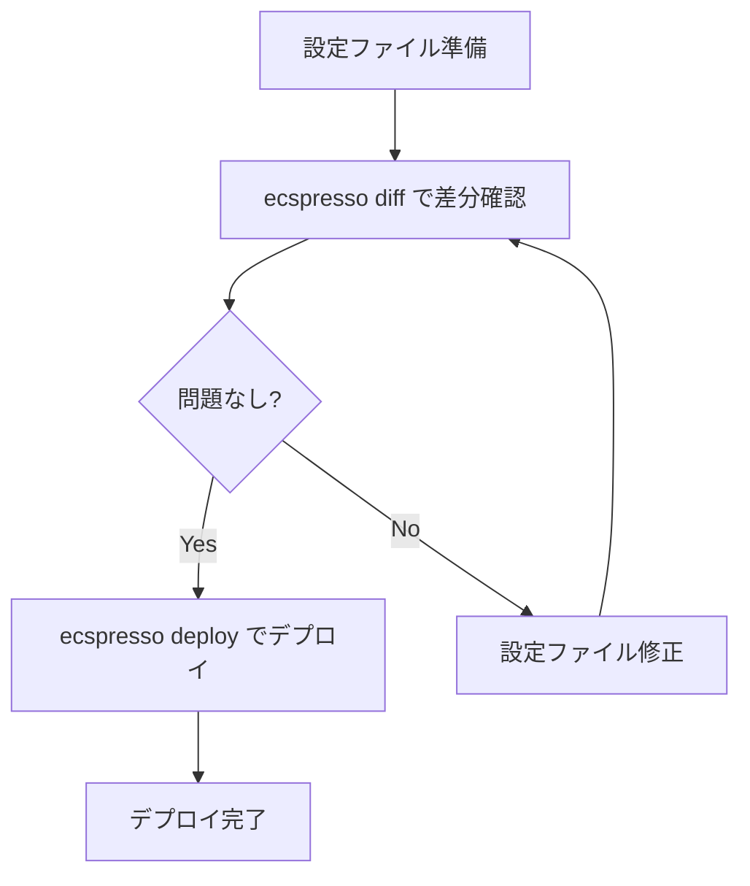

# 基本的な使い方

ecspressoを使用するための基本的な手順を説明します。

## 初期化

まず、ecspressoの設定ファイルを作成します。v2では、YAML形式とJsonnet形式の両方がサポートされています。

```console
$ ecspresso init --region ap-northeast-1 --cluster your-cluster-name --service your-service-name
```

Jsonnet形式で初期化する場合：

```console
$ ecspresso init --region ap-northeast-1 --cluster your-cluster-name --service your-service-name --jsonnet
```

このコマンドは、現在のディレクトリに設定ファイル（`ecspresso.yml`または`ecspresso.jsonnet`）、`ecs-service-def.json`、`ecs-task-def.json`を作成します。

## 設定ファイル

`ecspresso.yml`は以下のような内容になります：

```yaml
region: ap-northeast-1
cluster: your-cluster-name
service: your-service-name
service_definition: ecs-service-def.json
task_definition: ecs-task-def.json
timeout: 10m
```

Jsonnet形式の場合：

```jsonnet
{
  region: "ap-northeast-1",
  cluster: "your-cluster-name",
  service: "your-service-name",
  service_definition: "ecs-service-def.json",
  task_definition: "ecs-task-def.json",
  timeout: "10m"
}
```

## デプロイ

サービスをデプロイするには：

```console
$ ecspresso deploy
```

## 差分確認

デプロイ前に変更内容を確認するには：

```console
$ ecspresso diff
```

## タスク実行

一時的なタスクを実行するには：

```console
$ ecspresso run
```

## 設定検証

設定が正しいか検証するには：

```console
$ ecspresso verify
```

## デプロイフロー図

以下は基本的なデプロイフローを示しています：


