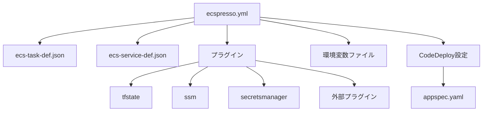

# 設定ファイル

ecspressoの設定ファイルについて詳しく説明します。

## 基本的な設定ファイル

ecspressoは、YAML、JSON、またはJsonnet形式の設定ファイルをサポートしています。デフォルトでは、`ecspresso.yml`（または`.yaml`、`.json`、`.jsonnet`）という名前のファイルを使用します。

### YAML形式

```yaml
region: ap-northeast-1
cluster: my-cluster
service: my-service
service_definition: ecs-service-def.json
task_definition: ecs-task-def.json
timeout: 10m
```

### JSON形式

```json
{
  "region": "ap-northeast-1",
  "cluster": "my-cluster",
  "service": "my-service",
  "service_definition": "ecs-service-def.json",
  "task_definition": "ecs-task-def.json",
  "timeout": "10m"
}
```

### Jsonnet形式（v2で追加）

```jsonnet
{
  region: "ap-northeast-1",
  cluster: "my-cluster",
  service: "my-service",
  service_definition: "ecs-service-def.json",
  task_definition: "ecs-task-def.json",
  timeout: "10m"
}
```

## 設定項目

| 項目 | 説明 | デフォルト値 |
|------|------|------------|
| `region` | AWSリージョン | - |
| `cluster` | ECSクラスター名 | - |
| `service` | ECSサービス名 | - |
| `service_definition` | サービス定義ファイルのパス | `ecs-service-def.json` |
| `task_definition` | タスク定義ファイルのパス | `ecs-task-def.json` |
| `timeout` | コマンド実行のタイムアウト時間 | `10m` |
| `plugins` | 使用するプラグインの設定 | - |
| `appspec` | CodeDeployのAppSpecファイルのパス | - |
| `code_deploy` | CodeDeployの設定 | - |
| `envfile` | 環境変数ファイルのパス | - |
| `filter_command` | 外部フィルターコマンド（非推奨、環境変数`ECSPRESSO_FILTER_COMMAND`を使用） | - |

## プラグイン設定

v2では、様々なプラグインをサポートしています。

### tfstateプラグイン

Terraformの状態ファイルから値を取得するプラグイン：

```yaml
plugins:
  - name: tfstate
    config:
      url: s3://my-bucket/terraform.tfstate
```

複数のtfstateファイルを使用する場合（v2で追加）：

```yaml
plugins:
  - name: tfstate
    config:
      url: s3://my-bucket/network.tfstate
      prefix: network
  - name: tfstate
    config:
      url: s3://my-bucket/app.tfstate
      prefix: app
```

### SSMパラメータストアプラグイン（v2で追加）

```yaml
plugins:
  - name: ssm
```

### Secrets Managerプラグイン（v2で追加）

```yaml
plugins:
  - name: secretsmanager
```

### 外部プラグイン（v2で追加）

```yaml
plugins:
  - name: my-plugin
    command: /path/to/plugin
    config:
      key: value
```

## CodeDeploy設定（v2で追加）

Blue/Greenデプロイを使用する場合のCodeDeploy設定：

```yaml
code_deploy:
  application_name: AppECS-my-cluster-my-service
  deployment_group_name: DgpECS-my-cluster-my-service
  deployment_config_name: CodeDeployDefault.ECSAllAtOnce
```

## 環境変数ファイル

環境変数ファイルを使用して、テンプレート関数で参照する環境変数を設定できます：

```yaml
envfile:
  - .env
  - .env.{{ env `ENV` `development` }}
```

## 設定ファイルの選択

異なる環境や目的に応じて、複数の設定ファイルを用意することができます：

```
.
├── ecspresso.yml          # デフォルト設定
├── ecspresso.dev.yml      # 開発環境用
├── ecspresso.staging.yml  # ステージング環境用
├── ecspresso.prod.yml     # 本番環境用
```

特定の設定ファイルを使用するには、`--config`オプションを指定します：

```console
$ ecspresso deploy --config ecspresso.dev.yml
```

## 設定ファイルの構成図

以下は設定ファイルの構成と関連ファイルの関係を示しています：



## 設定ファイルのベストプラクティス

1. **環境ごとに設定ファイルを分ける**: 開発、ステージング、本番環境など、環境ごとに設定ファイルを用意します。
2. **テンプレート関数を活用**: 環境変数やプラグインを使用して、環境に依存する値を動的に設定します。
3. **Jsonnetを活用**: 複雑な設定や再利用可能な設定には、Jsonnetを使用します。
4. **シークレット管理**: 機密情報はAWS Secrets ManagerやSSMパラメータストアを使用して管理します。
5. **タイムアウト設定**: 大規模なサービスや複雑なデプロイでは、適切なタイムアウト値を設定します。
