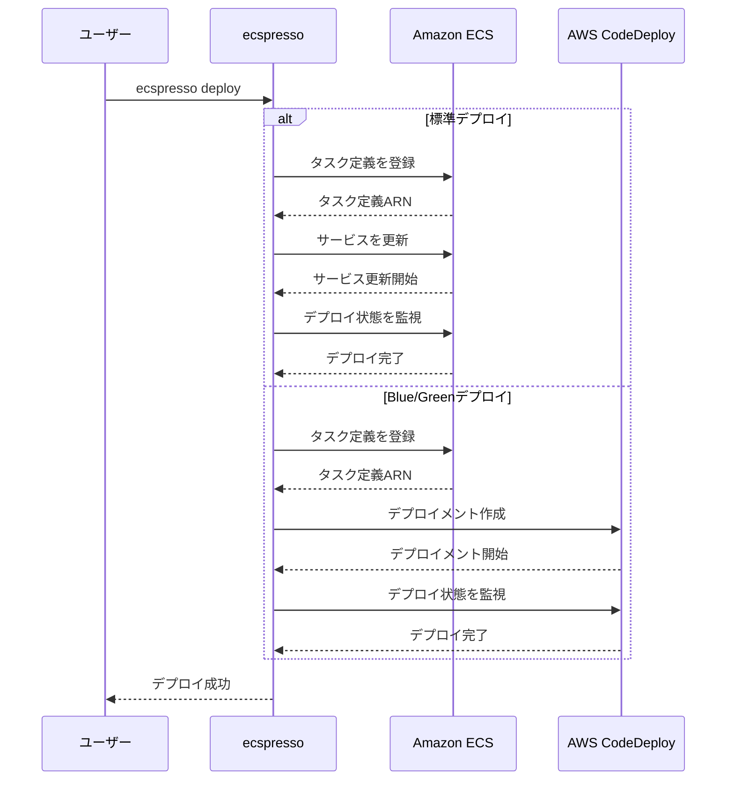

# サービスデプロイ

ecspressoを使用したECSサービスのデプロイ方法について説明します。

## デプロイの準備

デプロイを実行する前に、以下の準備が必要です：

1. **設定ファイルの作成**: `ecspresso init`コマンドで初期化した設定ファイル
2. **タスク定義ファイル**: ECSタスク定義を記述したJSONファイル
3. **サービス定義ファイル**: ECSサービス定義を記述したJSONファイル
4. **AWS認証情報**: デプロイに必要なIAM権限を持つAWS認証情報

## 基本的なデプロイ

最も基本的なデプロイは、以下のコマンドで実行できます：

```console
$ ecspresso deploy
```

このコマンドは、以下の処理を行います：

1. タスク定義を登録
2. サービスを更新（または存在しない場合は作成）
3. デプロイの進行状況を監視
4. サービスが安定状態になるまで待機

## デプロイオプション

ecspressoは、様々なデプロイオプションをサポートしています：

### ドライラン

実際にデプロイせずに、変更内容を確認します：

```console
$ ecspresso deploy --dry-run
```

### タスク定義のみ更新

タスク定義のみを更新し、サービスは更新しません：

```console
$ ecspresso deploy --no-update-service
```

### サービス定義のみ更新

サービス定義のみを更新し、タスク定義は更新しません：

```console
$ ecspresso deploy --skip-task-definition --update-service
```

### 強制的な新しいデプロイ

タスク定義やサービス定義に変更がなくても、強制的に新しいデプロイを開始します：

```console
$ ecspresso deploy --force-new-deployment
```

### デプロイ完了を待たない

デプロイ開始後、完了を待たずに終了します：

```console
$ ecspresso deploy --no-wait
```

### 待機条件の指定

デプロイの待機条件を指定します：

```console
$ ecspresso deploy --wait-until service_stable
$ ecspresso deploy --wait-until service_deployment_completed
```

## Blue/Greenデプロイ

AWS CodeDeployを使用したBlue/Greenデプロイを実行します：

```console
$ ecspresso deploy --blue-green
```

Blue/Greenデプロイを使用するには、以下の設定が必要です：

1. サービス定義に`deploymentController`を設定：

```json
{
  "deploymentController": {
    "type": "CODE_DEPLOY"
  }
}
```

2. AppSpecファイルを用意（v2ではYAMLまたはJSON形式をサポート）：

```yaml
# appspec.yaml
version: 0.0
Resources:
  - TargetService:
      Type: AWS::ECS::Service
      Properties:
        TaskDefinition: <TASK_DEFINITION>
        LoadBalancerInfo:
          ContainerName: "app"
          ContainerPort: 80
```

3. 設定ファイルにCodeDeployの設定を追加（v2で追加）：

```yaml
# ecspresso.yml
code_deploy:
  application_name: AppECS-my-cluster-my-service
  deployment_group_name: DgpECS-my-cluster-my-service
  deployment_config_name: CodeDeployDefault.ECSAllAtOnce
```

## デプロイフロー図

以下は標準デプロイとBlue/Greenデプロイのフロー図です：



## デプロイ戦略の選択

以下の表は、異なるデプロイ戦略の比較です：

| デプロイ戦略 | メリット | デメリット | 使用シナリオ |
|------------|---------|-----------|------------|
| 標準デプロイ | シンプル、設定が少ない | ダウンタイムの可能性がある | 小規模サービス、非本番環境 |
| Blue/Green | ダウンタイムなし、ロールバックが容易 | 設定が複雑、リソース消費が多い | 本番環境、重要なサービス |
| タスク定義のみ更新 | 軽量、サービス設定に影響しない | 新しいタスク定義が即時に使用されない | 設定変更のステージング |
| サービス定義のみ更新 | タスク定義に影響しない | コンテナイメージは更新されない | サービス設定の変更 |

## デプロイのベストプラクティス

1. **デプロイ前の検証**: `ecspresso verify`と`ecspresso diff`を使用して、デプロイ前に設定を検証します。
2. **段階的なデプロイ**: 非本番環境でテストしてから本番環境にデプロイします。
3. **ロールバック計画**: 問題が発生した場合のロールバック手順を用意します。
4. **監視**: デプロイ中と後のサービスの状態を監視します。
5. **自動化**: CI/CDパイプラインにecspressoを統合して、デプロイを自動化します。
