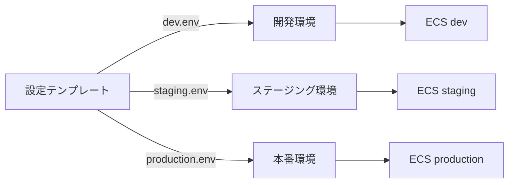

# 一般的なユースケース

ecspressoを使用する一般的なユースケースを紹介します。

## ローリングデプロイの実行

ECSのデフォルトデプロイメント戦略であるローリングデプロイを実行する場合：

```bash
ecspresso deploy
```

## Blue/Greenデプロイの実行

AWS CodeDeployを使用したBlue/Greenデプロイを行うには、最初にCodeDeployの設定を`ecspresso.yml`に追加し、デプロイメントコントローラーをサービス定義に設定します：

```yaml
# ecspresso.yml
codedeploy:
  application_name: AppECS-your-cluster-your-service
  deployment_group_name: DgpECS-your-cluster-your-service
  deployment_config_name: CodeDeployDefault.ECSAllAtOnce
```

```json
// ecs-service-def.json
{
  "deploymentController": {
    "type": "CODE_DEPLOY"
  }
}
```

その後、通常のdeployコマンドを実行します：

```bash
ecspresso deploy
```

デプロイ失敗時に自動ロールバックを設定する場合：

```bash
ecspresso deploy --rollback-events DEPLOYMENT_FAILURE
```

## サービスのスケーリング

サービスのタスク数を変更するには：

```bash
ecspresso scale --tasks 10
```

## 一時的なタスクの実行とコンテナへの接続

一時的なタスクを実行し、そのコンテナへ接続するには：

```bash
ecspresso run
ecspresso exec --command /bin/bash
```

## 複数環境での設定管理

環境変数ファイルを使用して、複数の環境（開発、ステージング、本番）のデプロイを管理できます：

```bash
ecspresso deploy --envfile dev.env
ecspresso deploy --envfile staging.env
ecspresso deploy --envfile production.env
```



## 既存サービスの設定エクスポート

既存のECSサービスの設定をecspressoの形式でエクスポートするには：

```bash
ecspresso init --region ap-northeast-1 --cluster your-cluster --service your-service
```
