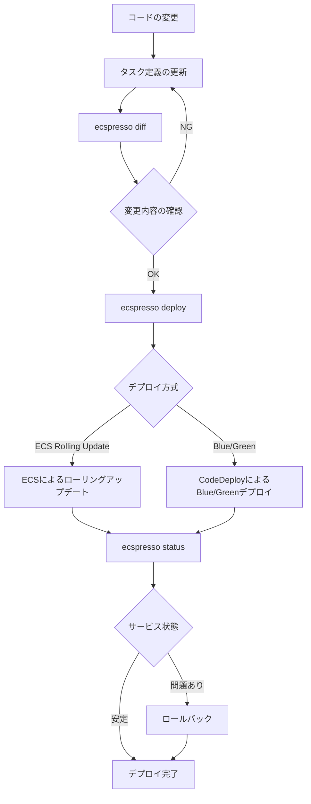

# よくあるユースケース

ecspressoを使用した一般的なユースケースと、それぞれの実装方法を説明します。

## 新しいサービスの作成

新しいECSサービスを作成するには、まず設定ファイルとタスク定義、サービス定義を準備します。

```console
# 設定ファイルの作成
$ ecspresso init --region ap-northeast-1 --cluster your-cluster --service your-service --config ecspresso.yml

# タスク定義とサービス定義を編集
$ vi ecs-task-def.json
$ vi ecs-service-def.json

# デプロイ
$ ecspresso deploy --config ecspresso.yml
```

## 既存サービスの更新

既存のECSサービスを更新するには、タスク定義やサービス定義を編集してからデプロイします。

```console
# 現在の設定を取得
$ ecspresso init --region ap-northeast-1 --cluster your-cluster --service your-service --config ecspresso.yml

# タスク定義を編集（例：コンテナイメージの更新）
$ vi ecs-task-def.json

# 変更内容の確認
$ ecspresso diff --config ecspresso.yml

# デプロイ
$ ecspresso deploy --config ecspresso.yml
```

## Blue/Greenデプロイメント

AWS CodeDeployを使用したBlue/Greenデプロイメントを実行するには、設定ファイルにCodeDeployの設定を追加します。

```yaml
# ecspresso.yml
region: ap-northeast-1
cluster: your-cluster
service: your-service
service_definition: ecs-service-def.json
task_definition: ecs-task-def.json
timeout: 10m
codedeploy:
  application_name: AppECS-your-cluster-your-service
  deployment_group_name: DgpECS-your-cluster-your-service
  deployment_config_name: CodeDeployDefault.ECSAllAtOnce
```

サービス定義にもデプロイメントコントローラーの設定が必要です：

```json
{
  "deploymentController": {
    "type": "CODE_DEPLOY"
  },
  "loadBalancers": [
    {
      "targetGroupArn": "arn:aws:elasticloadbalancing:ap-northeast-1:123456789012:targetgroup/blue/1234567890123456",
      "containerName": "app",
      "containerPort": 80
    }
  ]
}
```

デプロイを実行します：

```console
$ ecspresso deploy --config ecspresso.yml
```

## 自動ロールバック

デプロイ失敗時に自動的にロールバックするには、`--rollback-events`オプションを使用します：

```console
$ ecspresso deploy --config ecspresso.yml --rollback-events DEPLOYMENT_FAILURE
```

指定可能なイベントは以下の通りです：
- `DEPLOYMENT_FAILURE`: デプロイメントの失敗
- `DEPLOYMENT_STOP_ON_ALARM`: アラームによるデプロイメントの停止
- `DEPLOYMENT_STOP_ON_REQUEST`: リクエストによるデプロイメントの停止

## 強制デプロイ

現在のタスク定義で強制的に新しいデプロイメントを作成するには、`--force-new-deployment`オプションを使用します：

```console
$ ecspresso deploy --config ecspresso.yml --force-new-deployment
```

## タスク定義の更新をスキップ

サービスの設定のみを更新し、タスク定義の更新をスキップするには、`--skip-task-definition`オプションを使用します：

```console
$ ecspresso deploy --config ecspresso.yml --skip-task-definition
```

## 一時的なタスクの実行

一時的なタスクを実行するには、`run`コマンドを使用します：

```console
$ ecspresso run --config ecspresso.yml --task-definition ecs-task-def.json --count 1
```

特定のコマンドを上書きして実行するには：

```console
$ ecspresso run --config ecspresso.yml --task-definition ecs-task-def.json --overrides '{"containerOverrides":[{"name":"app","command":["echo","hello"]}]}'
```

## デプロイフロー

ecspressoを使用した一般的なデプロイフローは以下の通りです：


