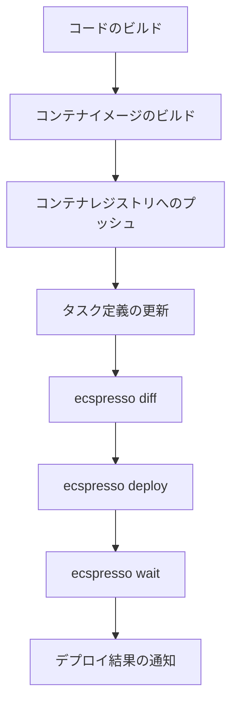

# よくあるユースケース

このページでは、ecspressoの一般的なユースケースと実践的な使用例を紹介します。

## コンテナイメージの更新

最も一般的なユースケースは、コンテナイメージのバージョンを更新してデプロイすることです。

```bash
# タスク定義ファイルを編集してイメージタグを更新
# ecs-task-def.json内のimageを更新

# 変更を確認
ecspresso diff

# デプロイ
ecspresso deploy
```

## ブルー/グリーンデプロイメント

AWS CodeDeployを使用したブルー/グリーンデプロイメントを行うには、サービス定義でデプロイメントコントローラーを設定します。

```json
{
  "deploymentController": {
    "type": "CODE_DEPLOY"
  }
}
```

そして、`ecspresso.yml`にCodeDeployの設定を追加します：

```yaml
region: ap-northeast-1
cluster: your-cluster
service: your-service
service_definition: ecs-service-def.json
task_definition: ecs-task-def.json
codedeploy:
  application_name: AppECS-your-cluster-your-service
  deployment_group_name: DgpECS-your-cluster-your-service
```

デプロイ時に自動ロールバックを設定することもできます：

```bash
ecspresso deploy --rollback-events DEPLOYMENT_FAILURE
```

## 環境変数の管理

異なる環境（開発、ステージング、本番）で異なる環境変数を使用するには、環境変数ファイルを使用します。

```bash
# 開発環境用の環境変数ファイル（dev.env）
ENVIRONMENT=development
LOG_LEVEL=debug

# 本番環境用の環境変数ファイル（prod.env）
ENVIRONMENT=production
LOG_LEVEL=info
```

環境変数ファイルを指定してデプロイします：

```bash
# 開発環境へのデプロイ
ecspresso deploy --envfile=dev.env

# 本番環境へのデプロイ
ecspresso deploy --envfile=prod.env
```

## サービスのスケーリング

サービスのタスク数を変更するには、`scale`コマンドまたは`deploy`コマンドの`--tasks`オプションを使用します。

```bash
# タスク数を5に設定
ecspresso scale --tasks=5

# または
ecspresso deploy --tasks=5 --skip-task-definition
```

## 強制的な再デプロイ

サービスを強制的に再デプロイするには、`--force-new-deployment`オプションを使用します。

```bash
ecspresso deploy --force-new-deployment
```

または、`refresh`コマンドを使用することもできます：

```bash
ecspresso refresh
```

## タスク定義の更新なしでのデプロイ

サービス設定のみを更新する場合は、`--skip-task-definition`オプションを使用します。

```bash
ecspresso deploy --skip-task-definition
```

## 一時的なタスクの実行

メンテナンスやデータ処理などの一時的なタスクを実行するには、`run`コマンドを使用します。

```bash
# デフォルトのタスク定義を使用してタスクを実行
ecspresso run

# コマンドをオーバーライドして実行
ecspresso run --overrides='{"containerOverrides":[{"name":"app","command":["./maintenance.sh"]}]}'

# タスク数を指定して実行
ecspresso run --count=3
```

## デプロイの待機

デプロイが完了するまで待機するには、`wait`コマンドを使用します。

```bash
# デプロイ後に安定状態になるまで待機
ecspresso deploy --no-wait
ecspresso wait
```

## 実行中のタスクでのコマンド実行

実行中のタスクでコマンドを実行するには、`exec`コマンドを使用します。

```bash
# タスクIDを取得
ecspresso tasks

# タスクでコマンドを実行
ecspresso exec --task-id=your-task-id --command="ls -la"
```

## デプロイワークフロー例

以下は、CI/CDパイプラインでecspressoを使用する一般的なワークフローです：



これらのユースケースは、ecspressoの基本的な機能を示していますが、より詳細な情報については[コマンドリファレンス](../commands/)を参照してください。
