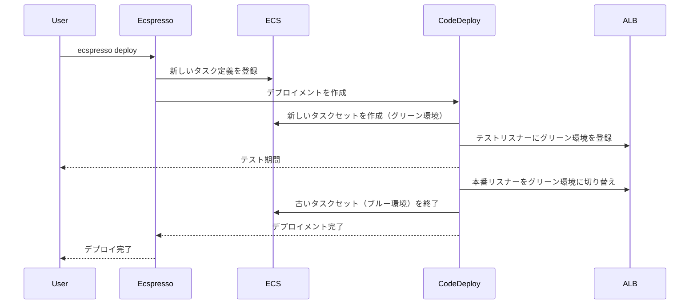

# よくあるユースケース

このページでは、ecspressoのよくあるユースケースと応用例について説明します。

## 1. CI/CDパイプラインでの自動デプロイ

ecspressoはCI/CDパイプラインと簡単に統合できます。以下は、GitHub Actionsでの使用例です。

```yaml
name: Deploy to ECS

on:
  push:
    branches: [ main ]

jobs:
  deploy:
    runs-on: ubuntu-latest
    steps:
      - uses: actions/checkout@v3
      - uses: kayac/ecspresso@v2
        with:
          version: v2.3.0
      - name: Configure AWS credentials
        uses: aws-actions/configure-aws-credentials@v1
        with:
          aws-access-key-id: ${{ secrets.AWS_ACCESS_KEY_ID }}
          aws-secret-access-key: ${{ secrets.AWS_SECRET_ACCESS_KEY }}
          aws-region: ap-northeast-1
      - name: Deploy to ECS
        run: |
          IMAGE_TAG=${{ github.sha }} ecspresso deploy --config ecspresso.yml
```

## 2. Blue/Greenデプロイメント

AWS CodeDeployを使用したBlue/Greenデプロイメントを実現できます。

設定例（ecspresso.yml）：
```yaml
region: ap-northeast-1
cluster: default
service: myservice
task_definition: ecs-task-def.json
service_definition: ecs-service-def.json
codedeploy:
  application_name: AppECS-default-myservice
  deployment_group_name: DgpECS-default-myservice
  deployment_config_name: CodeDeployDefault.ECSAllAtOnce
  termination_wait_time_in_minutes: 5
  auto_rollback_enabled: true
```

サービス定義例（ecs-service-def.json）：
```json
{
  "deploymentController": {
    "type": "CODE_DEPLOY"
  },
  "loadBalancers": [
    {
      "containerName": "nginx",
      "containerPort": 80,
      "targetGroupArn": "{{ tfstate `aws_lb_target_group.blue.arn` }}"
    }
  ]
}
```

デプロイコマンド：
```bash
ecspresso deploy --config ecspresso.yml
```

Blue/Greenデプロイメントのフロー：



## 3. タスクの一時実行

メンテナンスやバッチ処理のためにタスクを一時的に実行する例：

```bash
ecspresso run --config ecspresso.yml --task-definition=maintenance.json --overrides='{"containerOverrides":[{"name":"app","command":["php","artisan","migrate"]}]}'
```

このコマンドは、指定されたタスク定義を使用してタスクを実行し、コンテナのコマンドをオーバーライドします。

## 4. サービスのスケーリング

サービスのタスク数を変更する例：

```bash
ecspresso scale --config ecspresso.yml --tasks=5
```

このコマンドは、サービスのタスク数を5に設定します。

## 5. 複数環境での運用

開発、ステージング、本番環境など、複数の環境で同じ設定ファイルを使用する例：

```bash
# 開発環境
ecspresso deploy --config ecspresso.yml --envfile=dev.env

# ステージング環境
ecspresso deploy --config ecspresso.yml --envfile=staging.env

# 本番環境
ecspresso deploy --config ecspresso.yml --envfile=prod.env
```

環境変数ファイルの例：

dev.env:
```
CLUSTER=dev-cluster
SERVICE=myservice-dev
IMAGE_TAG=latest
MIN_CAPACITY=1
MAX_CAPACITY=2
```

staging.env:
```
CLUSTER=staging-cluster
SERVICE=myservice-staging
IMAGE_TAG=stable
MIN_CAPACITY=2
MAX_CAPACITY=4
```

prod.env:
```
CLUSTER=prod-cluster
SERVICE=myservice-prod
IMAGE_TAG=v1.0.0
MIN_CAPACITY=3
MAX_CAPACITY=10
```

設定ファイル例（ecspresso.yml）：
```yaml
region: ap-northeast-1
cluster: "{{ must_env `CLUSTER` }}"
service: "{{ must_env `SERVICE` }}"
task_definition: ecs-task-def.json
service_definition: ecs-service-def.json
```

## 6. 自動ロールバック

デプロイ失敗時に自動的にロールバックする例：

```bash
ecspresso deploy --config ecspresso.yml --rollback-events DEPLOYMENT_FAILURE
```

このコマンドは、デプロイメントが失敗した場合に自動的に前のバージョンにロールバックします。

## 7. 差分のみのデプロイ

タスク定義を更新せずにサービスのみを更新する例：

```bash
ecspresso deploy --config ecspresso.yml --skip-task-definition
```

このコマンドは、タスク定義の登録をスキップし、サービス定義のみを更新します。

## 8. 強制的な新規デプロイメント

現在のタスク定義を使用して強制的に新しいデプロイメントを作成する例：

```bash
ecspresso deploy --config ecspresso.yml --force-new-deployment
```

このコマンドは、タスク定義が変更されていなくても、新しいデプロイメントを強制的に作成します。
